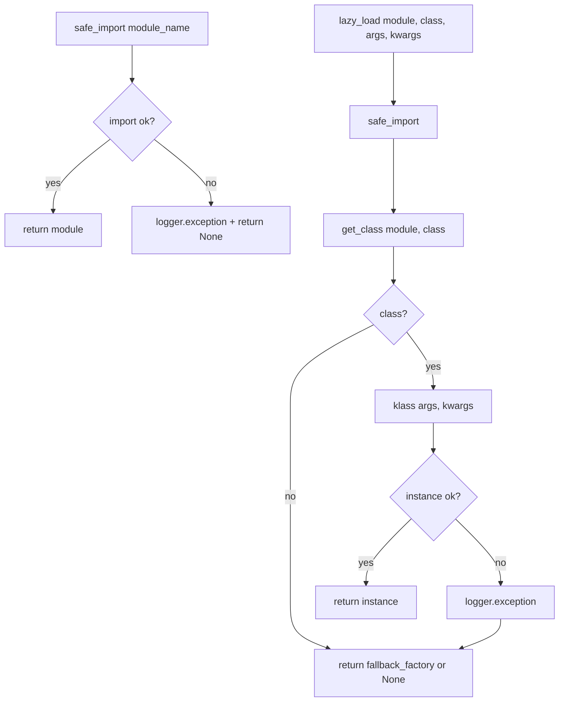
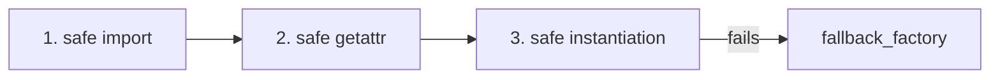

---
tags:
  - secinterp
  - code-walkthrough
  - core
  - utils
  - di
  - resilience
aliases:
  - safe_loader.py
  - SafeLoader
cssclass: secinterp-note
---

# 17 — `core/utils/safe_loader.py`

> [!abstract] One-line summary
> A **fault-tolerant loading** helper: it imports modules and classes safely and lazily, so a broken component **does not bring down** the plugin.

**Path**: `core/utils/safe_loader.py` (79 lines)
**Class**: `SafeLoader`
**Layer**: Core · Utilities
**Tags**: #secinterp #core #utils #di #resilience

---

## 🎯 Why does this file exist?

The plugin assembles many components (services, adapters, managers) at runtime. If **a single import fails** — due to a missing dependency, a syntax error in an optional module, or an incompatible version — a normal `import` would abort the entire load.

`SafeLoader` turns those imports into **safe, observable** operations:

| Problem | `SafeLoader` solution |
|---------|-----------------------|
| An import fails and breaks the whole plugin | Catches the exception, logs it, returns `None` |
| Heavy load at startup | `lazy_load` imports + instantiates on demand |
| You need the module and the class separately | `safe_import` + `get_class` |
| You want a silent fallback | `fallback_factory` |

> [!important] Role in the architecture
> It is the piece that enables the **tolerant Composition Root** of [[01 - sec_interp_plugin]] and the service construction in [[10 - controller]].

---

## 🧬 Flow diagram



---

## 🧱 Method 1 — `safe_import()`

```python
@staticmethod
def safe_import(module_name: str, error_message: str | None = None) -> Any:
    try:
        return importlib.import_module(module_name)
    except (ImportError, Exception):
        msg = error_message or f"Failed to load optional module: {module_name}"
        logger.exception(msg)
        return None
```

| Detail | Explanation |
|--------|-------------|
| **`importlib.import_module`** | Dynamic import by name (string) |
| **`except (ImportError, Exception)`** | `Exception` already includes `ImportError` → the tuple is redundant |
| **`logger.exception`** | Logs the **full traceback** (not just the message) |
| **Return** | `None` on failure |

> [!warning] Note on `(ImportError, Exception)`
> `Exception` covers `ImportError`, so the tuple is redundant.
> A more precise equivalent would be `except ImportError:` for the expected case
> and `except Exception:` for the unexpected one (better separated).

---

## 🧱 Method 2 — `get_class()`

```python
@staticmethod
def get_class(module: Any, class_name: str) -> type | None:
    if not module:
        return None
    return getattr(module, class_name, None)
```

- If the module is `None` (because `safe_import` failed) → returns `None`.
- `getattr(..., None)` avoids an `AttributeError` if the class is missing.

> [!tip] Composable
> `safe_import` + `get_class` let you obtain a symbol safely without instantiating it.
> Useful when the class needs arguments that are not yet available.

---

## 🧱 Method 3 — `lazy_load()` — the most used

```python
@staticmethod
def lazy_load(
    module_name: str,
    class_name: str,
    fallback_factory: Callable[[], T] | None = None,
    *args: Any,
    **kwargs: Any,
) -> T | None:
    module = SafeLoader.safe_import(module_name)
    klass = SafeLoader.get_class(module, class_name)
    if klass:
        try:
            return klass(*args, **kwargs)
        except Exception:
            logger.exception(
                f"Failed to instantiate {class_name} from {module_name} "
                f"with args={args}, kwargs={kwargs}"
            )

    return fallback_factory() if fallback_factory else None
```

### Three safety levels



| Level | Risk covered |
|-------|--------------|
| 1. `safe_import` | Missing module / import error |
| 2. `get_class` | Class missing in the module |
| 3. `try/except` | Error in `__init__` (wrong args/kwargs) |
| 4. `fallback_factory` | Optional substitute if everything fails |

> [!important] Why DI + tolerance fit together
> The Composition Root can inject dependencies (`kwargs`) even if an optional module fails,
> because `lazy_load` returns `None` instead of raising. The plugin starts in **degraded mode**.

### Usage in the project

```python
# sec_interp_plugin.py
self.preview_renderer = SafeLoader.lazy_load(
    "sec_interp.gui.preview_renderer", "PreviewRenderer"
)
self.controller = SafeLoader.lazy_load(
    "sec_interp.core.controller", "ProfileController",
    data_fetcher=data_fetcher,
    structure_extractor=structure_extractor,
    ...
)
```

```python
# core/controller.py
self.collar_processor = SafeLoader.lazy_load(
    "sec_interp.core.services.drillhole.collar_processor", "CollarProcessor"
)
```

---

## 🧾 API summary

| Method | Type | Returns |
|--------|------|---------|
| `safe_import(module_name, error_message=None)` | static | module or `None` |
| `get_class(module, class_name)` | static | class or `None` |
| `lazy_load(module, class, fallback_factory=None, *args, **kwargs)` | static | instance, fallback, or `None` |

---

## 🏛️ Design patterns present

| Pattern | Where | Purpose |
|---------|-------|---------|
| **Static Service** | all methods | Stateless helper |
| **Lazy Loading** | `lazy_load` | Import + instantiate on demand |
| **Fail-safe / Graceful Degradation** | `safe_import` | Don't crash on a broken module |
| **Factory Function** | `fallback_factory` | Injectable substitute |
| **Composition helper** | `lazy_load` | Supports the Composition Root |

---

## 👀 Observations and notes

> [!success] Strengths
> - Makes the plugin **robust** against broken optional modules.
> - Enables **DI** from the composition root.
> - `logger.exception` leaves full traceability.

> [!warning] Points of attention
> - `except (ImportError, Exception)` is redundant; better to separate them.
> - An import failure is **silenced** at the exception level (only logged). If a critical service fails to load, the symptom appears later (e.g. "Service failed to load" in the controller).
> - There is no retry or user-notification policy.
> - `lazy_load` does not distinguish between "missing module" and "initialization error" in its return value (`None` for both).

> [!question] Open questions
> - Should `lazy_load` record the failure in a diagnostic registry the UI can query?
> - Should `except ImportError` be separated from `except Exception` for better semantics?

---

## 🔗 Related notes

- [[00 - Index]] — vault index
- [[01 - sec_interp_plugin]] — uses `lazy_load` in the Composition Root
- [[10 - controller]] — uses `lazy_load` to build services
- [[ARCHITECTURE_EN]] — general architecture

---

*Note 17 of the SecInterp Code Walkthrough vault — v3.8.0*
