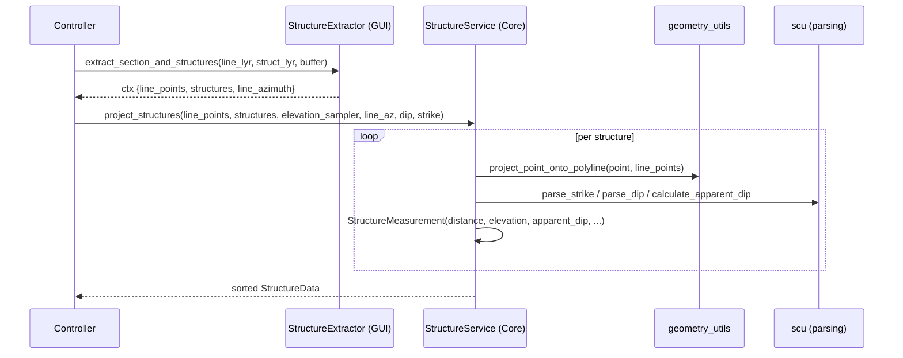

---
tags:
  - secinterp
  - code-walkthrough
  - core
  - structure
  - services
aliases:
  - structure_service.py
  - StructureService
cssclass: secinterp-note
---

# 19 — `core/services/structure_service.py`

> [!abstract] One-line summary
> The **pure structure service**: projects structural points onto the section line, samples elevation, and computes **apparent dip** — without touching QGIS.

**Path**: `core/services/structure_service.py` (187 lines)
**Class**: `StructureService(IStructureService, TranslatableMixin)`
**Interface**: `IStructureService` → `project_structures(line_points, struct_data, elevation_sampler, line_az, dip_field, strike_field) -> StructureData`
**Layer**: Core · Services
**Tags**: #secinterp #core #structure #services

---

## 🎯 Why does this file exist?

Structures arrive as **points with strike/dip**. This service projects them orthogonally to the section and corrects the dip:

| Input (adapter) | Output |
|-----------------|--------|
| `struct_data: list[{"point": (x,y), "attributes": {strike_field, dip_field, ...}}]` | `StructureData = list[StructureMeasurement]` sorted by `distance` |

> [!important] Fully QGIS-agnostic
> Only depends on `project_point_onto_polyline`, `parse_strike/dip`, and `calculate_apparent_dip` (pure math) + the injected `elevation_sampler`.

---

## 🧬 Extract → Compute relationship



---

## 🧱 `project_structures()` — orchestrator

```python
def project_structures(self, line_points, struct_data, elevation_sampler, line_az, dip_field, strike_field):
    projected_structs = []
    for item in struct_data:
        measurement = self._process_single_structure(
            item, line_points, elevation_sampler, line_az, dip_field, strike_field,
        )
        if measurement:
            projected_structs.append(measurement)
    projected_structs.sort(key=lambda x: x.distance)
    logger.info(self.tr("Processed {0} structural measurements").format(len(projected_structs)))
    return projected_structs
```

---

## 🧱 `_process_single_structure()` — per point

```python
def _process_single_structure(self, data, line_points, elevation_sampler, line_az, dip_field, strike_field):
    point = data.get("point")
    if point is None:
        return None
    proj_dist, proj_pt = project_point_onto_polyline(point, line_points)
    elev = elevation_sampler(proj_pt[0], proj_pt[1])

    parsed = self._parse_structural_data(data.get("attributes", {}), strike_field, dip_field, line_az)
    if not parsed:
        return None
    strike, dip_angle, app_dip = parsed

    return StructureMeasurement(
        distance=round(proj_dist, 1),
        elevation=round(elev, 1),
        apparent_dip=round(app_dip, 1),
        original_dip=dip_angle,
        original_strike=strike,
        attributes=data.get("attributes", {}),
    )
```

| Step | What it does |
|------|--------------|
| 1 | `project_point_onto_polyline(point, line_points)` → `(dist, proj_pt)` |
| 2 | `elevation_sampler(proj_pt.x, proj_pt.y)` → `elev` |
| 3 | `_parse_structural_data(attributes, strike_field, dip_field, line_az)` → `(strike, dip, app_dip)` or `None` |
| 4 | Creates `StructureMeasurement` rounded to 0.1 |

> [!tip] `elevation_sampler` is the controller's closure
> Keeps the core from importing `QgsRasterLayer`: the adapter injects `lambda (x,y): sample_elevation`.

---

## 🧱 `_parse_structural_data()` — strike/dip → apparent

```python
def _parse_structural_data(self, attributes, strike_field, dip_field, line_az):
    strike_raw = attributes.get(strike_field)
    dip_raw = attributes.get(dip_field)
    strike = scu.parse_strike(strike_raw)
    dip_angle, _ = scu.parse_dip(dip_raw)
    if strike is None or dip_angle is None:
        return None
    if not (0 <= strike <= 360) or not (0 <= dip_angle <= 90):
        return None
    app_dip = scu.calculate_apparent_dip(strike, dip_angle, line_az)
    return strike, dip_angle, app_dip
```

| Helper | Role |
|--------|------|
| `scu.parse_strike` | Tolerates `N30E`, `30`, `030°`, etc. |
| `scu.parse_dip` | Tolerates `45SE`, `45`, empty → tuple |
| `scu.calculate_apparent_dip` | `atan(tan(dip) * sin(strike - line_az))` |

> [!warning] Range validation
> Silently discards if `strike∉[0,360]` or `dip∉[0,90]` → `return None`.

---

## 🏛️ Design patterns present

| Pattern | Where | Purpose |
|---------|-------|---------|
| **Pure Strategy (Compute)** | whole class | Computation without QGIS |
| **Per-point Template** | `_process_single_structure` | Fail-soft per structure |
| **Callback (Strategy)** | `elevation_sampler` | Dependency inversion |

---

## 🧾 API summary

| Method | Signature |
|--------|-----------|
| `project_structures` | `(line_points, struct_data, elevation_sampler, line_az, dip_field, strike_field) -> StructureData` |
| `_process_single_structure` | `(data, line_points, elevation_sampler, line_az, dip_field, strike_field) -> StructureMeasurement | None` |

---

## 👀 Observations and notes

> [!success] Strengths
> - QGIS-agnostic and testable with fabricated data.
> - Fail-soft per measurement (one bad doesn't break the batch).

> [!warning] Points of attention
> - `attributes` passed by reference (mutability); better to copy.
> - Rounding to `0.1` loses scientific precision.

---

## 🔗 Related notes

- [[00 - Index]] — vault index
- [[10 - controller]] — orchestrates `_process_structures` (elevation closure)
- [[11 - domain]] — `StructureMeasurement`, `StructureData`
- [[25 - adapters]] — `StructureExtractor` (decoupled data producer)

---

*Note 19 of the SecInterp Code Walkthrough vault — v3.8.0*
