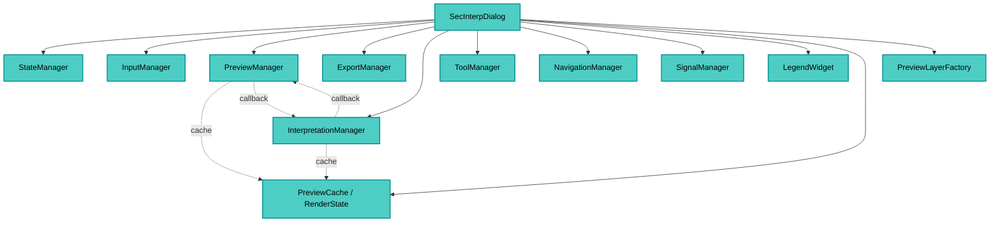

---
tags:
  - secinterp
  - code-walkthrough
  - gui
  - main-dialog
  - orchestrator
aliases:
  - main_dialog.py
  - SecInterpDialog
cssclass: secinterp-note
---

# 20 — `gui/main_dialog.py`

> [!abstract] One-line summary
> The **main dialog** (thin orchestrator): it composes `SecInterpMainWindow` and **delegates** to 7 specialized managers — it holds no business logic.

**Path**: `gui/main_dialog.py` (480 lines)
**Class**: `SecInterpDialog(SecInterpMainWindow)`
**Layer**: GUI
**Tags**: #secinterp #gui #main-dialog #orchestrator

---

## 🎯 Why does this file exist?

The dialog shouldn't be a "god object". It only **orchestrates**:

| Responsibility | Delegated to |
|----------------|--------------|
| State and persistence | `StateManager` |
| Signals/slots | `SignalManager` |
| Layer inputs | `InputManager` |
| Preview and rendering | `PreviewManager` |
| Export | `ExportManager` |
| Interpretations | `InterpretationManager` |
| Map tools | `ToolManager` + `NavigationManager` |
| Legend | `LegendWidget` |
| Cache/render | `PreviewCache` + `RenderState` + `PreviewLayerFactory` |

> [!important] Programmatic UI lives in `ui/main_window.py` (`SecInterpMainWindow`). This file **does not build widgets**: it only wires them.

---

## 🧬 Architecture — managers



---

## 🧱 `__init__(iface, plugin_instance, parent)`

```python
def __init__(self, iface, plugin_instance, parent=None):
    super().__init__(iface, parent)
    self.iface = iface
    self.plugin_instance = plugin_instance
    self.project = QgsProject.instance()
    self.messagebar = iface.messageBar() if iface else _NoOpMessageBar()

    self._init_managers()
    self.legend_widget = LegendWidget(self.preview_widget.canvas)
    self.render_state = RenderState()
    self.clear_cache_btn = QPushButton(self.tr("Clear Cache"))
    self.reset_defaults_btn = QPushButton(self.tr("Reset Defaults"))
    self.button_box.addButton(self.clear_cache_btn, ActionRole)
    self.button_box.addButton(self.reset_defaults_btn, ActionRole)

    self.tool_manager.initialize_tools()

    self.signal_manager = SignalManager(
        self, self.preview_manager, self.export_manager,
        self.tool_manager, self.state_manager,
    )
    self.signal_manager.connect_all()

    self.state_manager.update_all()
    self.state_manager.load_settings()
    self._save_on_close = True
```

### `_init_managers()` — dialog composition root

```python
preview_cache = PreviewCache()
pages = Pages(
    dem=self.page_dem, section=self.page_section, geology=self.page_geology,
    structure=self.page_struct, drillhole=self.page_drillhole, settings=self.page_settings
)

self.input_manager   = InputManager(pages, self.output_widget, self.tr)
self.state_manager   = StateManager(self)
self.preview_manager = PreviewManager(self, PreviewService(self.plugin_instance.controller), cache=preview_cache)
self.export_manager  = ExportManager(self)
self.state_manager.setup_indicators()
self.interpretation_manager = InterpretationManager(self, cache=preview_cache)
self.interpretation_manager.load_interpretations()
self.tool_manager  = ToolManager(self.preview_widget.canvas, self.preview_widget, self.tr,
                                 self.on_interpretation_finished, self.update_measurement_display)
self.navigation_manager = NavigationManager(self.preview_widget.canvas)
self.layer_factory = PreviewLayerFactory()

# Decoupled callbacks
self.preview_manager.set_interpretations_cleared_handler(self.interpretation_manager.clear_interpretations)
self.interpretation_manager.set_preview_update_handler(self.preview_manager.update_from_checkboxes)
```

> [!tip] Shared cache
> `PreviewCache` is **shared injection** between `PreviewManager` and `InterpretationManager` — a single source of truth for topography/geology/structures.

> [!note] Two-phase `StateManager`
> Created, then `setup_indicators()` and later `update_all()` / `load_settings()`.

---

## 🧱 Messages and errors

```python
def push_message(self, title, message, level=Qgis.MessageLevel.Info, duration=5, show_in_plugin=True):
    if self.messagebar:
        self.messagebar.pushMessage(title, message, level=level, duration=duration)
    if show_in_plugin:
        icon, color = {"Success": ("✓", "#28a745"), "Warning": ("⚠", "#ffc107"), ...}[level.name]
        self.preview_widget.results_text.append(
            f'<span style="color: {color};">{icon} {title}:</span> {message}'
        )

def handle_error(self, error: Exception, title: str = "Error") -> None:
    if isinstance(error, SecInterpError):
        logger.warning(f"{title}: {msg} - Details: {error.details}")
        self.show_dialog(title, msg, level="warning")
    else:
        logger.error(f"{title}: {msg}\n{traceback.format_exc()}")
        self.show_dialog(title, self.tr("{}\n\nPlease check the logs for details.").format(msg), level="critical")
```

| Method | Destination |
|--------|-------------|
| `push_message` | QGIS bar **and** results panel (colored HTML) |
| `show_dialog` | `gui/utils.show_user_message` (QMessageBox) |
| `handle_error` | `warning` (SecInterpError) vs `critical` (unexpected) |

---

## 🧱 Lifecycle and cleanup

```python
def wheelEvent(self, event):   # delegates to NavigationManager
def closeEvent(self, event):
    if self._save_on_close:
        self.state_manager.save_settings()
    self._cleanup_resources()
    super().closeEvent(event)

def _cleanup_resources(self):
    self._cleanup_map_tools()        # measure/interp reset
    self._cleanup_managers()         # save_interpretations + preview cleanup
    self._cleanup_signals_and_components() # signal_manager.disconnect_all + legend cleanup
```

> [!important] `_save_on_close`
> Flag for tests: avoids `QSettings` I/O when not needed.

---

## 🧱 UI delegation

The `toggle_*` and proxies are **thin wrappers** to managers:

```python
def toggle_measure_tool(self, checked: bool):        self.tool_manager.toggle_measure_tool(checked)
def toggle_interpretation_tool(self, checked: bool): self.tool_manager.toggle_interpretation_tool(checked)
def on_interpretation_finished(self, polygon):       self.interpretation_manager.handle_interpretation_finished(polygon)
@property def interpretations(self):                  return self.interpretation_manager.interpretations
def update_preview_checkbox_states(self):            self.state_manager.update_preview_checkbox_states()
```

---

## 🏛️ Design patterns present

| Pattern | Where | Purpose |
|---------|-------|---------|
| **Thin Dialog / Orchestrator** | whole class | Avoid god object |
| **Manager (decomposition)** | 7 managers | Single responsibility |
| **Shared Cache (DI)** | `PreviewCache` | Single source for topography/geol |
| **Observer (signals)** | `SignalManager.connect_all` | Centralized wiring |
| **No-op / Null Object** | `_NoOpMessageBar` | Tests without `iface` |

---

## 🧾 API extract

| Method | Role |
|--------|------|
| `__init__` | Composes managers + legend + buttons |
| `_init_managers` | Creates cache, pages, managers and cross callbacks |
| `push_message` / `show_dialog` / `handle_error` | Unified messaging |
| `wheelEvent` / `closeEvent` | Navigation and persistence |
| `open_help` | Opens `help/html/<locale>/index.html` with fallback |
| `toggle_*` | Delegation to `ToolManager` |

---

## 👀 Observations and notes

> [!success] Strengths
> - **Thin** dialog without business logic.
> - Decoupled, testable managers.
> - Thorough cleanup (tools, managers, signals, legend).

> [!warning] Points of attention
> - `self.interpretation_manager` is referenced **before** assignment (render_state comment duplicates the point).
> - Two-phase `StateManager` (`setup_indicators` + `update_all`/`load_settings`) couples to the dialog.
> - `_NoOpMessageBar.pushMessage` ignores args → silently drops messages in tests.

---

## 🔗 Related notes

- [[00 - Index]] — vault index
- [[01 - sec_interp_plugin]] — composition root that creates the dialog
- [[10 - controller]] — controller injected via `PreviewService`
- [[25 - adapters]] — adapters injected indirectly
- `gui/ui/main_window.py` — programmatic UI

---

*Note 20 of the SecInterp Code Walkthrough vault — v3.8.0*
