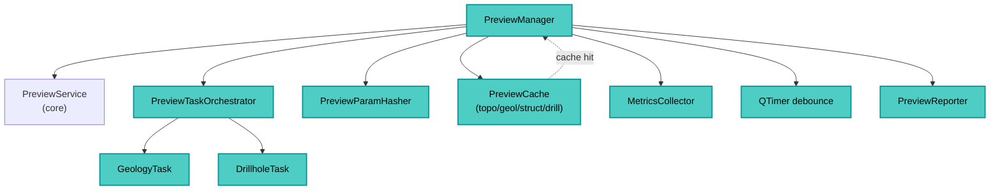

---
tags:
  - secinterp
  - code-walkthrough
  - gui
  - preview-manager
  - orchestrator
aliases:
  - dialog_preview_manager.py
  - PreviewManager
cssclass: secinterp-note
---

# 21 — `gui/dialog_preview_manager.py`

> [!abstract] One-line summary
> The **preview orchestrator**: handles synchronous generation, async tasks, cache, LOD, and rendering — everything after *Generate Preview* is clicked.

**Path**: `gui/dialog_preview_manager.py` (434 lines)
**Class**: `PreviewManager(TranslatableMixin)`
**Layer**: GUI · Managers
**Tags**: #secinterp #gui #preview-manager #orchestrator

---

## 🎯 Why does this file exist?

The preview combines **cache, validation, core services, QgsTask, zoom debounce, and rendering**. This manager centralizes:

| Responsibility | How |
|----------------|-----|
| Synchronous generation | `generate_preview()` + `PreviewService.generate_all` |
| Cache + hashing | `PreviewCache` + `PreviewParamHasher` |
| Async tasks | `PreviewTaskOrchestrator` (geology/drillholes) |
| Rendering | Delegation to `plugin.draw_preview()` |
| Adaptive LOD | `QTimer` debounce + `canvas.extentsChanged` |
| Messages/metrics | `PreviewReporter` + `MetricsCollector` |

> [!important] Thin controller, thick manager
> `SecInterpDialog` only delegates `preview_manager.generate_preview()`. The logic lives here.

---

## 🧬 Internal components



---

## 🧱 `__init__` — wiring

```python
def __init__(self, dialog, preview_service=None, cache=None):
    self.dialog = dialog
    self.preview_service = preview_service or PreviewService(self.dialog.plugin_instance.controller)
    self.metrics = MetricsCollector()
    self.orchestrator = PreviewTaskOrchestrator(self)
    self.hasher = PreviewParamHasher()
    self.cached_data = cache if cache is not None else PreviewCache()
    self.last_params_hash: str | None = None
    self.last_result: PreviewResult | None = None
    self._on_interpretations_cleared: Callable | None = None
    self.debounce_timer = QTimer()
    self.debounce_timer.setSingleShot(True)
    self.connect_signals()
```

### Signals

```python
def connect_signals(self):
    self.debounce_timer.timeout.connect(self._update_lod_for_zoom)
    self.dialog.preview_widget.canvas.extentsChanged.connect(self._on_extents_changed)
```

> [!tip] Debounce
> `extentsChanged` fires on every pixel of zoom/pan. The `QTimer` groups events and re-renders only after `ZOOM_DEBOUNCE_MS`.

---

## 🧱 `generate_preview()` — main entry

```python
def generate_preview(self) -> tuple[bool, str]:
    self.metrics.clear()
    try:
        with PerformanceTimer("Total Preview Generation", self.metrics):
            params = self.dialog.plugin_instance._get_and_validate_inputs()
            if not params:
                return False, self.tr("Invalid configuration")

            result = self._process_preview_data(params)
            self._update_ui_state(params, result)

    except SecInterpError as e:
        self.dialog.handle_error(e, self.dialog.tr("Preview Error"))
        return False, str(e)
    except (AttributeError, TypeError, ValueError) as e:
        logger.exception("Unexpected UI error")
        self.dialog.handle_error(e, self.dialog.tr("Unexpected Preview Error"))
        return False, str(e)
    except Exception as e:
        logger.exception("Critical unexpected error")
        self.dialog.handle_error(e, self.dialog.tr("Critical Error"))
        return False, str(e)
    else:
        return True, self.tr("Preview generated successfully")
```

| Step | What it does |
|------|--------------|
| 1 | Clears metrics |
| 2 | Validates `PreviewParams` via `plugin._get_and_validate_inputs()` |
| 3 | `_process_preview_data` (cache/compute + async trigger) |
| 4 | `_update_ui_state` (CRS + render + message) |

> [!note] Error hierarchy
> `SecInterpError` → dialog warning; UI errors → logged and dialog; critical → critical dialog.

---

## 🧱 `_process_preview_data()` — cache and dispatch

```python
def _process_preview_data(self, params: PreviewParams) -> PreviewResult:
    if self._is_data_unchanged(params):
        logger.info("Using cached data (params unchanged)")
        return self.last_result

    self._handle_geometric_changes(params)
    transform_context = self._get_transform_context()

    result = self.preview_service.generate_all(params, transform_context)

    self._update_cache_and_metrics(result)
    self._cancel_active_tasks()
    self._trigger_async_updates(params)

    self.last_result = result
    return result
```

| Method | Role |
|--------|------|
| `_is_data_unchanged` | Compares `hasher.calculate_hash(params)` with `last_params_hash` |
| `_handle_geometric_changes` | Detects section geometry change → clears interpretations via callback |
| `_get_transform_context` | `mapCanvas().mapSettings().transformContext()` |
| `_trigger_async_updates` | `orchestrator.start_geology_task` + `start_drillhole_task` |

---

## 🧱 `_update_ui_state()` and rendering

```python
def _update_ui_state(self, params: PreviewParams, result: PreviewResult) -> None:
    line_lyr = resolve_layer(params.line_layer)
    self._update_crs_label(line_lyr)
    self._run_render_pipeline(result)
    result_msg = PreviewReporter.format_results_message(result, self.metrics)
    self.dialog.preview_widget.results_text.setPlainText(result_msg)
```

```python
def _run_render_pipeline(self, result: PreviewResult) -> None:
    with PerformanceTimer("Rendering", self.metrics):
        self._render_cached_data()

def _render_cached_data(self, preserve_extent=False):
    opts = self.dialog.get_preview_options()
    max_points = PreviewService.calculate_max_points(
        canvas_width=self.dialog.preview_widget.canvas.width(),
        manual_max=opts["max_points"], auto_lod=opts["auto_lod"],
    )
    self.dialog.plugin_instance.draw_preview(
        self.cached_data["topo"], self.cached_data.get("geol"),
        self.cached_data["struct"], drillhole_data=self.cached_data["drillhole"],
        max_points=max_points, preserve_extent=preserve_extent,
        use_adaptive_sampling=opts["use_adaptive_sampling"],
    )
```

> [!tip] `preserve_extent`
> In `_update_lod_for_zoom` it is `True` to keep the canvas position during zoom re-render.

---

## 🧱 `update_from_checkboxes()` and async

```python
def update_from_checkboxes(self) -> None:
    if not self.last_result:
        return
    self._render_cached_data()
```

```python
def _on_geology_finished(self, results):
    if results and isinstance(results, list):
        self.cached_data["geol"] = results
    self.update_from_checkboxes()
    self._update_results_display()
    self.orchestrator.remove_task(self.orchestrator.geology_task)
```

---

## 🏛️ Design patterns present

| Pattern | Where | Purpose |
|---------|-------|---------|
| **Orchestrator** | whole class | Coordinates cache, tasks, render |
| **Cache + Hasher** | `PreviewParamHasher` | Avoids recomputation |
| **Debounce** | `QTimer` + `extentsChanged` | LOD without spam |
| **Callback decoupling** | `set_interpretations_cleared_handler` | Preview ↔ Interpretations |

---

## 🧾 API extract

| Method | Role |
|--------|------|
| `generate_preview()` | Full flow (validate → process → UI) |
| `_process_preview_data` | Cache/compute + async trigger |
| `_run_render_pipeline` / `_render_cached_data` | Rendering from cache |
| `update_from_checkboxes` | Re-render on visibility toggle |
| `_on_extents_changed` / `_update_lod_for_zoom` | LOD on zoom |

---

## 👀 Observations and notes

> [!success] Strengths
> - Hash-based cache avoids repeated work.
> - Interpretation clearing on geometry change.
> - Layered error handling.

> [!warning] Points of attention
> - Depends on `dialog.plugin_instance._get_and_validate_inputs` (coupling to the composition root).
> - `last_result` and `cached_data` duplicate state (sync needed).

---

## 🔗 Related notes

- [[00 - Index]] — vault index
- [[10 - controller]] — core that generates data
- [[11 - domain]] — `PreviewParams`, `PreviewResult`, `ProfileData`
- [[20 - main_dialog]] — creates and wires this manager
- `gui/preview_task_orchestrator.py` — background tasks

---

*Note 21 of the SecInterp Code Walkthrough vault — v3.8.0*
