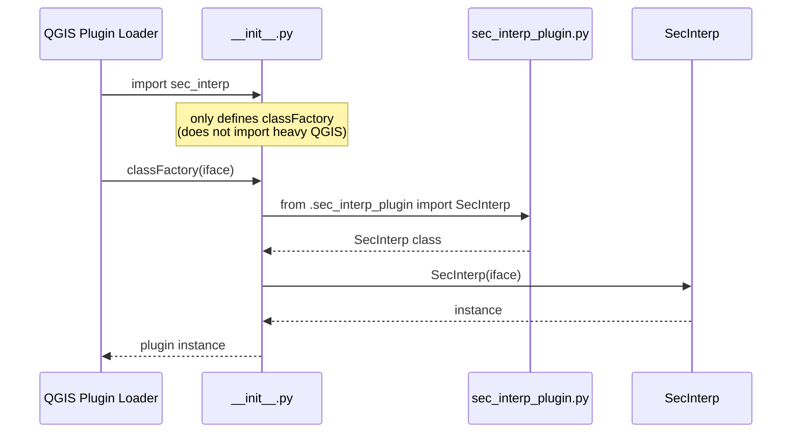

---
tags:
  - secinterp
  - code-walkthrough
  - entry-point
  - plugin-factory
  - lazy-import
aliases:
  - __init__.py
  - classFactory
  - SecInterp factory
cssclass: secinterp-note
---

# `__init__.py`

> [!abstract] One-line summary
> This is the plugin's **official entry point**: QGIS imports this package and calls `classFactory(iface)` to obtain the `SecInterp` instance.

**Path**: `__init__.py` (49 lines)
**Main function**: `classFactory(iface)`
**Layer**: Entry point (bootstrap)
**Tags**: #secinterp #entry-point #lazy-import

---

## 🎯 Why does this file exist?

QGIS knows nothing about the `SecInterp` class. Its **load contract** is:

1. Find a Python package named after the plugin (the `sec_interp/` folder).
2. Import its `__init__.py`.
3. Find and call the function **`classFactory(iface)`**.
4. Use the returned object as the plugin instance.

This file fulfills that contract. It is **deliberately minimal**: it only imports and constructs.

> [!important] QGIS contract
> The name `classFactory` is **mandatory and case-sensitive**. It cannot be renamed.

---

## 🧬 Load flow diagram



---

## 📦 The code, line by line

### 1. Package docstring

```python
from __future__ import annotations

"""SecInterp QGIS Plugin.

This plugin provides tools for cross-section generation and geological interpretation
data extraction from QGIS layers.
"""
```

> [!warning] Subtle style detail
> The docstring comes **after** `from __future__ import annotations`.
> Strictly, a module docstring must be the **first** statement for `__doc__` to be assigned.
> Here the string becomes a bare expression (not the module docstring).
> It works, but `sec_interp.__doc__` will be `None`. A minor detail inherited from the Plugin Builder.

### 2. License header (GPL v2+)

A comment block generated by the **Plugin Builder** with:
- Author: Juan M Bernales
- Date: 2025-11-15
- `git sha: $Format:%H$` (Git placeholder)
- GPL v2-or-later license

> [!note] `$Format:%H$`
> This is a Git keyword. If an `ident` filter is enabled, it is replaced by the commit hash.
> It usually stays literal.

### 3. Type-only import under `TYPE_CHECKING`

```python
from typing import TYPE_CHECKING

if TYPE_CHECKING:
    from qgis.gui import QgsInterface
```

> [!tip] Why not import `QgsInterface` directly
> - `qgis.gui` is a heavy module.
> - The type is only needed by **type checkers** (mypy/pyright), not at runtime.
> - `TYPE_CHECKING` is `False` at runtime → the import never happens in production.
> - Avoids loading QGIS during static analysis or tests that don't need it.

### 4. The `classFactory` function

```python
# noinspection PyPep8Naming
def classFactory(iface: QgsInterface):  # pylint: disable=invalid-name
    """Load SecInterp class from file SecInterp.

    Args:
        iface: A QGIS interface instance.

    Returns:
        SecInterp: An instance of the plugin.

    """
    from .sec_interp_plugin import SecInterp

    return SecInterp(iface)
```

| Element | Explanation |
|---------|-------------|
| `# noinspection PyPep8Naming` | Silences PyCharm about the camelCase name |
| `# pylint: disable=invalid-name` | Silences Pylint for the same reason |
| `from .sec_interp_plugin import SecInterp` | **Deferred import**: happens *inside* the function |
| `return SecInterp(iface)` | Constructs and returns the instance |

> [!important] Why the import is deferred (lazy)
> If `from .sec_interp_plugin import SecInterp` were at the **top** of the module, it would run
> when the package is imported — before QGIS is ready, and dragging in the whole dependency tree.
> Putting it **inside** `classFactory` means the import only happens when QGIS requests the instance.
> Benefits:
> - Faster plugin-manager startup.
> - Fewer circular-import errors.
> - Heavy loading is concentrated in a single controlled point.

---

## 🔗 Relationship with note 01

`classFactory` is the **first link** in the load chain:

```
QGIS → __init__.classFactory(iface)          ← this note (02)
        └─> SecInterp.__init__(iface)         ← note 01
             └─> SafeLoader.lazy_load(...)     ← DI
                  └─> ProfileController, Dialog, ...
```

See [[sec_interp_plugin]] for the full lifecycle.

---

## 🏛️ Design patterns present

| Pattern | Where | Purpose |
|---------|-------|---------|
| **Factory Function** | `classFactory` | Encapsulate instance creation |
| **Lazy Import** | import inside the function | Defer heavy QGIS loading |
| **Type-only Import** | `if TYPE_CHECKING:` | Typing without runtime cost |
| **Plugin Contract** | name `classFactory` | Fulfill the QGIS contract |

---

## 🧾 API summary

| Symbol | Type | Responsibility |
|--------|------|----------------|
| `classFactory(iface)` | function | Returns a `SecInterp` instance |
| `QgsInterface` | type (TYPE_CHECKING) | Type annotation for `iface` |

---

## 👀 Observations and notes

> [!success] Strengths
> - Extremely simple and aligned with the QGIS contract.
> - Deferred import → clean startup.
> - Typing without a runtime dependency.

> [!warning] Points of attention
> - The module docstring is after `from __future__` → `__doc__` is `None`. It could be moved up (keeping in mind a docstring must come before any import, including `__future__`, to be valid). Reorder to: docstring → `from __future__`.
> - The `SecInterp` docstring says "from file SecInterp" (inherited from the builder); the real file is `sec_interp_plugin.py`. Cosmetic detail.

> [!question] Open questions
> - Should `importlib.import_module` be used for maximum tolerance (consistent with `SafeLoader`)?
>   No: here an import failure **must** propagate so QGIS marks the plugin as unloadable.

---

## 🔗 Related notes

- [[Index]] — vault index
- [[sec_interp_plugin]] — `SecInterp` class and lifecycle
- [[logger_config]] — centralized logging
- [[safe_loader]] — fault-tolerant loading (contrast with this strict import)

---

*Note of the SecInterp Code Walkthrough vault — v3.8.0*
