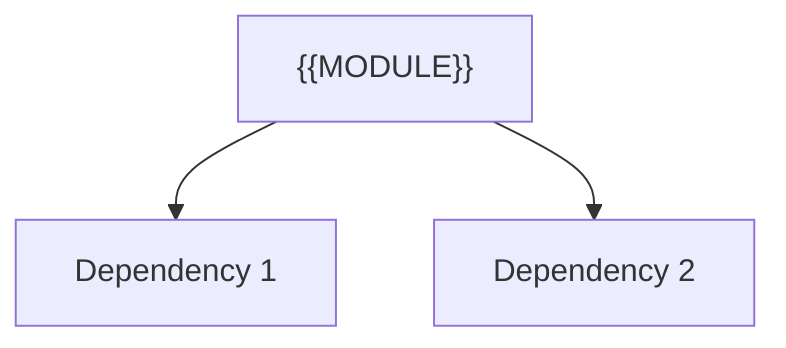

---
tags:
  - secinterp
  - code-walkthrough
  - {{LAYER_TAG}}
  - {{DOMAIN_TAG}}
aliases:
  - {{FILE_BASENAME}}
  - {{CLASS_NAME}}
cssclass: secinterp-note
---

# `{{REL_PATH}}`

> [!abstract] One-line summary
> {{ONE_LINE_SUMMARY}} — what this module does in one sentence, without touching QGIS if it is core.

**Path**: `{{REL_PATH}}` ({{LINES}} lines)
**Main class/function**: `{{CLASS_NAME}}`
**Layer**: {{LAYER}} (QGIS-agnostic / GUI · Type)
**Tags**: #secinterp #{{LAYER_TAG}} #{{DOMAIN_TAG}}

---

## 🎯 Why does this file exist?

| Problem | Solution |
|---------|----------|
| {{PROBLEM_1}} | {{SOLUTION_1}} |
| {{PROBLEM_2}} | {{SOLUTION_2}} |

> [!important] Architectural note
> {{ARCH_NOTE}} (e.g. "QGIS-agnostic", "Extract Adapter", "Factory").

---

## 🧬 Relationship diagram



> [!tip] How to read
> Solid arrow = imports/delegates; dashed = callback/injected.

---

## 📦 Imports — architectural reading

```python
# {{FILE}}
{{IMPORT_BLOCK}}
```

| # | Observation |
|---|-------------|
| ① | {{OBS_1}} |
| ② | {{OBS_2}} |

---

## 🧱 Main section — `{{MAIN_SYMBOL}}`

```python
{{CODE_SNIPPET}}
```

| Parameter | Role |
|-----------|------|
| `{{PARAM}}` | {{ROLE}} |

---

## 🏛️ Design patterns present

| Pattern | Where | Purpose |
|--------|-------|---------|
| {{PATTERN}} | {{WHERE}} | {{WHY}} |

---

## 🧾 API summary

| Symbol | Signature / Inherits | Typical use |
|--------|----------------------|-------------|
| `{{SYMBOL}}` | `{{SIG}}` | {{USE}} |

---

## 👀 Observations and notes

> [!success] Strengths
> - {{STRENGTH}}

> [!warning] Points of attention
> - {{RISK}}

> [!question] Open questions
> - {{QUESTION}}

---

## 🔗 Related notes

- [[00 - Index]] — vault index
- [[{{RELATED_1}}]] — {{WHY_1}}
- [[{{RELATED_2}}]] — {{WHY_2}}

---

*Note of the SecInterp Code Walkthrough vault — v3.8.0*
