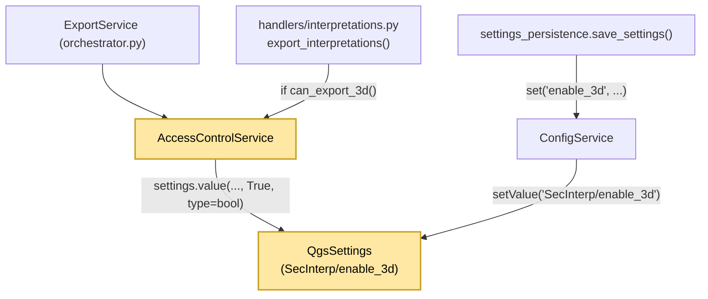
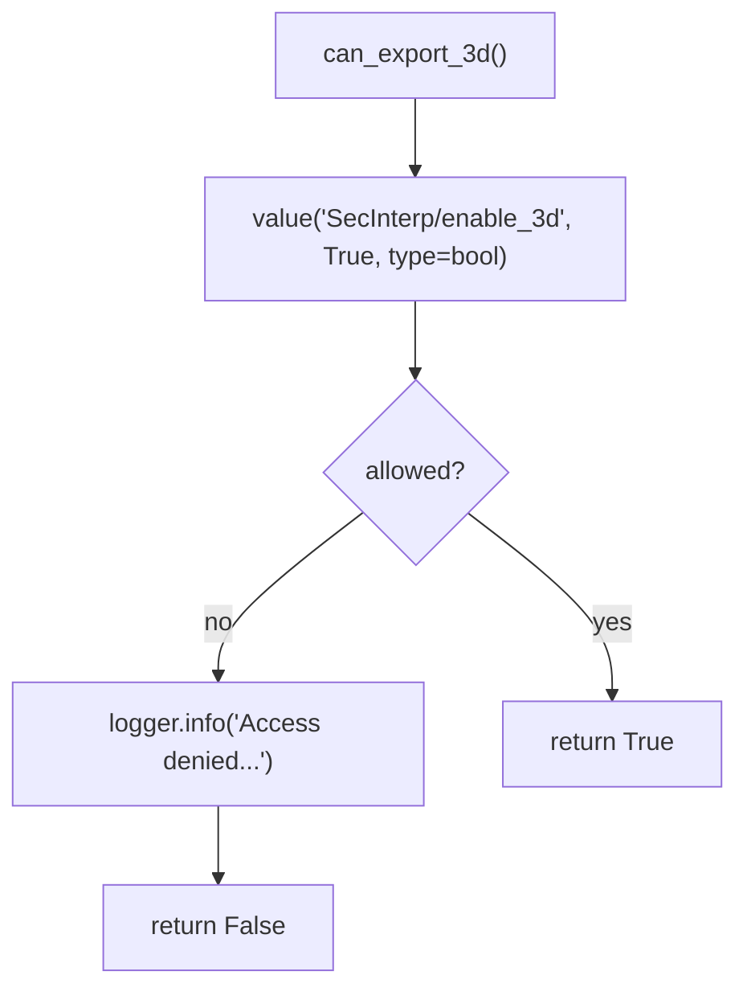

---
tags:
  - secinterp
  - code-walkthrough
  - core
  - access-control
aliases:
  - access_control_service.py
  - AccessControlService
cssclass: secinterp-note
---

# `core/services/access_control_service.py`

> [!abstract] One-line summary
> Reads the `SecInterp/enable_3d` flag from `QgsSettings` to decide whether the user may run **3D export**; enabled by default.

**Path**: `core/services/access_control_service.py` (36 lines)
**Class**: `AccessControlService`
**Layer**: Core · Services — ⚠️ with a `qgis.core` dependency (grey area)
**Tags**: #secinterp #core #access-control

---

## 🎯 Why does this file exist?

3D export is a **restricted feature**: the user can disable it from Settings. Rather than scattering `if settings.value("enable_3d")` across exporters, it is centralized in a single decision point.

| Problem | Solution |
|---------|----------|
| Each handler would read the flag its own way | A single `can_export_3d()` method |
| The settings key would be hardcoded and scattered | An implicit constant `"SecInterp/enable_3d"` in one place |
| Traceability is needed when denied | `logger.info(...)` on the rejection path |
| Ambiguous default | Explicit: `True` (opt-out) |

> [!warning] Core boundary grey area
> `core/AGENTS.md` forbids `qgis.core` in `/core`. This file **imports `QgsSettings`** directly. It is one of the documented pragmatic exceptions: QGIS persistence is treated as infrastructure, not domain logic. It should be flagged as architectural debt.

---

## 🧬 Relationship diagram



> [!tip] How to read
> Yellow nodes mark the QGIS dependency. The UI writes the flag through `ConfigService`; the gate only **reads** it.

---

## 📦 Imports — architectural reading

```python
from qgis.core import QgsSettings

from sec_interp.logger_config import get_logger

logger = get_logger(__name__)
```

| # | Observation |
|---|-------------|
| ① | `QgsSettings` is the **only** reason this module is not QGIS-agnostic. |
| ② | It imports neither `core/domain` nor interfaces: the gate has no abstract contract. |
| ③ | It uses the centralized logger (`SecInterp.*`) to leave a trace of denials. |

---

## 🧱 `AccessControlService` — the gate

```python
class AccessControlService:
    """Service to manage access to restricted features."""

    def __init__(self) -> None:
        """Initialize the access control service."""
        self.settings = QgsSettings()

    def can_export_3d(self) -> bool:
        """Check if the user has permission to export 3D data."""
        # Linked to the UI toggle in Settings persisted via QgsSettings.
        # Defaults to enabled (True); users can opt out via the toggle.
        allowed = self.settings.value("SecInterp/enable_3d", True, type=bool)

        if not allowed:
            logger.info("Access denied for restricted feature: 3D Export")

        return bool(allowed)
```

| Element | Role |
|---------|------|
| `__init__` | Instantiates its own `QgsSettings` (no injection) |
| `settings.value(..., True, type=bool)` | Reads the flag with **default `True`** and type coercion |
| `if not allowed` | Logs the denial at `INFO` level |
| `return bool(allowed)` | Normalizes to a plain `bool` for the caller |

### Decision flow



---

## 🏛️ Design patterns present

| Pattern | Where | Purpose |
|---------|-------|---------|
| **Feature Flag / Policy** | `can_export_3d` | Centralized feature switch |
| **Guard / Gatekeeper** | calls `if access_control.can_export_3d()` | Prevents running the 3D export |
| **Service** | `AccessControlService` | Domain object with a single responsibility |
| **Fail-Open Default** | `default=True` | Missing config enables rather than blocks |

---

## 🧾 API summary

| Symbol | Signature / Inherits | Typical use |
|--------|----------------------|-------------|
| `AccessControlService` | `class` (no inheritance) | Instantiated by `ExportService` (`self.access_control`) |
| `__init__` | `() -> None` | Creates the internal `QgsSettings` |
| `can_export_3d` | `() -> bool` | `if access_control and access_control.can_export_3d():` |

---

## 👀 Observations and notes

> [!success] Strengths
> - **Single decision point**: the gate is queried in one method.
> - **Sensible default**: opt-out; 3D works right after install.
> - **Traceability**: every denial lands in the plugin log.

> [!warning] Points of attention
> - **Core boundary violation**: `QgsSettings` in `/core` contradicts `core/AGENTS.md`. The correct approach would be an injected `Protocol` plus an adapter in the GUI layer.
> - **No interface**: there is no `IAccessControlService`; consumers depend on the concrete class.
> - **No caching**: every call reads settings; acceptable at low frequency, but unnecessary.
> - `bool(allowed)` over a value already coerced to `bool` is redundant (cheap defense).

> [!question] Open questions
> - Will it migrate to `core/interfaces` with a `QgsSettingsAccessControl` adapter in GUI?
> - Should the default align with `ConfigService` (`enable_3d` is not in `_load_from_qgs_settings`)?
> - Would a `RestrictedFeature` enum be better than one method per feature?

---

## 🔗 Related notes

- [[Index]] — vault index
- [[export_package]] — orchestrator that instantiates it
- [[export_service]] — historical shim that queried the gate
- [[config]] — settings service with the same `QgsSettings` pattern
- [[layer_gui_ui_pages_settings]] — UI that writes the 3D toggle
- [[settings_page]] — Settings page that persists `enable_3d`

---

*Note of the SecInterp Code Walkthrough vault — v3.8.0*
