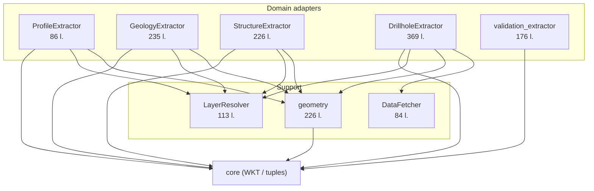

---
tags:
  - secinterp
  - code-walkthrough
  - gui
  - adapters
  - extract-phase
aliases:
  - gui/adapters
  - Adapters
  - Extract phase
cssclass: secinterp-note
---

# `gui/adapters/`

> [!abstract] One-line summary
> It is the **Extract phase**: eight modules that translate the world of QGIS objects (layers, features, rasters) into DTOs and primitives the core consumes without touching `qgis.*`.

**Path**: `gui/adapters/` (8 modules + `__init__.py` · ~1522 lines)
**Key symbols**: `ProfileExtractor`, `GeologyExtractor`, `StructureExtractor`, `DrillholeExtractor`, `DataFetcher`, `LayerResolver`, `geometry`, `validation_extractor`
**Layer**: GUI · Adapters
**Tags**: #secinterp #gui #adapters #extract-phase

---

## 🎯 Why does this package exist?

It is the **QGIS ↔ Core** boundary. The pattern is always the same: read live QGIS objects and return serializable data.

| Problem | Solution |
|---------|----------|
| The core must be QGIS-agnostic and thread-safe | Each adapter converts to `ProfileData`, `GeologyContext`, `DrillholeContext`, `LayerMetadata`… |
| Layer references arrive as ID/name/object | `LayerResolver` centralizes and caches |
| Surveys/intervals require N reads | `DataFetcher.fetch_bulk_data` in a single pass |
| QGIS geometry repeats across every extractor | `geometry.py` as a shared toolbox |
| QGIS `QVariant`s must not cross threads | Everything is sanitized to `int/float/str/bool/None` |

> [!important] The only layer with `QgsProject`/`QgsGeometry`
> If a `core/` module needs geometry, it receives WKT or primitives. It never imports `qgis.*`.

---

## 🧬 Package map



---

## 📦 Imports — architectural reading

```python
from qgis.core import (QgsProject, QgsGeometry, QgsFeatureRequest, QgsRaster,
                       QgsDistanceArea, QgsWkbTypes, QgsVectorLayer, QgsRasterLayer)
from qgis.PyQt.QtCore import QCoreApplication
from sec_interp.core.domain.task_inputs import GeologyContext, DrillholeContext, OutcropSegments
from sec_interp.core.domain import ProfileData, FieldType
from sec_interp.core.exceptions import DataMissingError, GeometryError, ValidationError
```

| # | Observation |
|---|-------------|
| ① | `QgsProject` appears only in `layer_resolver` and `validation_extractor` (reference resolution). |
| ② | `QgsGeometry`/`QgsDistanceArea` are concentrated in `geometry.py`, which the rest import as a module. |
| ③ | The DTOs (`GeologyContext`, `DrillholeContext`, `LayerMetadata`) come from `sec_interp.core.*`: adapters never redefine them. |
| ④ | `QCoreApplication` is used in every `tr()` for i18n. |

---

## 🧱 `profile_extractor.py` (86 l.) — `ProfileExtractor`

```python
def extract_profile(self, line_lyr, raster_lyr, band_number=1, interval=None) -> ProfileData:
    line_feat = next(line_lyr.getFeatures(), None)
    if not line_feat:
        raise DataMissingError(self.tr("Line layer has no features"), ...)
    geom = line_feat.geometry()
    if not geom or geom.isNull():
        raise GeometryError(self.tr("Line geometry is not valid"), ...)
    da = geometry.create_distance_area(line_lyr.crs())
    points = geometry.sample_elevation_along_line(geom, raster_lyr, band_number, da, interval=interval)
    return [(round(p.x(), 1), round(p.y(), 1)) for p in points]
```

| Method | Role |
|--------|------|
| `calculate_lod_interval(line_lyr, canvas_width)` | `line_len / max(200, canvas_width * 2)` for adaptive LOD |
| `extract_profile(...)` | Topographic profile `[(dist, elev)]` |

> [!note] `ProfileData = list[tuple[float, float]]`
> It is a core type alias, not a QGIS object. Rounding to 1 decimal shrinks the payload.

---

## 🧱 `structure_extractor.py` (226 l.) — `StructureExtractor` + `SectionContext`

| Method | Role |
|--------|------|
| `extract_section_and_structures(line_lyr, struct_lyr, buffer_m)` | Entry point → `SectionContext \| None` |
| `extract_line(line_geom)` | Vertices + start + azimuth |
| `detach_structures(struct_lyr, line_geom, buffer_m)` | `buffer(buffer_m, 25)` + bbox filter + `intersects` |
| `sample_elevation(raster_lyr, x, y, band_number=1)` | Single-point DEM sampling (injected as a closure) |

> Full detail in [[structure_extractor]].

---

## 🧱 `geology_extractor.py` (235 l.) — `GeologyExtractor`

| Method | Role |
|--------|------|
| `extract_context(...)` | Entry point → `GeologyContext` |
| `_generate_master_profile(...)` | Densifies by `rasterUnitsPerPixelX()` and samples the DEM |
| `_extract_outcrop_data(...)` | Outcrops in the line bbox → WKT |
| `_intersect_outcrop(...)` | `line.intersection(polygon)` → stretches `(d0, d1, wkt)` |

> Full detail in [[geology_extractor]].

---

## 🧱 `drillhole_extractor.py` (369 l.) — `DrillholeExtractor`

| Method | Role |
|--------|------|
| `extract_context(...)` | Entry point → `DrillholeContext \| None` |
| `_detach_collars(...)` | Buffer + CRS + Z pre-sampling |
| `_prepare_feature_request(...)` | bbox + `setDestinationCrs` with the `transformContext` |
| `_validate_fields(...)` | Collar/survey/interval field validation |

> `DEFAULT_BUFFER_SEGMENTS = 8`. Full detail in [[drillhole_extractor]].

---

## 🧱 `validation_extractor.py` (176 l.) — validation metadata

| Function | Role |
|----------|------|
| `resolve_layer_metadata(layer_ref)` | Resolve + extract in one step |
| `extract_layer_metadata(layer)` | Dispatch vector/raster/unknown |
| `extract_vector_metadata` / `extract_raster_metadata` | Fields, geometry, bands, CRS |
| `build_validation_params(params)` | `PreviewParams` → `ValidationParams` (DTOs) |

> Full detail in [[validation_extractor]].

---

## 🧱 `feature_fetcher.py` (84 l.) — `DataFetcher`

```python
def fetch_bulk_data(self, layer, hole_ids, fields) -> dict[Any, list[tuple[Any, ...]]]:
    if not self._validate_fields(layer, fields):
        return {}
    id_f = fields["id"]
    is_survey = "depth" in fields
    ids_str = ", ".join([f"'{hid!s}'" for hid in hole_ids])
    request = QgsFeatureRequest().setFilterExpression(f'"{id_f}" IN ({ids_str})')
    for feat in layer.getFeatures(request):
        hole_id = feat[id_f]
        data = self._extract_data_tuple(feat, fields, is_survey)
        if data:
            result_map.setdefault(hole_id, []).append(data)
    if is_survey:
        for h_id in result_map:
            result_map[h_id].sort(key=lambda x: x[0])   # sort by depth
    return result_map
```

| Aspect | Detail |
|--------|--------|
| Survey vs interval detection | `"depth" in fields` |
| Survey tuple | `(depth, azim, incl)` as `float` |
| Interval tuple | `(from, to, lith)` as `float, float, str` |
| Ordering | Surveys are sorted by depth |
| Validation | `_validate_fields` checks `id` + required fields |

> [!warning] `IN` expression by interpolation
> `ids_str` is built with `f"'{hid!s}'"`. It works for numeric and simple text IDs; IDs containing quotes could break the expression.

---

## 🧱 `layer_resolver.py` (113 l.) — `LayerResolver`

```python
@classmethod
def resolve(cls, layer_ref, use_cache=True) -> QgsMapLayer | None:
    if layer_ref is None:
        return None
    if not isinstance(layer_ref, str):
        return layer_ref if hasattr(layer_ref, "isValid") and layer_ref.isValid() else None
    ref_str = str(layer_ref)
    cached = cls._resolve_from_cache(ref_str, use_cache)
    if cached: return cached
    project = QgsProject.instance()
    layer = cls._resolve_by_id(project, ref_str)
    return layer or cls._resolve_by_name(project, ref_str)
```

| Method | Role |
|--------|------|
| `resolve(ref, use_cache=True)` | Object / ID / name → `QgsMapLayer` |
| `_resolve_from_cache` | Caches and invalidates broken entries |
| `_resolve_by_id` | Caches by ID **and** name |
| `_resolve_by_name` | Caches by name **and** ID |
| `clear_cache()` / `invalidate(layer_id)` | Explicit cache management |

> [!note] Class-level cache
> `_cache` is a class `dict` (shared state). `resolve_layer(ref)` is the legacy wrapper that delegates here.

---

## 🧱 `geometry.py` (226 l.) — QGIS toolbox

| Function | Role |
|----------|------|
| `create_distance_area(crs)` | `QgsDistanceArea` with CRS + ellipsoid |
| `extract_all_vertices(geometry)` | Vertices of any geometry |
| `get_line_vertices(geometry)` | Line vertices (validates `LineGeometry`) |
| `extract_lines_from_geometry(geometry)` | Splits MultiLine into `QgsGeometry` |
| `densify_line_by_interval(geometry, interval)` | Densifies via `_densify_line_points` (pure math) |
| `calculate_segment_range(seg_geom, line_start, da)` | Normalized `(dist_start, dist_end)` |
| `sample_point_elevation(raster, point, band=1)` | Single-point raster sampling |
| `sample_elevation_along_line(...)` | Profile sampled along the line |
| `prepare_profile_context(line_lyr)` | `(geom, line_start, da)` with clear errors |
| `line_length(line_lyr)` | Length of the first feature |

> [!tip] The single QGIS geometry dependency
> By concentrating `QgsGeometry`/`QgsDistanceArea` here, the other adapters (and the core) stay clean. `_densify_line_points` is pure math without QGIS.

---

## 🏛️ Design patterns present

| Pattern | Where | Purpose |
|---------|-------|---------|
| **Adapter / Bridge** | whole package | QGIS → DTOs |
| **Facade** | `extract_context` / `extract_profile` | A single entry point |
| **Strategy / injection** | `DataFetcher`, `elevation_sampler` | Injectable behaviour |
| **Singleton / Cache** | `LayerResolver._cache` | Avoid repeated `mapLayer()` calls |
| **Fail-fast** | `_validate_inputs`, `_validate_fields` | Errors before extracting |
| **Graceful degradation** | fallbacks (`return []`, `0.0`, optional DEM) | Robustness |

---

## 🧾 API summary

| Module | Main symbol | Output |
|--------|-------------|--------|
| `profile_extractor` | `ProfileExtractor.extract_profile` | `ProfileData` |
| `geology_extractor` | `GeologyExtractor.extract_context` | `GeologyContext` |
| `structure_extractor` | `StructureExtractor.extract_section_and_structures` | `SectionContext` |
| `drillhole_extractor` | `DrillholeExtractor.extract_context` | `DrillholeContext` |
| `validation_extractor` | `build_validation_params` | `ValidationParams` |
| `feature_fetcher` | `DataFetcher.fetch_bulk_data` | `dict[id, list[tuple]]` |
| `layer_resolver` | `LayerResolver.resolve` | `QgsMapLayer \| None` |
| `geometry` | `sample_elevation_along_line` and helpers | primitives / `QgsGeometry` |

---

## 👀 Observations and notes

> [!success] Strengths
> - A single, clear boundary between QGIS and the core.
> - All QGIS geometry lives in one module (`geometry.py`).
> - Dependency injection (`DataFetcher`, sampler) makes mocking easy.

> [!warning] Points of attention
> - Buffers (`buffer_m`, `buffer_width`) are interpreted in **layer units**, not always metres.
> - `LayerResolver._cache` is class-level state: it must be invalidated when layers reload.
> - `DataFetcher` builds `IN` expressions by string interpolation.
> - The long signatures of `DrillholeExtractor.extract_context` suggest a parameter dataclass.

> [!question] Open questions
> - Should every extractor share a common interface (`extract() -> DTO`)?
> - Should `validation_extractor._resolve_layer` be unified with `LayerResolver`?

---

## 🔗 Related notes

- [[structure_extractor]] — structure adapter in detail
- [[geology_extractor]] — geology adapter in detail
- [[drillhole_extractor]] — drillhole adapter in detail
- [[validation_extractor]] — validation adapter in detail
- [[layer_gui_adapters]] — GUI · adapters layer index
- [[controller]] — consumes the contexts in the classic pipeline
- [[tasks]] — DTOs cross into the `QgsTask`s
- [[domain]] — definition of the DTOs
- [[Index]] — vault index

---

*Note of the SecInterp Code Walkthrough vault — v3.8.0*
