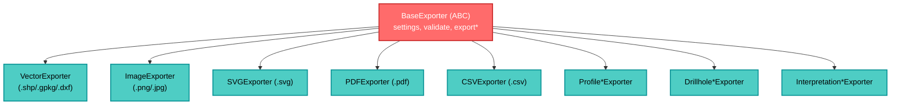

---
tags:
  - secinterp
  - code-walkthrough
  - exporters
aliases:
  - base_exporter.py
  - BaseExporter
cssclass: secinterp-note
---

# 30 — `exporters/base_exporter.py`

> [!abstract] One-line summary
> The **abstract base exporter**: defines the `export()` contract and provides secure path validation and settings access.

**Path**: `exporters/base_exporter.py` (137 lines)
**Class**: `BaseExporter(ABC)`
**Layer**: Exporters
**Tags**: #secinterp #exporters

---

## 🎯 Why does this file exist?

Without a common base, each exporter would re-implement path validation and settings. This class solves:

| Problem | Solution |
|---------|----------|
| Inconsistent contract | `export(path, data, layer_name?) -> bool` abstract |
| Path traversal / unwritable dirs | `validate_export_path()` with `resolve()` and `validate_safe_output_path` |
| Scattered settings | `self.settings` + `get_setting(key, default)` |
| Unvalidated extensions | `get_supported_extensions()` + `validate_path()` |

> [!important] The Factory lives in `exporters/__init__.py`
> `get_exporter(extension, settings)` picks the concrete subclass by extension.

---

## 🧬 Hierarchy



---

## 🧱 Contract — `export()`

```python
class BaseExporter(ABC):
    def __init__(self, settings: dict[str, Any]) -> None:
        self.settings = settings

    @abstractmethod
    def export(self, output_path: Path, data: Any, layer_name: str | None = None) -> bool: ...

    @abstractmethod
    def get_supported_extensions(self) -> list[str]: ...
```

| Parameter | Role |
|-----------|------|
| `output_path` | Disk destination (`Path`) |
| `data` | Data to export (type depends on exporter: `list[dict]`, `QgsMapSettings`, etc.) |
| `layer_name` | Conceptual name inside containers (GeoPackage) |
| **Return** | `True/False` (does not raise unless severe) |

---

## 🧱 Validation — `validate_export_path()`

```python
def validate_export_path(self, output_path: Path, base_dir: Path | None = None) -> tuple[bool, str]:
    resolved_path = output_path.resolve()
    if base_dir and not str(resolved_path).startswith(str(base_dir.resolve())):
        return False, "Path traversal detected: {path} is outside of {base}"

    parent_dir = output_path.parent
    is_valid, error, _ = validate_safe_output_path(
        str(parent_dir), base_dir=base_dir, must_exist=False, create_if_missing=True,
    )
    if not is_valid:
        return False, f"Invalid export path: {error}"
    return True, ""
```

> [!tip] Defense in depth
> `resolve()` neutralizes `../` and symlinks → compare with `base_dir`.
> Then validates the parent directory (permissions, creation).

---

## 🧱 Helpers — `validate_path()` and `get_setting()`

```python
def validate_path(self, path: Path) -> bool:
    return path.suffix.lower() in self.get_supported_extensions()

def get_setting(self, key: str, default: Any = None) -> Any:
    return self.settings.get(key, default)
```

> [!note] `get_supported_extensions` is abstract
> Each subclass declares its list (e.g. `[".shp", ".gpkg", ".dxf"]`).

---

## 🧱 Factory — `get_exporter()`

In `exporters/__init__.py`:

```python
def get_exporter(extension: str, settings: dict) -> BaseExporter:
    extension = extension.lower()
    if extension in [".png", ".jpg", ".jpeg"]: return ImageExporter(settings)
    if extension == ".svg":  return SVGExporter(settings)
    if extension == ".pdf":  return PDFExporter(settings)
    if extension == ".csv":  return CSVExporter(settings)
    if extension in [".shp", ".gpkg", ".dxf"]: return VectorExporter(settings)
    raise ValueError(f"Unsupported file extension: {extension}")
```

> [!tip] Centralized factory
> `ExportManager` (`[[dialog_export_manager]]`) knows only the extension, not concrete classes.

---

## 🏛️ Design patterns present

| Pattern | Where | Purpose |
|---------|-------|---------|
| **Template Method** | `BaseExporter` | Common contract + shared validation |
| **Factory** | `get_exporter` | Selection by extension |
| **Strategy** | each subclass | Format-specific strategy |

---

## 🔗 Related notes

- [[Index]] — vault index
- [[dialog_export_manager]] — consumes `BaseExporter` and the factory
- [[vector_exporter]] — generic vector implementation
- `core/validation/path_validator.py` — `validate_safe_output_path`

---

*Note 30 of the SecInterp Code Walkthrough vault — v3.8.0*
