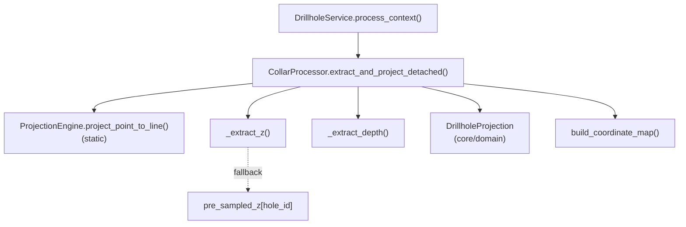

---
tags:
  - secinterp
  - code-walkthrough
  - core
  - drillhole
aliases:
  - collar_processor.py
  - CollarProcessor
cssclass: secinterp-note
---

# `core/services/drillhole/collar_processor.py`

> [!abstract] One-line summary
> Projects **detached collars** (dicts with `point`/`attributes`) onto the section line, extracts Z and depth tolerantly, and filters by `buffer_width`.

**Path**: `core/services/drillhole/collar_processor.py` (100 lines)
**Class**: `CollarProcessor`
**Layer**: Core · Drillhole (QGIS-agnostic)
**Tags**: #secinterp #core #drillhole

---

## 🎯 Why does this file exist?

The GUI extracts collars from the layer and hands them over as **primitive data** (`{"id", "point", "attributes"}`). Someone must turn that raw dict into a valid `DrillholeProjection` without touching QGIS again.

| Problem | Solution |
|---------|----------|
| The collar may lack an ID or point | Guard clauses: early `return None` |
| Elevation Z may be missing or garbage | `_extract_z()` with fallback to `pre_sampled_z` |
| Collars outside the section buffer | `offset <= buffer_width` filter |
| An ID→coordinate map is needed elsewhere | `build_coordinate_map()` |

> [!important] Core boundary
> It receives primitives and returns a `core/domain` DTO. The only "external" dependency is `ProjectionEngine` (also pure). It **never imports `qgis`.**

---

## 🧬 Relationship diagram



---

## 📦 Imports — architectural reading

```python
import contextlib
from typing import Any

from sec_interp.core.domain import DrillholeProjection
from sec_interp.core.services.drillhole.projection_engine import ProjectionEngine
```

| # | Observation |
|---|-------------|
| ① | `contextlib.suppress` parses floats without noisy `try/except`. |
| ② | `DrillholeProjection` comes from `core/domain` → the processor **produces DTOs**, not QGIS objects. |
| ③ | `ProjectionEngine` is static (called without instantiation); no `qgis.*` or `PyQt` → complies with `core/AGENTS.md`. |

---

## 🧱 `extract_and_project_detached()` — the main flow

```python
def extract_and_project_detached(
    self, collar_data, line_points, buffer_width,
    collar_id_field, collar_z_field, collar_depth_field, pre_sampled_z=None,
) -> DrillholeProjection | None:
    point = collar_data.get("point")
    if not point:
        return None

    attrs = collar_data.get("attributes", {})
    hole_id = collar_data.get("id")
    if not hole_id:
        hole_id = attrs.get(collar_id_field)
    if not hole_id:
        return None

    z = self._extract_z(attrs, collar_z_field, hole_id, pre_sampled_z)
    depth = self._extract_depth(attrs, collar_depth_field)

    dist_along, offset = ProjectionEngine.project_point_to_line(point, line_points)

    if offset <= buffer_width:
        return DrillholeProjection(
            hole_id=str(hole_id), distance=dist_along, elevation=z,
            offset=offset, total_depth=depth,
        )
    return None
```

| Step | Role |
|------|------|
| `point` guard | No coordinate, no projection |
| `hole_id` guard | Tries `collar_data["id"]` and, if missing, `attrs[collar_id_field]` |
| `_extract_z` / `_extract_depth` | Tolerant attribute parsing + Z fallback |
| `ProjectionEngine.project_point_to_line` | Returns `(dist_along, offset)` |
| `offset <= buffer_width` filter | Only collars inside the section band |
| `DrillholeProjection` | DTO with `hole_id` normalized to `str` |

---

## 🧱 Private helpers

```python
def _extract_z(self, attrs, z_field, hole_id, pre_sampled) -> float:
    z = 0.0
    if z_field:
        with contextlib.suppress(ValueError, TypeError):
            z = float(attrs.get(z_field, 0.0))
    if z == 0.0 and pre_sampled and hole_id in pre_sampled:
        z = pre_sampled[hole_id]
    return z

def _extract_depth(self, attrs, depth_field) -> float:
    depth = 0.0
    if depth_field:
        with contextlib.suppress(ValueError, TypeError):
            depth = float(attrs.get(depth_field, 0.0))
    return depth
```

| Helper | Strategy |
|--------|----------|
| `_extract_z` | Z field → if `0.0`, DEM pre-sampled elevation |
| `_extract_depth` | Depth field → `0.0` if empty/invalid |

### `build_coordinate_map()`

It walks `collar_data` and builds `{id: point}`, skipping entries without `id` or `point`. It is the `hole_id -> (x, y)` index other steps use without going back to the layer.

---

## 🏛️ Design patterns present

| Pattern | Where | Purpose |
|---------|-------|---------|
| **Adapter (Extract boundary)** | `extract_and_project_detached` | Raw dict → domain DTO |
| **Guard Clauses** | `if not point`, `if not hole_id` | Explicit early exits |
| **Strategy / Static Utility** | `ProjectionEngine` | Interchangeable, stateless math |
| **Fallback Chain** | `_extract_z` | Field → pre-sampling → `0.0` |
| **Null Object** | `return None` | "Unprojectable collar" without raising |

---

## 🧾 API summary

| Symbol | Signature / Inherits | Typical use |
|--------|----------------------|-------------|
| `CollarProcessor` | `class` (no inheritance) | Injected into `DrillholeService` |
| `extract_and_project_detached` | `(collar_data, line_points, buffer_width, collar_id_field, collar_z_field, collar_depth_field, pre_sampled_z=None) -> DrillholeProjection \| None` | Projects one collar |
| `build_coordinate_map` | `(collar_data: list[dict]) -> dict[Any, tuple[float, float]]` | ID→XY index |
| `_extract_z` | `(attrs, z_field, hole_id, pre_sampled) -> float` | Elevation resolution |
| `_extract_depth` | `(attrs, depth_field) -> float` | Depth resolution |

---

## 👀 Observations and notes

> [!success] Strengths
> - **Dirty-data tolerant**: `contextlib.suppress` avoids crashes from non-numeric strings.
> - **No QGIS**: testable with dicts and lists of tuples.
> - **Normalizes the ID** to `str`, unifying numeric and textual collars.

> [!warning] Points of attention
> - A legitimate `Z` of `0.0` (sea-level elevation) is confused with "missing Z" and triggers the `pre_sampled_z` fallback. This is a design ambiguity.
> - `_extract_depth` has no fallback: if the field is missing, `total_depth = 0.0`.
> - The filter is inclusive (`<=`), so a collar exactly on the edge is kept.

> [!question] Open questions
> - Should `z is None` be distinguished from `z == 0.0`, and should the discard reason be returned?

---

## 🔗 Related notes

- [[Index]] — vault index
- [[projection_engine]] — projection math used here
- [[drillhole_service]] — calls it per collar
- [[trajectory_engine]] — receives `DrillholeProjection.elevation`/`total_depth`
- [[domain]] — defines `DrillholeProjection`
- [[layer_core_services_drillhole]] — pipeline sub-layer

---

*Note of the SecInterp Code Walkthrough vault — v3.8.0*
