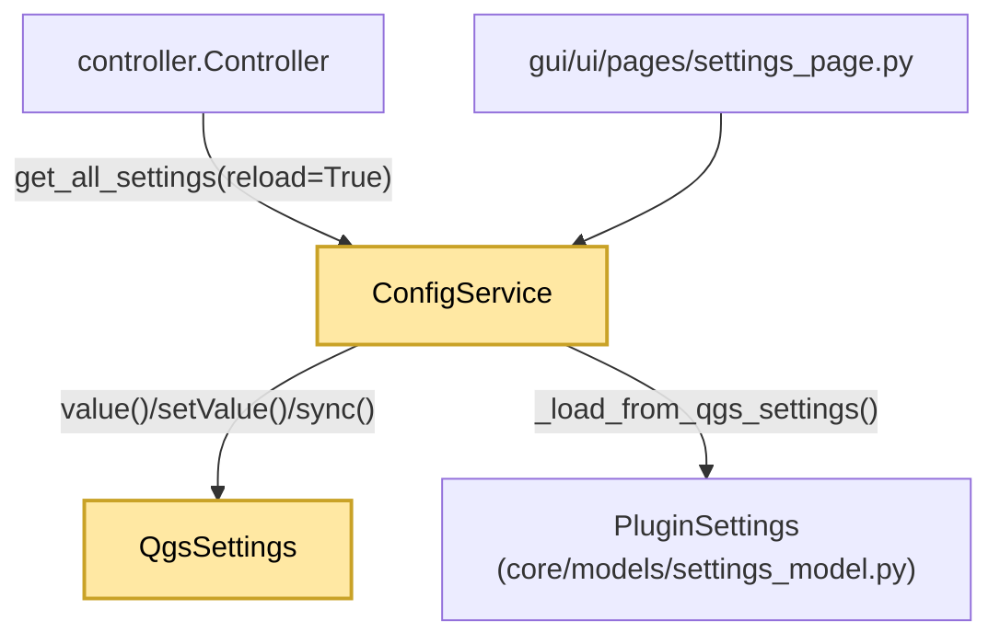

---
tags:
  - secinterp
  - code-walkthrough
  - core
  - config
aliases:
  - config.py
  - ConfigService
cssclass: secinterp-note
---

# `core/config.py`

> [!abstract] One-line summary
> Configuration service that reads/writes `QgsSettings` under `SecInterp/`, caches and validates a typed `PluginSettings`, and exposes `get`/`set`/`reset_defaults`.

**Path**: `core/config.py` (250 lines)
**Class**: `ConfigService`
**Model**: `PluginSettings` in `core/models/settings_model.py`
**Layer**: Core · Config (⚠️ with `QgsSettings` and `QCoreApplication`)
**Tags**: #secinterp #core #config

---

## 🎯 Why does this file exist?

Without a service, every manager would read `QgsSettings` with ad-hoc keys (`"SecInterp/buffer_dist"`) and duplicated defaults. `ConfigService` centralizes keys, defaults, validation, and translation.

| Problem | Solution |
|---------|----------|
| Scattered keys and defaults | `PREFIX = "SecInterp/"` + `DEFAULT_*` constants |
| Unvalidated dictionaries | `PluginSettings.from_dict()` with validating dataclasses |
| Costly re-reads of settings | `_current_settings` cache + `reload` flag |
| Untranslated messages | `tr()` via `QCoreApplication.translate("ConfigService", ...)` |

> [!warning] Core boundary grey area
> It imports `QgsSettings` (QGIS persistence) and `QCoreApplication` (Qt i18n). `core/AGENTS.md` forbids QGIS/Qt dependencies in `/core`; this service is a recognized pragmatic exception.

---

## 🧬 Relationship diagram



> [!tip] How to read
> `ConfigService` is a **repository** over `QgsSettings` that produces a validated DTO (`PluginSettings`). The controller forces `reload=True` whenever the UI changes something.

---

## 🧱 Class constants

`PREFIX = "SecInterp/"`; defaults: `DEFAULT_SCALE=50000.0`, `DEFAULT_BUFFER_DIST=100.0`, `DEFAULT_VERT_EXAG=1.0`, `DEFAULT_DPI=300`, `DEFAULT_MAX_POINTS=10000`, `DEFAULT_DEM_BAND=1`, `DEFAULT_SAMPLING_INTERVAL=10.0`, `DEFAULT_EXPORT_QUALITY=95`, `DEFAULT_PREVIEW_WIDTH=800`, `DEFAULT_PREVIEW_HEIGHT=600`; supported: `SUPPORTED_IMAGE_FORMATS`, `SUPPORTED_VECTOR_FORMATS`, `SUPPORTED_DOCUMENT_FORMATS`. `PREFIX` is prepended to every key; `DEFAULT_*` avoid magic numbers; `SUPPORTED_*` filter formats in dialogs.

---

## 🧱 `get_all_settings()` — cache and reload

```python
def get_all_settings(self, reload: bool = False) -> PluginSettings:
    if reload or self._current_settings is None:
        self._current_settings = self._load_from_qgs_settings()
    return self._current_settings
```

| Case | Behavior |
|------|----------|
| First call (`None`) / `reload=True` | Loads or forces a reload from `QgsSettings` |
| Subsequent | Returns the cached instance |

---

## 🧱 `_load_from_qgs_settings()` — mapping to the DTO

It builds a nested dict by category (`section`, `dem`, `geology`, `structure`, `drillhole`, `interpretation`, `preview`, `export`) and validates it with `PluginSettings.from_dict`.

| Detail | Value |
|--------|-------|
| `custom_fields` | JSON parsed with `try/except (ValueError, TypeError)` → `[]` |
| Validation failure | `logger.exception(...)` + default `PluginSettings()` |

> [!important] Fail-safe
> If `PluginSettings.from_dict` raises, it logs and returns the default model: **the plugin is never left without settings**.

---

## 🧱 `get()` — dual default and coercion

```python
def get(self, key: str, default: Any = None) -> Any:
    full_key = self.PREFIX + key
    static_defaults = { "scale": self.DEFAULT_SCALE, "dh_use_geom": True, ... }
    if default is None:
        default = static_defaults.get(key)
    value = self.settings.value(full_key, None)
    if value is None:
        value = self.settings.value("/SecInterp/" + key, default)   # leading-slash compat
    if isinstance(value, str):
        return value.lower() == "true" if value.lower() in ("true", "false") else value
    return value
```

| Feature | Reason |
|---------|--------|
| `static_defaults` | Backward compatibility for legacy keys |
| `"/SecInterp/" + key` fallback | Installs that stored with a leading slash |
| `"true"/"false"` coercion | `QgsSettings` sometimes returns strings instead of bools |

---

## 🧱 `set()`, `reset_defaults()` and `tr()`

```python
def set(self, key: str, value: Any) -> None:
    self.settings.setValue(self.PREFIX + key, value)
    self.settings.sync()
    self._current_settings = None          # invalidate the cache
    logger.debug(f"Config set: {self.PREFIX + key} = {value}")

def reset_defaults(self) -> None:           # rewrites 15 known defaults
    logger.info(self.tr("Configuration reset to defaults initiated"))
    self.set("scale", self.DEFAULT_SCALE)
```

| Method | Effect |
|--------|--------|
| `set` | Persists, calls `sync()`, and **invalidates** the cache |
| `reset_defaults` | Explicitly rewrites the known defaults |
| `tr()` | `QCoreApplication.translate("ConfigService", message)` — fixed i18n context |

---

## 🏛️ Design patterns present

| Pattern | Where | Purpose |
|---------|-------|---------|
| **Repository / DAO** | `get`/`set` over `QgsSettings` | Isolate persistence |
| **DTO Mapper** | `_load_from_qgs_settings` | Dict → validated `PluginSettings` |
| **Cache-Aside** | `_current_settings` + `reload` | Avoid re-reads |
| **Fail-safe** | `try/except` → `PluginSettings()` | Never leave without configuration |

---

## 🧾 API summary

| Symbol | Signature / Inherits | Typical use |
|--------|----------------------|-------------|
| `get_all_settings` | `(reload: bool = False) -> PluginSettings` | `cfg.get_all_settings(reload=True)` |
| `get` / `set` | `(key, default=None) -> Any` / `(key, value) -> None` | Read/persist a key |
| `reset_defaults` | `() -> None` | Restore configuration |
| `tr` | `(message: str) -> str` | Translate service messages |

---

## 👀 Observations and notes

> [!success] Strengths
> - **Single source of truth** for keys and defaults; centralized validation via dataclasses.
> - **Safe degradation**: corrupted settings do not break startup.

> [!warning] Points of attention
> - **Dual default system**: `DEFAULT_*` constants and `static_defaults` inside `get()`; they can diverge.
> - `_load_from_qgs_settings` is a long method (~100 lines) that exceeds the recommended complexity threshold.
> - `get()` mixes legacy logic (leading slash, string coercion) with the modern model.

> [!question] Open questions
> - Should `ConfigService` implement a `Protocol` in `core/interfaces` and move `QgsSettings` to an adapter, decomposing `_load_from_qgs_settings`?

---

## 🔗 Related notes

- [[Index]] — vault index
- [[controller]] — `config_service` + `reload_settings()`
- [[layer_core_models]] — defines `PluginSettings` and its dataclasses
- [[settings_page]] — UI that persists via `ConfigService`
- [[access_control_service]] — another direct consumer of `QgsSettings`
- [[domain]] — plugin domain DTOs

---

*Note of the SecInterp Code Walkthrough vault — v3.8.0*
