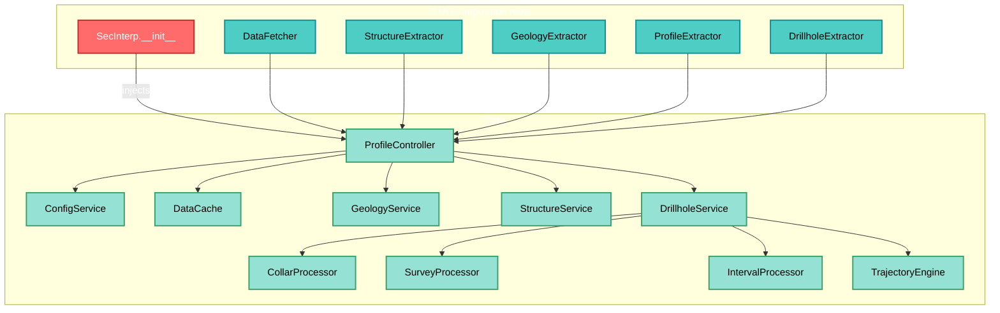
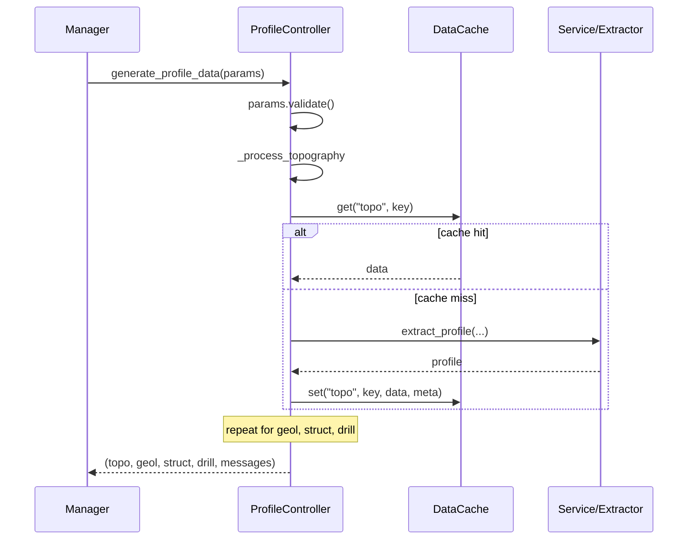

---
tags:
  - secinterp
  - code-walkthrough
  - core
  - orchestrator
  - caching
  - di
aliases:
  - controller.py
  - ProfileController
cssclass: secinterp-note
---

# `core/controller.py`

> [!abstract] One-line summary
> This is the core's **central orchestrator**: it coordinates the services (topography, geology, structures, drillholes) through **injected adapters** and manages a **granular per-component cache**.

**Path**: `core/controller.py` (425 lines)
**Main class**: `ProfileController(TranslatableMixin)`
**Layer**: Core (QGIS-agnostic)
**Tags**: #secinterp #core #orchestrator #caching #di

---

## 🎯 Why does this file exist?

The controller is the **entry point of business logic**. Its mission:

1. **Orchestrate** four data domains (topo, geology, structures, drillholes).
2. **Cache** each component separately (avoid recomputing what didn't change).
3. **Inject** the GUI adapters (*Extract* phase) without directly depending on QGIS.
4. **Accumulate** status messages for the UI.

> [!important] QGIS-agnostic (verified)
> `controller.py` **imports nothing from `qgis.*`**.
> All layer interaction happens via the injected *extractors* (`gui/adapters/*`).
> This respects the **Extract-then-Compute** pattern and makes the core testable without QGIS.

---

## 🧬 Orchestration architecture



---

## 📦 Imports — architectural reading

```python
import hashlib
import time
from typing import Any

from sec_interp.core.config import ConfigService          # ①
from sec_interp.core.data_cache import DataCache
from sec_interp.core.domain import (                       # ②
    DrillholeProjection, GeologySegment, PreviewParams, StructureMeasurement,
)
from sec_interp.core.exceptions import ProcessingError
from sec_interp.core.utils.i18n import TranslatableMixin
from sec_interp.core.utils.safe_loader import SafeLoader
from sec_interp.logger_config import get_logger
```

| # | Observation |
|---|-------------|
| ① | Only internal core dependencies + stdlib. **Zero `qgis.*`**. |
| ② | The domain DTOs (`PreviewParams`, `GeologySegment`…) define the data contracts. |

---

## 🔧 `__init__` — Dependency Injection

```python
def __init__(
    self,
    data_fetcher=None,
    structure_extractor=None,
    geology_extractor=None,
    profile_extractor=None,
    drillhole_extractor=None,
) -> None:
    self.config_service = ConfigService()
    self.data_cache = DataCache()
    self.settings = self.config_service.get_all_settings()

    # Adapters injected from the composition root (GUI)
    self.data_fetcher = data_fetcher
    self.structure_extractor = structure_extractor
    self.geology_extractor = geology_extractor
    self.profile_extractor = profile_extractor
    self.drillhole_extractor = drillhole_extractor
    ...
```

### Internal services (lazy + safe)

```python
# Drillhole processors
self.collar_processor   = SafeLoader.lazy_load("...collar_processor", "CollarProcessor")
self.survey_processor   = SafeLoader.lazy_load("...survey_processor", "SurveyProcessor")
self.interval_processor = SafeLoader.lazy_load("...interval_processor", "IntervalProcessor")
self.trajectory_engine  = SafeLoader.lazy_load("...trajectory_engine", "TrajectoryEngine")

# QGIS-agnostic services
self.geology_service  = SafeLoader.lazy_load("...geology_service", "GeologyService")
self.structure_service= SafeLoader.lazy_load("...structure_service", "StructureService")
self.drillhole_service= SafeLoader.lazy_load(
    "...drillhole_service", "DrillholeService",
    collar_processor=self.collar_processor,
    survey_processor=self.survey_processor,
    interval_processor=self.interval_processor,
    data_fetcher=self.data_fetcher,
    trajectory_engine=self.trajectory_engine,
)
```

> [!tip] Service composition
> `DrillholeService` receives its 4 collaborators via constructor (Facade).
> See [[drillhole_service]] for the sub-system breakdown.

> [!note] `data_fetcher` crosses layers
> The `DataFetcher` (GUI) is passed **twice**: to the controller and to `DrillholeService`.
> It is the lowest-level adapter for fetching features from QGIS.

---

## 🔄 `generate_profile_data(params)` — Main orchestration

```python
def generate_profile_data(self, params: PreviewParams) -> tuple[...]:
    params.validate()
    messages: list[str] = []
    cache_meta = {
        "max_points": params.max_points,
        "canvas_width": params.canvas_width,
        "timestamp": time.time(),
    }

    profile_data   = self._process_topography(params, cache_meta, messages)   # 1
    geol_data      = self._process_geology(params, cache_meta, messages)      # 2
    struct_data    = self._process_structures(params, cache_meta, messages)   # 3
    drillhole_data = self._process_drillholes(params, cache_meta, messages)   # 4

    return profile_data, geol_data, struct_data, drillhole_data, messages
```



> [!important] Granular per-component cache
> Each domain has its **own namespace** in `DataCache`: `topo`, `geol`, `struct`, `drill` (and `main`).
> If only geology changes, topography is served from cache — not recomputed.

---

## 🔑 `_get_cache_sub_key(param_values)` — Cache key

```python
def _get_cache_sub_key(self, param_values: list[Any]) -> str:
    hasher = hashlib.md5()  # nosec B324
    for val in param_values:
        if hasattr(val, "id"):     # QGIS layers → use their ID
            val = val.id()
        hasher.update(str(val).encode("utf-8"))
    return hasher.hexdigest()
```

| Detail | Reason |
|--------|--------|
| **MD5** | Not security — it's a cache key → `# nosec B324` (Bandit) |
| `hasattr(val, "id")` | A QGIS layer is identified by its `id()`, not its `repr` |
| `str(val)` | Normalizes any type (int, float, str) to text |

> [!warning] `MD5` and the security linter
> Bandit flags `hashlib.md5` as `B324` (insecure hash) by default.
> Here it is **not** cryptography: it's a cache key. The `# nosec B324` comment documents and suppresses the alert.

> [!caution] Rigor note
> `hashlib.md5()` without arguments fails in **FIPS mode**. In extreme production, use `hashlib.md5(usedforsecurity=False)` (Python 3.9+) instead of `# nosec`.

---

## 1️⃣ `_process_topography(...)`

```python
topo_key = self._get_cache_sub_key([params.band_num, params.max_points])
profile_data = self.data_cache.get("topo", topo_key)

if not profile_data:
    if not line_lyr or not raster_lyr:
        raise ProcessingError(self.tr("Required layers for topography are missing."))
    if not self.profile_extractor:
        raise ProcessingError(self.tr("Topography service failed to load."))
    profile_data = self.profile_extractor.extract_profile(line_lyr, raster_lyr, params.band_num)
    if not profile_data:
        raise ProcessingError(self.tr("No topographic profile data was generated."))

self.data_cache.set("topo", topo_key, profile_data, cache_meta)
messages.append(self.tr("✓ Data processed successfully!\n\nTopography: {0} points").format(...))
```

| Feature | Detail |
|---------|--------|
| **Mandatory** | Unlike the others, topography **raises `ProcessingError`** if missing |
| **Key** | `[band_num, max_points]` |
| **Adapter** | `profile_extractor.extract_profile(...)` (Extract phase) |

> [!note] Why topography is "mandatory"
> It is the basis of the section. Without a topographic profile there is nothing to show, so it fails fast instead of returning `None`.

---

## 2️⃣ `_process_geology(...)`

```python
if not params.outcrop_layer:
    return None                       # optional

geol_key = self._get_cache_sub_key(
    [params.outcrop_layer, params.outcrop_name_field, params.band_num]
)
geol_data = self.data_cache.get("geol", geol_key)

if not geol_data:
    context = self.geology_extractor.extract_context(...)   # EXTRACT
    geol_data = self.geology_service.build_segments(context) # COMPUTE
```

> [!important] Explicit Extract-then-Compute
> - `geology_extractor.extract_context(...)` → converts QGIS layers into a pure *context*.
> - `geology_service.build_segments(context)` → **pure computation**, no QGIS.
> See [[geology_service]].

---

## 3️⃣ `_process_structures(...)`

```python
ctx = self.structure_extractor.extract_section_and_structures(line_lyr, struct_lyr, params.buffer_dist)
if ctx is None:
    return None

def elevation_sampler(x: float, y: float) -> float:
    return self.structure_extractor.sample_elevation(raster_lyr, x, y, params.band_num)

struct_data = self.structure_service.project_structures(
    line_points=ctx.line_points,
    struct_data=ctx.structures,
    elevation_sampler=elevation_sampler,   # ← callback injection
    line_az=ctx.line_azimuth,
    dip_field=params.dip_field,
    strike_field=params.strike_field,
)
```

> [!tip] Closure as a sampling strategy
> `elevation_sampler` is a **closure** encapsulating raster access.
> This lets `structure_service.project_structures` (pure core) obtain elevations
> **without knowing QGIS**: it just calls `elevation_sampler(x, y)`.
> Dependency inversion in action.

---

## 4️⃣ `_process_drillholes(...)`

```python
if not params.collar_layer:
    return None                       # optional

drill_key = self._get_cache_sub_key(
    [params.collar_layer, params.survey_layer, params.interval_layer, params.buffer_dist]
)
drillhole_data = self.data_cache.get("drill", drill_key)
if drillhole_data:
    return drillhole_data

survey_fields   = {"id": ..., "depth": ..., "azim": ..., "incl": ...}
interval_fields = {"id": ..., "from": ..., "to": ..., "lith": ...}

context = self.drillhole_extractor.extract_context(
    params.line_layer, params.buffer_dist, params.collar_layer, params.collar_id_field, ...
)
if context is None:
    return None

_, drillhole_data = self.drillhole_service.process_context(context)   # COMPUTE
```

| Feature | Detail |
|---------|--------|
| **Key** | `[collar_layer, survey_layer, interval_layer, buffer_dist]` |
| **Fields** | Grouped into `survey_fields` / `interval_fields` dicts |
| **Return** | `process_context` returns a tuple; only the second element is used |

> [!note] Why `_, drillhole_data = ...`
> `process_context` returns `(something, drillhole_data)`. Using `_` explicitly discards what isn't needed.

---

## 🗄️ Caching strategy

`DataCache` is used with **namespaces** and **keys**:

| Namespace | Key | Content |
|-----------|-----|---------|
| `main` | hash of `inputs` (dict) | Full result (legacy public API) |
| `topo` | hash `[band_num, max_points]` | Topographic profile |
| `geol` | hash `[outcrop_layer, name_field, band_num]` | Geological segments |
| `struct` | hash `[struct_layer, buffer, dip, strike, band_num]` | Projected measurements |
| `drill` | hash `[collar, survey, interval, buffer]` | Projected drillholes |

> [!important] Cache-aside
> The pattern is: **look up → on miss, compute → store**.
> `cache_meta` (max_points, canvas_width, timestamp) is stored alongside the data for LOD-based invalidation.

---

## 🏛️ Design patterns present

| Pattern | Where | Purpose |
|---------|-------|---------|
| **Orchestrator / Facade** | `generate_profile_data` | Coordinates 4 domains behind one entry point |
| **Dependency Injection** | `__init__` | Receives extractors from the composition root |
| **Cache-Aside** | `_process_*` | Look up / compute / store |
| **Template Method** | `_process_*` | Same structure: key → cache → compute → message |
| **Strategy (callback)** | `elevation_sampler` | Injects elevation sampling |
| **Fault-tolerant Factory** | `SafeLoader.lazy_load` | Optional services without crashing |
| **Mixin** | `TranslatableMixin` | `self.tr()` in messages |

---

## 🧾 API summary

| Method | Type | Responsibility |
|--------|------|----------------|
| `__init__(...)` | constructor | DI of extractors + lazy services |
| `reload_settings()` | config | Reloads settings from `ConfigService` |
| `get_cached_data(inputs)` | cache | Reads from the `main` namespace |
| `cache_data(inputs, data)` | cache | Writes to the `main` namespace |
| `generate_profile_data(params)` | main | Orchestrates the 4 domains |
| `_get_cache_sub_key(values)` | helper | Normalized MD5 key |
| `_process_topography(...)` | private | Topography (mandatory) |
| `_process_geology(...)` | private | Geology (optional) |
| `_process_structures(...)` | private | Structures (optional) |
| `_process_drillholes(...)` | private | Drillholes (optional) |

---

## 👀 Observations and notes

> [!success] Strengths
> - **Zero QGIS** in the controller → testable without a QGIS environment.
> - Granular cache: changing one domain doesn't invalidate the others.
> - Clean DI: adapters enter via constructor.
> - Real dependency inversion (`elevation_sampler`).

> [!warning] Points of attention
> - `_process_*` share a repetitive signature and structure (candidates for a generic template).
> - `_get_cache_sub_key` uses `md5` (not FIPS-safe); consider `usedforsecurity=False`.
> - `get_cached_data`/`cache_data` (`main` namespace) look legacy compared to the sub-keys.
> - Inconsistent error behavior: topography **raises**; the rest return `None`.
> - UI messages (`✓ Data processed...`) are built in the core; ideally the UI would format them.

> [!question] Open questions
> - Should "optional" vs "mandatory" be unified with an explicit policy?
> - Should message formatting move to the GUI layer?

---

## 🔗 Related notes

- [[Index]] — vault index
- [[sec_interp_plugin]] — composition root that injects the adapters
- [[domain]] — DTOs (`PreviewParams`, `GeologySegment`…)
- [[exceptions]] — `ProcessingError`
- [[profile_service]] — topography
- [[geology_service]] — geology
- [[drillhole_service]] — drillholes
- [[adapters]] — Extract-phase extractors
- [[ARCHITECTURE_EN]] — general architecture

---

*Note of the SecInterp Code Walkthrough vault — v3.8.0*
