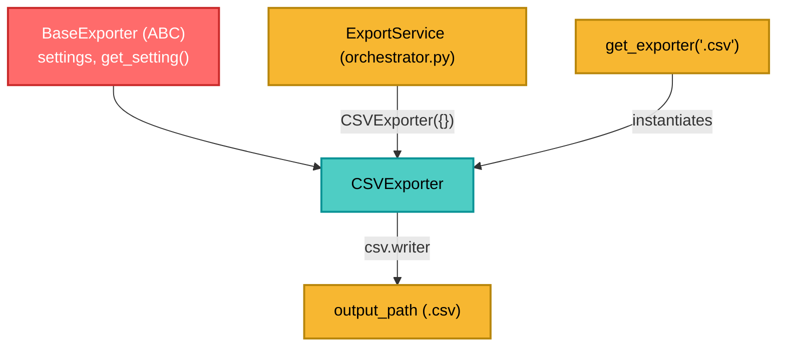

---
tags:
  - secinterp
  - code-walkthrough
  - exporters
  - csv
  - tabular
aliases:
  - csv_exporter.py
  - CSVExporter
cssclass: secinterp-note
---

# `exporters/csv_exporter.py`

> [!abstract] One-line summary
> Exports **pure** tabular data (`headers` + `rows`) to CSV with `csv.writer`, without touching QGIS: the simplest exporter in the package.

**Path**: `exporters/csv_exporter.py` (58 lines)
**Class**: `CSVExporter(BaseExporter)`
**Layer**: Exporters (pure Python, QGIS-agnostic)
**Tags**: #secinterp #exporters #csv #tabular

---

## 🎯 Why does this file exist?

Profile layers (topography, geology, structures, drillholes) summarize into **tables** the user wants to open in Excel/CSV. That format needs no render or CRS: just rows and columns.

| Problem | Solution |
|---------|----------|
| Tabular formats scattered across every handler | A single reusable `CSVExporter` |
| Broken encoding with accents/geology names | Explicit `encoding="utf-8"` |
| Corrupted line breaks on Windows | `newline=""` when opening the file |
| Incomplete data breaking the export | Guard clauses for `headers`/`rows` |

> [!important] Architectural note
> It is the only exporter that **does not import `qgis`**. It receives a `dict` with `headers`/`rows` and writes using the standard `csv` library. This makes it testable without QGIS (see `tests/exporters/test_exporters.py`).

---

## 🧬 Relationship diagram



---

## 📦 Imports — architectural reading

```python
import csv
from pathlib import Path
from typing import Any

from sec_interp.logger_config import get_logger

from .base_exporter import BaseExporter
```

| # | Observation |
|---|-------------|
| ① | `csv` is standard library → zero QGIS/Qt dependencies |
| ② | `get_logger(__name__)` attaches the logger to `SecInterp.*` (see [[logger_config]]) |
| ③ | Inherits from `BaseExporter` to reuse `get_setting()` and path validation |

---

## 🧱 `get_supported_extensions()` — format declaration

```python
def get_supported_extensions(self) -> list[str]:
    """Get supported CSV extension."""
    return [".csv"]
```

`BaseExporter.validate_path()` compares this list against `path.suffix.lower()`; the `get_exporter(".csv", settings)` factory is its consumer.

---

## 🧱 `export()` — the heart of the module

```python
def export(
    self, output_path: Path, data: dict[str, Any], layer_name: str | None = None
) -> bool:
    if not data:
        return False

    try:
        headers = data.get("headers")
        rows = data.get("rows")
        if not headers or not rows:
            return False

        with output_path.open("w", newline="", encoding="utf-8") as f:
            writer = csv.writer(f)
            writer.writerow(headers)
            writer.writerows(rows)

    except Exception:
        logger.exception(f"CSV export failed for {output_path}")
        return False
    else:
        return True
```

| Step | What it does |
|:----:|--------------|
| 1 | Discards empty/`None` `data` without opening a file |
| 2 | Requires **both** keys: no `headers` or no `rows` → `False` |
| 3 | Opens in text mode with `utf-8` and `newline=""` |
| 4 | `writerow(headers)` + `writerows(rows)` |
| 5 | Any exception is **logged with traceback** and returns `False` |
| 6 | `else` returns `True` only if no exception occurred |

> [!tip] `try/except/else`
> `else` runs **only if no exception occurred**; that way `return True` is not trapped inside `try` and `except` cannot accidentally return `True`.

> [!warning] `layer_name` is ignored and the path is not validated
> The signature accepts `layer_name` for compatibility with `BaseExporter`, but CSV is flat. Path security is provided by `validate_export_path()` (called by the orchestrator), not this method.

---

## 🏛️ Design patterns present

| Pattern | Where | Purpose |
|---------|-------|---------|
| **Template Method** | Inherits from `BaseExporter` | Reuses `get_setting()` / validation |
| **Strategy** | `CSVExporter` | Concrete tabular strategy |
| **Guard Clause** | `if not data` / `if not headers or not rows` | Early, cheap exit |
| **Fail-safe** | `try/except` + `logger.exception` | Never propagates disk failures |

---

## 🧾 API summary

| Symbol | Signature / Inherits | Typical use |
|--------|----------------------|-------------|
| `CSVExporter` | `class CSVExporter(BaseExporter)` | CSV exporter |
| `get_supported_extensions()` | `-> [".csv"]` | Extension validation |
| `export(output_path, data, layer_name=None)` | `-> bool` | Writes `{"headers": [...], "rows": [...]}` |
| `get_setting(key, default)` | inherited | Access to the settings dict |

`data` contract:

```python
data = {"headers": ["distance", "elevation", "unit"],
        "rows": [(0.0, 120.5, "Unit A"), (10.0, 118.2, "Unit B")]}
```

---

## 👀 Observations and notes

> [!success] Strengths
> - **QGIS-agnostic**: testable with plain `unittest`, no `xvfb` or QGIS mocks.
> - **Robust to incomplete data**: guard clauses avoid garbage files.
> - **Correct encoding** (`utf-8`), key with geological names.
> - **Traceback logging** via `logger.exception`.

> [!warning] Points of attention
> - Broad `except Exception` silences programming errors (e.g. non-iterable `rows`) by returning `False`.
> - It does not validate that `rows` is a sequence of sequences.
> - It does not flush/`fsync`; it relies on the `with` close (fine for non-critical CSV).

> [!question] Open questions
> - A configurable `delimiter` (`;` for Spanish Excel) via `get_setting("delimiter", ",")`?
> - Add a BOM (`utf-8-sig`) so Excel auto-detects UTF-8?

---

## 🔗 Related notes

- [[Index]] — vault index
- [[base_exporter]] — abstract contract and path validation
- [[vector_exporter]] — vector counterpart (SHP/GPKG/DXF)
- [[export_package]] — orchestrator that instantiates `CSVExporter`
- [[logger_config]] — source of `get_logger(__name__)`
- [[controller]] — source of the tabular data

---

*Note of the SecInterp Code Walkthrough vault — v3.8.0*
