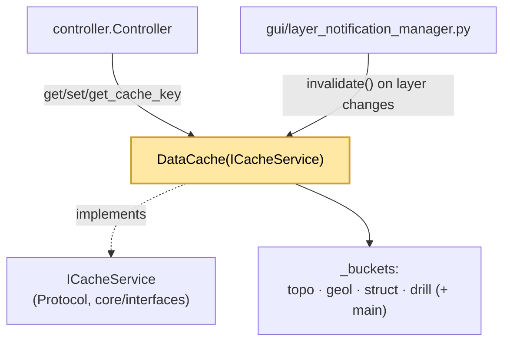

---
tags:
  - secinterp
  - code-walkthrough
  - core
  - cache
aliases:
  - data_cache.py
  - DataCache
cssclass: secinterp-note
---

# `core/data_cache.py`

> [!abstract] One-line summary
> In-memory per-**bucket** cache (`topo/geol/struct/drill`) with SHA256 keys, per-entry TTL, and metadata for LOD.

**Path**: `core/data_cache.py` (169 lines)
**Class**: `DataCache(ICacheService)`
**Layer**: Core · Cache (⚠️ uses `QCoreApplication` for i18n)
**Tags**: #secinterp #core #cache

---

## 🎯 Why does this file exist?

Every preview or export can recompute topography, geology, structures, and drillholes. Without a cache, moving the canvas or flipping a toggle means recomputing everything. `DataCache` stores the results indexed by parameters.

| Problem | Solution |
|---------|----------|
| Recomputing everything on each preview | Per-domain buckets with `get`/`set` |
| Parameters are not hashable (QGIS layers) | `get_cache_key()` uses `id()`/`source()` |
| Stale data accumulating | `DEFAULT_TTL_SECONDS = 3600` + per-entry `expiry` |
| The LOD/sampling used must be remembered | A `metadata` field per entry |
| Invalidate when a layer changes | `invalidate(bucket, key)` / `clear()` |

> [!warning] Core boundary grey area
> It imports `QCoreApplication` from `qgis.PyQt.QtCore` only for `tr()`. It is a pragmatic exception to `core/AGENTS.md` (which forbids Qt in `/core`), just like in `config.py`.

---

## 🧬 Relationship diagram



> [!tip] How to read
> The controller is the main client (*cache-aside* pattern). `layer_notification_manager` invalidates when a layer changes. The `main` bucket appears in `controller` even though it is not in the initial dict: `set()` creates it on the fly.

---

## 🧱 `get_cache_key()` — parameter hashing

```python
def get_cache_key(self, params: dict[str, Any]) -> str:
    key_parts = []
    for k, v in sorted(params.items()):
        if hasattr(v, "id"):        key_parts.append(f"{k}:{v.id()}")       # QGIS layers
        elif hasattr(v, "source"):  key_parts.append(f"{k}:{v.source()}")
        else:                       key_parts.append(f"{k}:{v!s}")
    return hashlib.sha256("".join(key_parts).encode("utf-8")).hexdigest()
```

| Feature | Detail |
|---------|--------|
| Order | `sorted(params.items())` → stable hash |
| QGIS layers | `hasattr(v, "id")` → `v.id()` (the object is not hashed) |
| Algorithm | **SHA256**, although the docstring says "MD5" (documentation debt) |

---

## 🧱 `get()` — read with TTL

```python
def get(self, bucket: str, key: str) -> Any | None:
    if bucket not in self._buckets:
        return None
    entry = self._buckets[bucket].get(key)
    if not entry:
        return None
    expiry = entry.get("expiry")
    if expiry and time.time() > expiry:          # expired entry
        logger.debug(f"Cache miss (TTL expired): {bucket}/{key}")
        del self._buckets[bucket][key]
        return None
    return entry.get("data")
```

| Situation | Return |
|-----------|--------|
| Missing bucket or key | `None` |
| Expired entry | Deletes and returns `None` |
| Valid entry | `entry["data"]` |

---

## 🧱 `set()` — write with metadata

```python
def set(self, bucket, key, data, metadata=None) -> None:
    if bucket not in self._buckets:
        self._buckets[bucket] = {}               # dynamic bucket (e.g. "main")
    ttl = (metadata or {}).get("ttl", self.default_ttl)
    expiry = time.time() + ttl if ttl > 0 else None
    self._buckets[bucket][key] = {
        "data": data, "expiry": expiry,
        "metadata": metadata or {}, "timestamp": time.time(),
    }
```

| Field | Meaning |
|-------|---------|
| `data` | Cached result |
| `expiry` | `None` if `ttl <= 0` (no expiration) |
| `metadata` | LOD/sampling context (`max_points`, `canvas_width`) |
| `timestamp` | Write time |

---

## 🧱 `invalidate()`, `clear()`, `get_metadata()` and `get_cache_size()`

| Method | Granularity |
|--------|-------------|
| `invalidate(bucket, key)` | A single entry |
| `invalidate(bucket)` | A whole bucket |
| `invalidate()` / `clear()` | The entire cache (`clear` is an alias of `invalidate`) |
| `get_metadata(bucket, key)` | Metadata of one entry |
| `get_cache_size()` | Count per bucket (diagnostics) |

---

## 🏛️ Design patterns present

| Pattern | Where | Purpose |
|---------|-------|---------|
| **Cache-Aside** | `controller` → `get`/`set` | The client decides what to cache |
| **Strategy per bucket** | `_buckets` | Separate data domains |
| **Protocol / Interface** | `ICacheService` | `runtime_checkable` contract |
| **TTL / Expiry** | `expiry` + `time.time()` | Avoid stale data |
| **Metadata Envelope** | `{"data","expiry","metadata","timestamp"}` | Enrich the entry |

---

## 🧾 API summary

| Symbol | Signature / Inherits | Typical use |
|--------|----------------------|-------------|
| `DataCache` | `(ICacheService)` · `DEFAULT_TTL_SECONDS = 3600` | `self.data_cache = DataCache()` |
| `get_cache_key` | `(params: dict[str, Any]) -> str` | Parameter hash |
| `get` / `set` | `(bucket, key) -> Any \| None` / `(bucket, key, data, metadata=None)` | Read/write with TTL |
| `invalidate` / `clear` | `(bucket=None, key=None)` / `()` | Selective/total deletion |
| `get_metadata` / `get_cache_size` | `(bucket, key)` / `() -> dict[str, int]` | Metadata and count |

---

## 👀 Observations and notes

> [!success] Strengths
> - **Explicit contract** via `ICacheService` (Protocol).
> - **Stable keys**: ordering + `id()`/`source()` make the hash reproducible.
> - **Flexible TTL** per entry, with `None` for permanent entries.

> [!warning] Points of attention
> - Docstring "MD5" vs. `sha256` implementation (documentation debt).
> - No **size limit** and no eviction policy (LRU): TTL only.
> - It is not explicitly thread-safe; if used from a `QgsTask`, care is needed (the GIL helps, but there is no lock).

> [!question] Open questions
> - Should it migrate to a stdlib `TTLCache`/LRU with an entry limit, and should `default_ttl` be exposed from `ConfigService`?

---

## 🔗 Related notes

- [[Index]] — vault index
- [[controller]] — main client (`get`/`set` per domain)
- [[config]] — another service with a Qt dependency in core
- [[layer_core_interfaces]] — defines `ICacheService`
- [[layer_notification_manager]] — invalidates the cache on layer changes
- [[sec_interp_plugin]] — injects `controller.data_cache`

---

*Note of the SecInterp Code Walkthrough vault — v3.8.0*
