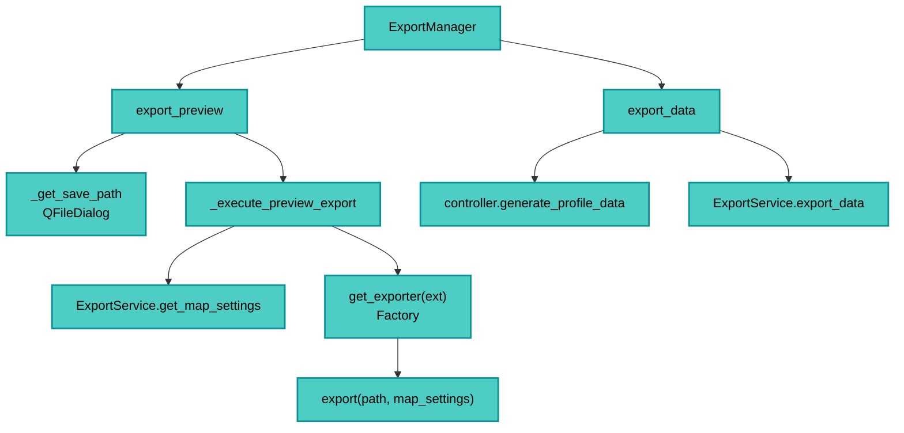

---
tags:
  - secinterp
  - code-walkthrough
  - gui
  - export-manager
  - orchestrator
aliases:
  - dialog_export_manager.py
  - ExportManager
cssclass: secinterp-note
---

# 22 — `gui/dialog_export_manager.py`

> [!abstract] One-line summary
> The **export orchestrator**: decides what and how to export (preview PNG/PDF/SVG or data SHP/CSV/3D) and delegates to `ExportService` + `get_exporter`.

**Path**: `gui/dialog_export_manager.py` (218 lines)
**Class**: `ExportManager`
**Layer**: GUI · Managers
**Tags**: #secinterp #gui #export-manager #orchestrator

---

## 🎯 Why does this file exist?

Export mixes **UI (dialogs, settings)**, **rendering (QgsMapSettings)**, and **business (SHP/CSV/3D)**. This manager separates:

| Flow | Method | Delegates to |
|------|--------|--------------|
| **Preview** (canvas image) | `export_preview()` → `_execute_preview_export()` | `export_service.get_map_settings()` + `get_exporter(ext)` |
| **Data** (SHP/CSV/3D) | `export_data()` | `controller.generate_profile_data()` + `export_service.export_data()` |

> [!important] GUI decides *when/what*; Core decides *how to write to disk*.

---

## 🧬 Diagram



---

## 🧱 `export_preview()` — canvas image

```python
def export_preview(self) -> bool:
    if not self.dialog.render_state.canvas:
        self._show_export_error(self.dialog.tr("No preview available..."))
        return False
    layers = self.dialog.render_state.canvas.layers()
    if not layers: ...
    output_path = self._get_save_path()
    if not output_path: return False

    with PerformanceTimer("Total Preview Export Time", self.metrics):
        success = self._execute_preview_export(output_path, layers)
        if success:
            self.dialog.push_message(self.dialog.tr("Success"),
                self.dialog.tr("Preview exported to {}").format(output_path.name),
                level=Qgis.MessageLevel.Success)
        return success
```

### `_get_save_path()`

```python
def _get_save_path(self) -> Path | None:
    last_dir = QgsSettings().value("SecInterp/lastExportDir", "", type=str)
    default_path = str(Path(last_dir) / "preview.png") if last_dir else "preview.png"
    file_filter = "PNG Image (*.png);;JPEG Image (*.jpg);;PDF (*.pdf);;SVG Vector (*.svg)"
    path_str, _ = QFileDialog.getSaveFileName(self.dialog, ..., default_path, file_filter)
    if not path_str: return None
    path = Path(path_str)
    QgsSettings().setValue("SecInterp/lastExportDir", str(path.parent))
    return path
```

> [!tip] Last-folder persistence
> Uses `QgsSettings("SecInterp/lastExportDir")` to remember the location.

### `_execute_preview_export(path, layers)`

```python
def _execute_preview_export(self, path: Path, layers: list) -> bool:
    ext = path.suffix.lower()
    width, height, dpi = self._get_export_dimensions(ext)

    opts = self.dialog.get_preview_options()
    export_params = {
        "width": width, "height": height, "dpi": dpi,
        "background_color": QColor(255,255,255),
        "show_legend": opts.get("show_legend", True),
        "legend_renderer": getattr(self.dialog.plugin_instance, "preview_renderer", None),
        "title": self.dialog.tr("Section Interpretation Preview"),
        "extent": self.dialog.render_state.canvas.extent(),
    }

    map_settings = self.export_service.get_map_settings(
        layers, export_params["extent"],
        self.dialog.preview_widget.canvas.size(),
        export_params["background_color"],
    )
    if ext in [".png", ".jpg", ".jpeg"]:
        map_settings.setOutputSize(QSize(width, height))

    exporter = get_exporter(ext, export_params)
    return exporter.export(path, map_settings)
```

| Ext | Dimensions | DPI |
|-----|------------|-----|
| `.png/.jpg/.jpeg` | `canvas*3` | 300 |
| `.pdf/.svg` | `canvas` | 96 |

> [!note] `get_exporter(ext)` is a **Factory** in `exporters/__init__.py` — picks PNG/JPG/PDF/SVG exporter.

---

## 🧱 `export_data()` — SHP/CSV/3D

```python
def export_data(self) -> bool:
    params = self.dialog.plugin_instance._get_and_validate_inputs()
    if not params: return False
    self.dialog.state_manager.save_settings()          # auto-save valid

    values = self.dialog.get_selected_values()
    output_folder = Path(values["output_path"])

    profile_data, geol_data, struct_data, drillhole_data, _ = \
        self.dialog.plugin_instance.controller.generate_profile_data(params)

    if not profile_data:
        self.dialog.push_message(self.dialog.tr("Error"),
            self.dialog.tr("No profile data generated."), level=Qgis.MessageLevel.Critical)
        return False

    export_options = {
        "exp_topo": values.get("exp_topo", True),
        "exp_geol": values.get("exp_geol", True),
        "exp_struct": values.get("exp_struct", True),
        "exp_drill": values.get("exp_drill", True),
        "exp_interp": values.get("exp_interp", True),
        "drill_3d_traces": values.get("drill_3d_traces", True),
        "drill_3d_intervals": values.get("drill_3d_intervals", True),
        "drill_3d_original": values.get("drill_3d_original", True),
        "drill_3d_projected": values.get("drill_3d_projected", False),
    }

    result_msg = self.export_service.export_data(
        output_folder, params, profile_data, geol_data, struct_data,
        drillhole_data, interp_data=self.dialog.interpretations,
        export_options=export_options,
    )
    self.dialog.preview_widget.results_text.setPlainText("\n".join(result_msg))
    return True
```

| Step | What it does |
|------|--------------|
| 1 | Validates `PreviewParams` (`_get_and_validate_inputs`) + `save_settings` |
| 2 | `controller.generate_profile_data(params)` → fresh data (not preview cache) |
| 3 | `export_service.export_data(output_folder, params, topo/geol/struct/drill/interp, options)` |
| 4 | Shows result messages |

> [!warning] Difference from preview
> Export regenerates data **from scratch** via the controller; it does not reuse `cached_data` from the preview.

---

## 🏛️ Design patterns present

| Pattern | Where | Purpose |
|---------|-------|---------|
| **Orchestrator** | both flows | Coordinates UI → core → disk |
| **Factory** | `get_exporter(ext)` | Picks exporter by extension |
| **Façade** | `ExportService.get_map_settings` | Builds `QgsMapSettings` |

---

## 🧾 API summary

| Method | Flow |
|--------|------|
| `export_preview()` | Canvas validation → dialog → `_execute_preview_export` |
| `_get_save_path()` | `QgsSettings` + `QFileDialog` |
| `_execute_preview_export` | dimensions + `get_map_settings` + `get_exporter` |
| `export_data()` | Validate → generate → `export_service.export_data` |

---

## 👀 Observations and notes

> [!success] Strengths
> - Clearly separates **preview (image)** from **data (layers)**.
> - Remembers last folder.
> - Auto-saves valid settings.

> [!warning] Points of attention
> - `export_data` calls `controller.generate_profile_data` again (could reuse cache with invalidation).
> - `export_options` hand-built from `values` → fragile when adding options.
> - `get_exporter(ext, export_params)` receives `legend_renderer` optionally (GUI coupling).

---

## 🔗 Related notes

- [[Index]] — vault index
- [[main_dialog]] — creates this manager
- [[controller]] — `generate_profile_data`
- [[domain]] — `PreviewParams`
- `core/services/export_service.py` + `exporters/` — export business

---

*Note 22 of the SecInterp Code Walkthrough vault — v3.8.0*
