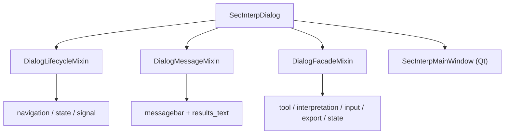

---
tags:
  - secinterp
  - code-walkthrough
  - gui
  - main-dialog
  - mixins
aliases:
  - dialog_message_mixin.py
  - dialog_lifecycle_mixin.py
  - dialog_facade_mixin.py
  - SecInterpDialog
cssclass: secinterp-note
---

# `gui/main_dialog.py` — mixins

> [!abstract] One-line summary
> The former 481-line `main_dialog.py` was decomposed (2026-09-20) into three mixins; `SecInterpDialog` is now a 193-line **composition root** keeping `__init__`, `_init_managers`, `show_dialog`, `open_help`, and `validate_inputs`.

**Path**: `gui/main_dialog.py` (193 lines) + `gui/dialog_message_mixin.py` (78), `gui/dialog_lifecycle_mixin.py` (64), `gui/dialog_facade_mixin.py` (164)
**Class**: `SecInterpDialog(DialogLifecycleMixin, DialogMessageMixin, DialogFacadeMixin, SecInterpMainWindow)`
**Layer**: GUI · Mixins
**Tags**: #secinterp #gui #main-dialog #mixins

---

## 🎯 Why does this file exist?

| Problem | Solution |
|---------|----------|
| A 481-line file mixed messaging, cleanup, and delegation | Three mixins, one responsibility each |
| The dialog was a hard-to-test "god object" | `SecInterpDialog` keeps only composition and the public API |

> [!important] MRO
> The mixins come **before** `SecInterpMainWindow`, so `super()` chains reach the Qt base and `SecInterpDialog` is still a `QDialog`.

---

## 🧬 Relationship diagram

---

## 🧱 The three mixins

| Mixin | Key methods | Responsibility |
|-------|-------------|----------------|
| `DialogMessageMixin` | `push_message`, `handle_error` | QGIS bar + HTML results; `SecInterpError`→warning, else→critical |
| `DialogLifecycleMixin` | `wheelEvent`, `closeEvent`, `_cleanup_*` | Wheel navigation and deterministic cleanup |
| `DialogFacadeMixin` | `toggle_*`, `interpretations`, `get_*`, `*_handler` | Thin proxies to the managers |

`DialogLifecycleMixin._cleanup_resources` calls, in order, `_cleanup_map_tools` (reset of `measure_tool`/`interpretation_tool`), `_cleanup_managers` (`save_interpretations` + `preview_manager.cleanup`), and `_cleanup_signals_and_components` (`signal_manager.disconnect_all` + `legend_widget.cleanup`), each tolerant via `contextlib.suppress`. `DialogFacadeMixin` also exposes `get_selected_values`, `get_preview_options`, `reject_handler`, `clear_cache_handler`, `reset_defaults_handler`, layer-name proxies, `_load/_save_interpretations`, and `_load/_save_user_settings`.

---

## 🏛️ Design patterns present

| Pattern | Where | Purpose |
|---------|-------|---------|
| **Mixin composition** | The three bases | Split responsibilities without rigid inheritance |
| **Facade** | `DialogFacadeMixin` | Thin proxies to the managers |
| **Null Object** | `_NoOpMessageBar` | Testable dialog without `iface` |

---

## 👀 Observations and notes

> [!success] Strengths
> - `main_dialog.py` drops from 481 to 193 lines; each mixin is independently testable.
> - The MRO preserves the `super()` chain toward Qt.

> [!warning] Points of attention
> - The mixins assume attributes (`messagebar`, `tool_manager`, `preview_widget`) created in `SecInterpDialog`.
> - `DialogFacadeMixin` accumulates "for compatibility" proxies that are cleanup candidates.

---

## 🔗 Related notes

- [[Index]] — vault index
- [[main_dialog]] — the class that composes these mixins
- [[sec_interp_plugin]] — creates the dialog
- [[ui_pages]] — `SecInterpMainWindow` (programmatic UI)

---

*Note of the SecInterp Code Walkthrough vault — v3.8.0*
