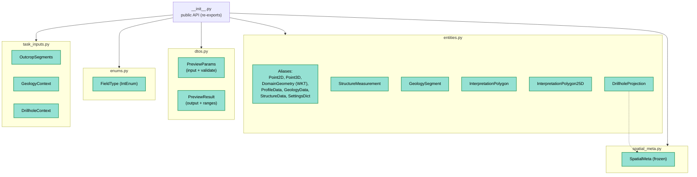

---
tags:
  - secinterp
  - code-walkthrough
  - core
  - domain
  - dto
  - entities
aliases:
  - core/domain
  - Domain Layer
cssclass: secinterp-note
---

# `core/domain/`

> [!abstract] One-line summary
> This is the **domain layer**: it defines the DTOs, entities, enums, and types that act as the **data contract** between GUI, core, and exporters.

**Path**: `core/domain/` (package)
**Modules**: `entities.py`, `dtos.py`, `enums.py`, `spatial_meta.py`, `task_inputs.py`, `__init__.py`
**Layer**: Core (QGIS-agnostic)
**Tags**: #secinterp #core #domain #dto #entities

---

## 🎯 Why does this file exist?

In the *Extract-then-Compute* architecture, layers communicate **only with pure data**, never with QGIS objects. `core/domain/` is where that data lives.

| Problem | Domain solution |
|---------|-----------------|
| GUI and core must exchange data without coupling | dataclass DTOs and entities |
| Avoid `QgsGeometry` in the core | `DomainGeometry = str` (WKT) |
| Avoid `QVariant`/PyQt in validation | `FieldType(IntEnum)` |
| Carry 3D/2D data between renderers | `SpatialMeta` (frozen) |
| Package inputs for pure computation | `GeologyContext`, `DrillholeContext` |

> [!important] Extract-then-Compute
> The *contexts* (`GeologyContext`, `DrillholeContext`) are **fully decoupled**: produced by the GUI (adapters) and consumed by the pure core. No live QGIS objects.

---

## 🧬 Package map



---

## 🧱 `entities.py` — entities and aliases

### Type aliases

```python
ProfilePoints   = list[tuple[float, float]]
GeologyPoints   = list[tuple[float, float, str]]
StructurePoints = list[tuple[float, float]]

SettingsDict    = dict[str, Any]
ExportSettings  = dict[str, Any]
ValidationResult = tuple[bool, str]

Point2D = tuple[float, float]
Point3D = tuple[float, float, float]
DomainGeometry = str          # ← WKT, NOT QgsGeometry
PointList = list[Point2D]

StructureData = list[StructureMeasurement]
GeologyData   = list[GeologySegment]
ProfileData   = list[tuple[float, float]]
```

> [!important] `DomainGeometry = str`
> The key decoupling alias: geometry travels as **WKT** (string), not as `QgsGeometry`.
> This is the core's golden rule.

### Entities (`@dataclass`)

| Entity | Key fields | Purpose |
|--------|------------|---------|
| `StructureMeasurement` | distance, elevation, apparent_dip, original_dip/strike, attributes | Projected structural measurement |
| `GeologySegment` | unit_name, geometry_wkt, attributes, points, points_3d, points_3d_projected | Geological segment on the profile |
| `InterpretationPolygon` | id, name, type, vertices_2d, color, created_at | Digitized 2D polygon |
| `InterpretationPolygon25D` | id, name, type, geometry_wkt, crs_authid | Georeferenced interpretation |
| `DrillholeProjection` | hole_id, distance, elevation, offset, total_depth, points_3d, segments | Projected drillhole |

> [!tip] `GeologySegment` serves double duty
> It represents both a projected **outcrop** and a **drillhole interval**
> (via `points_3d` / `points_3d_projected`). Reduces type duplication.

---

## 🧱 `dtos.py` — complex transfer objects

### `PreviewParams` — the unified input

```python
@dataclass
class PreviewParams:
    raster_layer: Any
    line_layer: Any
    band_num: int
    buffer_dist: float = 100.0
    # Geology / Structure / Drillhole ...
    max_points: int = 1000
    canvas_width: int = 800
    auto_lod: bool = True

    def validate(self) -> None:
        if not isinstance(self.buffer_dist, int | float) or self.buffer_dist < 0:
            raise ValueError("Buffer distance must be a non-negative number")
        if not isinstance(self.band_num, int) or self.band_num < 1:
            raise ValueError("Band number must be a positive integer")
```

| Detail | Explanation |
|--------|-------------|
| **Groups ~30 fields** | DEM, geology, structure, drillholes, and LOD in one object |
| **`validate()`** | Validates only **primitives** (buffer, band) |
| **Layers** | Stored as `Any` (resolved objects); their validation is delegated to the GUI |

> [!warning] Pragmatic exception
> `PreviewParams` holds **layer references** (`raster_layer`, `line_layer`, …) typed as `Any`.
> This is a controlled leak: the DTO transports the reference, but **the logic that uses them** lives in the adapters.
> Layer validation happens in the GUI (`ProjectValidator` + `LayerMetadata`).

### `PreviewResult` — the unified output

```python
@dataclass
class PreviewResult:
    topo: ProfileData | None = None
    geol: GeologyData | None = None
    struct: StructureData | None = None
    drillhole: Any | None = None
    metrics: MetricsCollector = field(default_factory=MetricsCollector)
    buffer_dist: float = 0.0

    def get_elevation_range(self) -> tuple[float, float]: ...
    def get_distance_range(self) -> tuple[float, float]: ...
```

| Method | Returns |
|--------|---------|
| `get_elevation_range()` | Global `(min_elev, max_elev)` across all layers |
| `get_distance_range()` | `(min_dist, max_dist)` per topography |

> [!tip] Range helpers
> Renderers use these methods to compute the profile extent/axes
> without manually recomputing minima and maxima. They delegate to `_get_*_elevations`.

---

## 🧱 `enums.py` — `FieldType`

```python
class FieldType(IntEnum):
    NULL = 0
    BOOL = 1
    INT = 2
    DOUBLE = 6
    STRING = 10
    LONG_LONG = 4
    DATE = 14
    DATE_TIME = 16
```

> [!important] Core-safe
> The numeric values **match Qt's `QVariant.Type`**.
> This lets the core validate types **without importing PyQt**.
> A perfect example of a "mirror enum" preserving decoupling.

---

## 🧱 `spatial_meta.py` — `SpatialMeta` (frozen)

```python
@dataclass(frozen=True)
class SpatialMeta:
    hole_id: str | None = None
    dist_along: float = 0.0
    offset: float = 0.0
    z: float = 0.0
    x_3d: float | None = None
    y_3d: float | None = None
    x_proj: float | None = None
    y_proj: float | None = None
    norm_x: float | None = None
    norm_y: float | None = None
    attributes: dict[str, Any] | None = None

    def to_vec3(self) -> tuple[float, float, float]:
        return (self.x_3d or 0.0, self.y_3d or 0.0, self.z)

    def to_vec2_profile(self) -> tuple[float, float]:
        return (self.dist_along, self.z)
```

| Feature | Detail |
|---------|--------|
| **`frozen=True`** | Immutable → thread-safe and cache-safe |
| **2D/3D bridge** | Global coords (`x_3d/y_3d`) + profile coords (`dist_along, z`) |
| **Normalized vectors** | `norm_x/norm_y` for orientation |
| **Converters** | `to_vec3()` and `to_vec2_profile()` |

> [!tip] Universal DTO
> A single object serves both the 2D engine (profile) and 3D, avoiding parallel types.

---

## 🧱 `task_inputs.py` — pure-computation contexts

```python
@dataclass
class OutcropSegments:
    unit_name: str
    attributes: dict[str, Any]
    segments: list[tuple[float, float, DomainGeometry]]

@dataclass
class GeologyContext:
    master_profile_data: list[Point2D]
    master_grid_dists: list[tuple[float, Point2D, float]]
    outcrops: list[OutcropSegments]
    tolerance: float = 0.001

@dataclass
class DrillholeContext:
    line_points: list[Point2D]
    section_azimuth: float
    buffer_width: float
    collar_id_field: str
    collar_z_field: str
    collar_depth_field: str
    collar_data: list[dict[str, Any]]
    survey_data: dict[Any, list[tuple[float, float, float]]]
    interval_data: dict[Any, list[tuple[float, float, str]]]
    pre_sampled_z: dict[Any, float] = field(default_factory=dict)
```

> [!important] Extract → Compute boundary
> These contexts are the **contract** between GUI adapters and core services:
> - GUI: `GeologyExtractor.extract_context(...)` → `GeologyContext`
> - Core: `GeologyService.build_segments(context)`
>
> See [[controller]] for the full flow.

---

## 🧱 `__init__.py` — import surface

The package **re-exports** everything at a single point and defines `__all__`:

```python
from .dtos import PreviewParams, PreviewResult
from .entities import (
    DomainGeometry, DrillholeProjection, ExportSettings, GeologyData, GeologyPoints,
    GeologySegment, InterpretationPolygon, InterpretationPolygon25D, Point2D, Point3D,
    PointList, ProfileData, ProfilePoints, SettingsDict, StructureData,
    StructureMeasurement, StructurePoints, ValidationResult,
)
from .enums import FieldType
from .spatial_meta import SpatialMeta
from .task_inputs import DrillholeContext, GeologyContext, OutcropSegments

__all__ = [...]
```

> [!tip] Stable import
> Thanks to `__init__`, the rest of the code does `from sec_interp.core.domain import PreviewParams`
> without knowing the internal file layout. Refactoring the package **does not break** consumers.

---

## 🏛️ Design patterns present

| Pattern | Where | Purpose |
|---------|-------|---------|
| **DTO (Data Transfer Object)** | `PreviewParams`, `PreviewResult`, contexts | Carry data between layers |
| **Entity** | `GeologySegment`, `DrillholeProjection`… | Model domain concepts |
| **Value Object (frozen)** | `SpatialMeta` | Immutable, safe object |
| **Type Alias / Newtype** | `Point2D`, `DomainGeometry`… | Readability and decoupling |
| **Enum Bridge** | `FieldType` | Mirror of `QVariant.Type` without PyQt |
| **Import Facade** | `__init__.py` | Stable import surface |

---

## 🧾 Exported types summary

| Group | Types |
|-------|-------|
| **Geometry** | `DomainGeometry` (WKT), `Point2D`, `Point3D`, `PointList` |
| **Profile data** | `ProfileData`, `ProfilePoints`, `GeologyData`, `GeologyPoints`, `StructureData`, `StructurePoints` |
| **Entities** | `GeologySegment`, `StructureMeasurement`, `DrillholeProjection`, `InterpretationPolygon`, `InterpretationPolygon25D` |
| **DTOs** | `PreviewParams`, `PreviewResult` |
| **Contexts** | `GeologyContext`, `DrillholeContext`, `OutcropSegments` |
| **Infra** | `FieldType`, `SpatialMeta`, `SettingsDict`, `ExportSettings`, `ValidationResult` |

---

## 👀 Observations and notes

> [!success] Strengths
> - Clear, **QGIS-agnostic** data contract (WKT, tuples, dataclasses).
> - `FieldType` avoids PyQt in the core via a mirror enum.
> - `SpatialMeta` immutable → thread-safe.
> - Stable import surface with `__all__`.

> [!warning] Points of attention
> - `PreviewParams` holds layer objects (`Any`): a pragmatic leak of GUI types into the core.
> - `entities.py` mixes **aliases** and **entities**; could be split if it grows.
> - `PreviewResult.drillhole: Any` (not typed as `list[DrillholeProjection]`).
> - Some types use `Any` in attributes (`dict[str, Any]`) — unavoidable but weak for validation.

> [!question] Open questions
> - Should `PreviewParams` migrate to a dedicated builder/validator in `core/validation/`?
> - Should aliases move to `core/domain/types.py`?

---

## 🔗 Related notes

- [[Index]] — vault index
- [[controller]] — consumes `PreviewParams` and produces the contexts
- [[exceptions]] — domain exceptions
- [[validation]] — parameter and layer validation
- [[adapters]] — producers of `GeologyContext` / `DrillholeContext`
- [[ARCHITECTURE_EN]] — general architecture

---

*Note of the SecInterp Code Walkthrough vault — v3.8.0*
