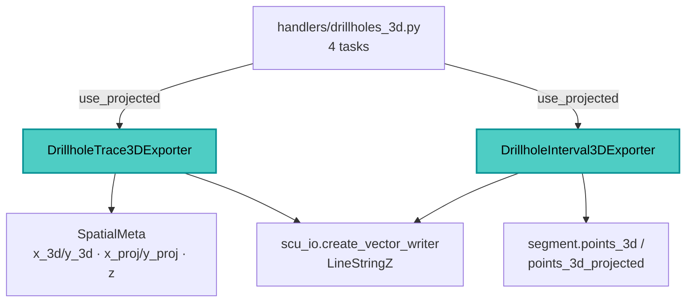

---
tags:
  - secinterp
  - code-walkthrough
  - exporters
aliases:
  - drillhole_3d_exporter.py
  - DrillholeTrace3DExporter
cssclass: secinterp-note
---

# `exporters/drillhole_3d_exporter.py`

> [!abstract] One-line summary
> Exports **3D drillhole traces and intervals** as `LineStringZ`, choosing between real (`x_3d/y_3d`) and projected (`x_proj/y_proj`) coordinates based on the `use_projected` flag.

**Path**: `exporters/drillhole_3d_exporter.py` (243 lines)
**Classes**: `DrillholeTrace3DExporter`, `DrillholeInterval3DExporter`
**Layer**: Exporters (QGIS · format strategies)
**Tags**: #secinterp #exporters #3d

---

## 🎯 Why does this file exist?

The 2D representation (`dist_along`, `z`) loses the real position in space. This module emits **real Z** geometry for 3D visualization and supports the "projected" variant (onto the section plane) with the same code.

| Problem | Solution |
|---------|----------|
| 2D does not place the hole in global space | `QgsPoint(x, y, z)` → `QgsLineString` → `LineStringZ` |
| A hole has both real and projected coordinates | `use_projected` selects `x_proj/y_proj` or `x_3d/y_3d` |
| The orchestrator generates 4 tasks (trace/interval × real/projected) | A boolean flag reuses the same class |
| Legacy 5-element formats | `_get_trace_points` unpacks them |

> [!important] Explicit 3D geometry
> Unlike the 2D module, here `QgsWkbTypes` **is** imported to declare `LineStringZ`, plus `QgsLineString`/`QgsPoint` to build the Z.

---

## 🧬 Relationship diagram



---

## 📦 Imports — architectural reading

`QgsWkbTypes.Type.LineStringZ` is passed to `create_vector_writer`: 3D is a WKB type decision. `QgsLineString(points)` + `QgsGeometry(...)` is the Z construction pattern. Only 3 constants: `NEW_DATA_LENGTH = 3`, `LEGACY_DATA_LENGTH = 5`, `MIN_POINTS_FOR_INTERVAL = 2`.

---

## 🧱 `DrillholeTrace3DExporter` — choosing the coordinate system

`export()` reads `use_projected` and delegates to helpers:

```python
drillhole_data = data.get("drillhole_data")
crs = data.get("crs")
use_projected = data.get("use_projected", False)
if not drillhole_data or not crs:
    return False

writer = scu_io.create_vector_writer(
    str(output_path), crs, fields,
    QgsWkbTypes.Type.LineStringZ, layer_name=layer_name,
)
for hole_data in drillhole_data:
    self._process_hole_trace(writer, fields, hole_data, use_projected)
```

`_extract_hole_spatial_data` recognizes the DTO and both tuple lengths:

```python
if isinstance(hole_data, DrillholeProjection):
    return hole_data.hole_id, hole_data.points_3d
if isinstance(hole_data, list | tuple):
    hole_id = hole_data[0]
    if len(hole_data) == NEW_DATA_LENGTH:
        return hole_id, hole_data[1]
    if len(hole_data) == LEGACY_DATA_LENGTH:
        return hole_id, hole_data
    logger.warning(f"Unexpected hole data format (length {len(hole_data)}) ...")
return None
```

And `_get_trace_points` decides the coordinate source:

```python
if isinstance(spatial_data, list | tuple) and len(spatial_data) == LEGACY_DATA_LENGTH:
    _, _, traces_3d, traces_3d_proj, _ = spatial_data
    points_source = traces_3d_proj if use_projected else traces_3d
    return [QgsPoint(x, y, z) for x, y, z in points_source]

if use_projected:
    return [QgsPoint(p.x_proj or 0.0, p.y_proj or 0.0, p.z)
            for p in spatial_data if p.x_proj is not None]
return [QgsPoint(p.x_3d or 0.0, p.y_3d or 0.0, p.z)
        for p in spatial_data if p.x_3d is not None]
```

> [!warning] Filtering by `is not None`
> Points lacking the coordinate of the chosen mode are dropped (`if p.x_proj is not None` / `x_3d is not None`). A poorly projected hole may be reduced or become empty.

---

## 🧱 `DrillholeInterval3DExporter` — spans with Z

There is no intermediate DTO: the interval is read from the segment, and `segments` is always the last tuple element.

```python
if isinstance(hole_data, DrillholeProjection):
    hole_id, segments = hole_data.hole_id, hole_data.segments
elif isinstance(hole_data, list | tuple):
    # segments are always the last element in both 3 and 5 element formats
    hole_id, segments = hole_data[0], hole_data[-1]
else:
    return
```

```python
points_source = segment.points_3d_projected if use_projected else segment.points_3d
if not points_source or len(points_source) < MIN_POINTS_FOR_INTERVAL:
    return
points = [QgsPoint(x, y, z) for x, y, z in points_source]
geom = QgsGeometry(QgsLineString(points))
```

| Field | Type | Source |
|-------|------|--------|
| `hole_id` | `QString` | Hole `hole_id` |
| `from_depth` | `Double` | `segment.attributes["from"]` |
| `to_depth` | `Double` | `segment.attributes["to"]` |
| `unit` | `QString` | `segment.unit_name` |

> [!note] Not `PolygonZ`, but `LineStringZ`
> Both classes export **3D lines**, not polygons. The `PolygonZ` from the vault belongs to `interpretation_3d_exporter`.

---

## 🏛️ Design patterns present

| Pattern | Where | Purpose |
|---------|-------|---------|
| **Template Method** | `BaseExporter` | Shared contract and validation |
| **Strategy by mode** | `use_projected` | Real vs projected without duplicating classes |
| **Adapter** | `_extract_hole_spatial_data` | DTO and legacy tuples |
| **Fail-safe** | `try/except` + `logger.exception` | Logs and returns `False` |

---

## 🧾 API summary

| Symbol | Signature / Inherits | Typical use |
|--------|----------------------|-------------|
| `DrillholeTrace3DExporter` | `BaseExporter` | Real or projected 3D traces |
| `DrillholeInterval3DExporter` | `BaseExporter` | Real or projected 3D intervals |
| `use_projected` | `data` key | `True` → `*_proj`, `False` → `*_3d` |
| `_prepare_fields()` | `-> QgsFields` | Trace: `hole_id`; interval: `+from/to/unit` |
| `get_supported_extensions()` | `-> list[str]` | `[".shp", ".gpkg", ".dxf"]` |

---

## 👀 Observations and notes

> [!success] Strengths
> - A single `use_projected` flag covers the orchestrator's 4 combinations.
> - Explicit and correct Z construction (`QgsPoint`, `QgsLineString`, `LineStringZ`).

> [!warning] Points of attention
> - Points whose chosen-mode coordinate is `None` are removed: the vertex count can change.
> - There is no CRS validation beyond requiring `crs` to be truthy.

> [!question] Open questions
> - Would it be worth unifying `drillhole_exporters` and `drillhole_3d_exporter` under a single abstraction?

---

## 🔗 Related notes

- [[Index]] — vault index
- [[base_exporter]] — inherited contract
- [[drillhole_exporters]] — 2D variant
- [[drillhole_service]] — data source
- [[export_package]] — orchestrator (`handlers/drillholes_3d.py`, 4 tasks)
- [[domain]] — `SpatialMeta` and `DrillholeProjection`

---

*Note of the SecInterp Code Walkthrough vault — v3.8.0*
