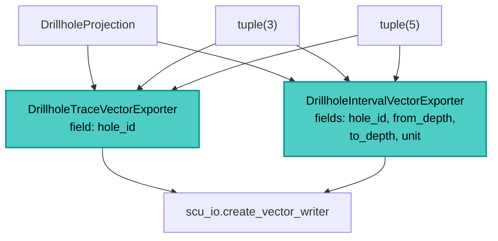

---
tags:
  - secinterp
  - code-walkthrough
  - exporters
aliases:
  - drillhole_exporters.py
  - DrillholeTraceVectorExporter
cssclass: secinterp-note
---

# `exporters/drillhole_exporters.py`

> [!abstract] One-line summary
> Exports **2D drillhole traces and intervals** to SHP/GPKG/DXF as `LineString`, normalizing at once the `DrillholeProjection` DTO and the legacy 3- and 5-element tuple formats.

**Path**: `exporters/drillhole_exporters.py` (239 lines)
**Classes**: `DrillholeTraceVectorExporter`, `DrillholeIntervalVectorExporter`
**Layer**: Exporters (QGIS · format strategies)
**Tags**: #secinterp #exporters #drillhole

---

## 🎯 Why does this file exist?

Drillholes reach the exporter in two different representations: the clean `DrillholeProjection` DTO and variable-length tuples that carry integration-test compatibility. This module absorbs both.

| Problem | Solution |
|---------|----------|
| The DTO and the legacy tuples share no interface | `_write_traces` / `_write_intervals` detect the type |
| Tuples may have 3 or 5 elements | `NEW_DATA_LENGTH = 3`, `LEGACY_DATA_LENGTH = 5` |
| A trace arrives as `SpatialMeta` or as a pair | `_create_feature` tries `dist_along/z`, then `p[0]/p[1]` |
| A 1-point trace is not valid geometry | `MIN_REQUIRED_TRACE_POINTS = 2` |

> [!important] No QGIS in the DTOs
> The exporter receives DTOs from `core.domain` (`DrillholeProjection`, `SpatialMeta`) and only **builds QGIS at the end**, in `QgsGeometry.fromPolylineXY`.

---

## 🧬 Relationship diagram



---

## 📦 Imports — architectural reading

`DrillholeProjection` comes from `core.domain` and is the first type it tries to detect; `QgsWkbTypes` is unused because `fromPolylineXY` fixes `LineString`; the constants document the supported tuple formats.

| Constant | Value | Meaning |
|----------|:-----:|---------|
| `MIN_REQUIRED_TRACE_POINTS` | `2` | Minimum for a trace |
| `LEGACY_DATA_LENGTH` | `5` | Legacy/integration-test tuple |
| `NEW_DATA_LENGTH` | `3` | New tuple with `SpatialMeta` |
| `MIN_POINTS_FOR_INTERVAL` | `2` | Minimum for an interval |
| `COORD_PAIR_LENGTH` | `2` | Length of an `(x, y)` pair |

---

## 🧱 `DrillholeTraceVectorExporter` — normalizing the input

`_write_traces` resolves the three possible forms before creating the feature:

```python
for item in drillhole_data:
    if isinstance(item, DrillholeProjection):
        hole_id, traces = item.hole_id, item.points_3d
    elif isinstance(item, list | tuple):
        if len(item) == NEW_DATA_LENGTH:
            hole_id, traces, _ = item
        elif len(item) >= LEGACY_DATA_LENGTH:
            hole_id, traces, _traces_3d, _traces_3d_proj, _ = item
        else:
            continue
    else:
        continue
    if not traces or len(traces) < MIN_REQUIRED_TRACE_POINTS:
        continue
```

Point conversion tolerates both `SpatialMeta` and tuples:

```python
for p in traces:
    if hasattr(p, "dist_along") and hasattr(p, "z"):
        points.append(QgsPointXY(p.dist_along, p.z))
    elif isinstance(p, list | tuple) and len(p) >= COORD_PAIR_LENGTH:
        points.append(QgsPointXY(p[0], p[1]))
```

> [!note] The trace field
> `_prepare_fields()` creates a single `hole_id` column (`QString`). The geometry is the whole trace and depth is not stored in 2D.

---

## 🧱 `DrillholeIntervalVectorExporter` — lithological intervals

Here the schema is rich: it identifies both the hole and the span.

```python
def _prepare_fields(self) -> QgsFields:
    fields = QgsFields()
    fields.append(QgsField("hole_id", QMetaType.Type.QString))
    fields.append(QgsField("from_depth", QMetaType.Type.Double))
    fields.append(QgsField("to_depth", QMetaType.Type.Double))
    fields.append(QgsField("unit", QMetaType.Type.QString))
    return fields
```

Finding `segments` exploits that it is **always the last element** of the tuple:

```python
if len(item) == NEW_DATA_LENGTH or len(item) >= LEGACY_DATA_LENGTH:
    hole_id = item[0]
    segments = item[-1]
else:
    continue
```

Each feature takes its attributes from `segment`: `attrs.get("from", 0.0)`, `attrs.get("to", 0.0)` and `segment.unit_name`.

| Field | Source |
|-------|--------|
| `hole_id` | `item.hole_id` / `item[0]` |
| `from_depth` | `segment.attributes["from"]` (default `0.0`) |
| `to_depth` | `segment.attributes["to"]` (default `0.0`) |
| `unit` | `segment.unit_name` |

---

## 🏛️ Design patterns present

| Pattern | Where | Purpose |
|---------|-------|---------|
| **Template Method** | `BaseExporter` | Shared contract and validation |
| **Adapter** | `_write_traces` / `_write_intervals` | Unifies DTO and legacy tuples |
| **Fail-safe** | `try/except/else` | Logs and returns `False` on error |
| **Tolerant reader** | `hasattr` / `isinstance` | Accepts several point shapes |

---

## 🧾 API summary

| Symbol | Signature / Inherits | Typical use |
|--------|----------------------|-------------|
| `DrillholeTraceVectorExporter` | `BaseExporter` | 2D traces → `LineString` with `hole_id` |
| `DrillholeIntervalVectorExporter` | `BaseExporter` | Intervals → `LineString` with `from/to/unit` |
| `_write_traces(writer, data, fields)` | private | Iterates and normalizes the holes |
| `_write_intervals(writer, data, fields)` | private | Iterates segments per hole |
| `get_supported_extensions()` | `-> list[str]` | `[".shp", ".gpkg", ".dxf"]` |

---

## 👀 Observations and notes

> [!success] Strengths
> - Accepts the modern DTO and the tuple formats without fragile branching: `isinstance` first, length second.
> - `item[-1]` for segments avoids duplicating the 3-vs-5 element logic.

> [!warning] Points of attention
> - 2D traces use `(dist_along, z)` from `SpatialMeta`; if those fields are `None`/`0`, the geometry loses the real trajectory.
> - In legacy 5-element tuples, `_traces_3d` and `_traces_3d_proj` are discarded with `_` (only the 2D trace matters here).

> [!question] Open questions
> - Should the legacy tuples be formally deprecated in favor of `DrillholeProjection` only?

---

## 🔗 Related notes

- [[Index]] — vault index
- [[base_exporter]] — inherited contract
- [[drillhole_3d_exporter]] — 3D variant of the same data
- [[drillhole_service]] — service producing the drillholes
- [[export_package]] — orchestrator (`handlers/drillholes.py`)

---

*Note of the SecInterp Code Walkthrough vault — v3.8.0*
