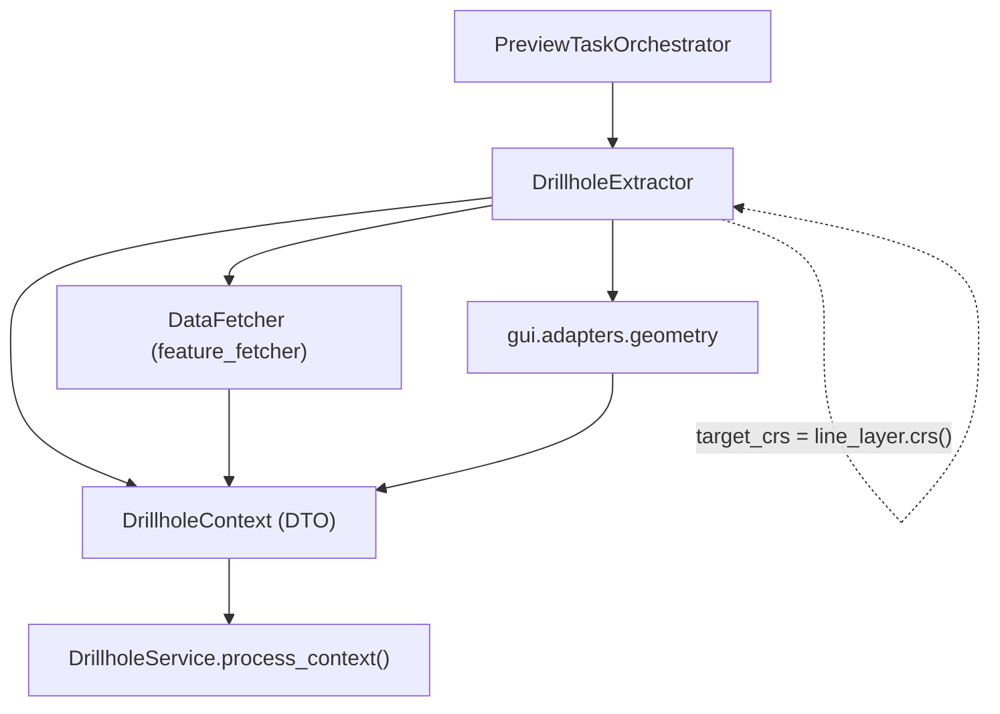

---
tags:
  - secinterp
  - code-walkthrough
  - gui
  - adapters
  - drillhole
aliases:
  - drillhole_extractor.py
  - DrillholeExtractor
  - DrillholeContext
cssclass: secinterp-note
---

# `gui/adapters/drillhole_extractor.py`

> [!abstract] One-line summary
> **Extract** adapter for drillholes: buffers the line, detaches the collars inside the buffer, pre-samples their Z from the DEM and bulk-fetches surveys/intervals → a detached `DrillholeContext`.

**Path**: `gui/adapters/drillhole_extractor.py` (369 lines)
**Class**: `DrillholeExtractor`
**Constant**: `DEFAULT_BUFFER_SEGMENTS = 8`
**Layer**: GUI · Adapters (Extract phase)
**Tags**: #secinterp #gui #adapters #drillhole

---

## 🎯 Why does this file exist?

| Problem | Solution |
|---------|----------|
| `DrillholeService` (core) cannot touch `QgsVectorLayer` | Everything is converted to detached dicts/tuples |
| We must decide which collars enter the section | `line_geom.buffer(buffer_width, 8)` + bbox filter + `intersects()` |
| Child layers may be in another CRS | `_prepare_feature_request` applies `setDestinationCrs` with the project `transformContext` |
| Surveys must be read in a single pass | `DataFetcher.fetch_bulk_data` with an `IN (...)` expression |
| Collar Z values may be missing | Pre-sampling from the DEM (`_pre_sample_z`) |

> [!important] Extract boundary
> The only drillhole module that touches QGIS. `DrillholeContext` holds IDs, `(depth, azim, incl)` tuples, `(from, to, lith)` tuples, `(x, y)` points and sanitized attributes.

---

## 🧬 Relationship diagram



---

## 📦 Imports — architectural reading

```python
from qgis.core import (QgsCoordinateReferenceSystem, QgsFeatureRequest, QgsGeometry,
                       QgsProject, QgsRasterLayer, QgsVectorLayer)
from qgis.PyQt.QtCore import QCoreApplication
from sec_interp.core import utils as scu
from sec_interp.core.domain.task_inputs import DrillholeContext
from sec_interp.core.exceptions import DataMissingError, ValidationError
from sec_interp.gui.adapters import geometry
```

| # | Observation |
|---|-------------|
| ① | `QgsProject` is used only to obtain the `transformContext` for reprojection. |
| ② | `DataFetcher` is **injected** via the constructor (not instantiated here): testable and decoupled. |
| ③ | `scu.extract_feature_attributes` sanitizes attributes to primitives. |
| ④ | `geometry.sample_point_elevation` is delegated to the shared adapter. |

---

## 🧱 `DrillholeContext` — the output DTO

```python
@dataclass
class DrillholeContext:
    line_points: list[Point2D]
    section_azimuth: float
    buffer_width: float
    collar_id_field: str
    collar_z_field: str
    collar_depth_field: str
    collar_data: list[dict[str, Any]]          # {"id", "point", "attributes"}
    survey_data: dict[Any, list[tuple[float, float, float]]]  # id -> (depth, azim, incl)
    interval_data: dict[Any, list[tuple[float, float, str]]]  # id -> (from, to, lith)
    pre_sampled_z: dict[Any, float] = field(default_factory=dict)
```

> [!note] No QGIS
> None of these fields references a QGIS object: the context is safe to cross into a background thread.

---

## 🧱 `extract_context()` — long signature, single responsibility

```python
def extract_context(self, line_layer, buffer_width, collar_layer, collar_id_field,
                    use_geometry, collar_x_field, collar_y_field, collar_z_field,
                    collar_depth_field, survey_layer, survey_fields, interval_layer,
                    interval_fields, dem_layer=None, band_num=1) -> DrillholeContext | None:
    if buffer_width <= 0:
        raise ValidationError(self.tr("Buffer width must be positive"))
    self._validate_fields(...)
    line_geom = self._read_line_geometry(line_layer)
    if line_geom is None:
        return None
    line_points = self._extract_line_points(line_geom)
    section_azimuth = self._calculate_azimuth(line_points)
    ...
```

| Phase | Method |
|-------|--------|
| 1. Validate buffer | guards `buffer_width <= 0` |
| 2. Validate fields | `_validate_fields` → `_validate_collar_fields` + `_validate_child_fields` |
| 3. Read line | `_read_line_geometry`, `_extract_line_points`, `_calculate_azimuth` |
| 4. Detach collars | `_detach_collars` |
| 5. Fetch children | `data_fetcher.fetch_bulk_data` (only if `collar_ids` and `data_fetcher`) |
| 6. Build DTO | `DrillholeContext(...)` |

---

## 🧱 `_detach_collars()` — buffer, CRS and pre-sampling

```python
line_buffer = self._create_line_buffer(line_geom, buffer_width)
req = self._prepare_feature_request(line_geom, line_buffer, collar_layer, target_crs)
for feat in collar_layer.getFeatures(req):
    if line_buffer and not feat.geometry().intersects(line_buffer):
        continue
    hid = feat[id_field]
    collar_ids.add(hid)
    attrs = scu.extract_feature_attributes(feat)
    point = self._extract_point(feat, attrs, use_geom, x_field, y_field)
    if point is None:
        continue
    collar_data.append({"id": hid, "point": point, "attributes": attrs})
    z = self._pre_sample_z(feat, attrs, hid, z_field, point, dem_layer)
    if z is not None:
        pre_sampled_z[hid] = z
```

| Detail | Behaviour |
|--------|-----------|
| `_create_line_buffer` | `buffer(buffer_width, DEFAULT_BUFFER_SEGMENTS)`; `None` if it fails |
| `_prepare_feature_request` | buffer bbox + `setDestinationCrs(target_crs)` when the CRS differs |
| `_extract_point` | Geometry if `use_geometry`; otherwise X/Y fields (via `float()`) |
| `_pre_sample_z` | Z from the field; if it is `0.0` and a DEM exists, samples the raster |

> [!warning] Two important nuances
> 1. The `hid` is added to `collar_ids` **before** checking `point is None`, so IDs without a point can reach the fetch.
> 2. `pre_sampled_z` only stores values **sampled from the DEM**: if the Z came from the field, `_pre_sample_z` returns `None` and nothing is stored.

---

## 🧱 Field validation — 3 levels

```python
def _validate_collar_fields(self, ...):
    collar_names = [f.name() for f in collar_layer.fields()]
    self._check_field(collar_id_field, collar_names, "Collar ID")
    if not use_geometry:
        self._check_field(collar_x_field, collar_names, "Collar X")
        self._check_field(collar_y_field, collar_names, "Collar Y")
    if collar_z_field: self._check_field(collar_z_field, collar_names, "Collar Z")
    if collar_depth_field: self._check_field(collar_depth_field, collar_names, "Collar Depth")
```

| Level | What it validates |
|-------|-------------------|
| Collar | ID always; X/Y only when geometry is not used; Z/Depth when defined |
| Survey | All fields in `survey_fields.values()` |
| Interval | All fields in `interval_fields.values()` |

---

## 🧱 Azimuth and buffer

```python
def _calculate_azimuth(self, points) -> float:
    MIN_REQUIRED_POINTS = 2
    if len(points) < MIN_REQUIRED_POINTS:
        return 0.0
    p1, p2 = points[0], points[1]
    azimuth = math.degrees(math.atan2(p2[0] - p1[0], p2[1] - p1[1]))
    return azimuth + 360 if azimuth < 0 else azimuth
```

> [!note] `buffer_width` in layer units
> Like `StructureExtractor`, the buffer is interpreted in the line layer's units. In EPSG:4326 that would be degrees, not metres.

---

## 🏛️ Design patterns present

| Pattern | Where | Purpose |
|---------|-------|---------|
| **Adapter / Bridge** | whole class | QGIS → DTO |
| **Dependency injection** | `__init__(data_fetcher)` | Inject the fetcher (mockable) |
| **Bulk fetch** | `DataFetcher.fetch_bulk_data` | A single query per child layer |
| **CRS transform** | `_prepare_feature_request` | Compare layers in different CRS |
| **Fail-fast** | `_validate_fields` | Errors before reading features |
| **Graceful degradation** | optional DEM, fallbacks | Works without a DEM too |

---

## 🧾 API summary

| Symbol | Signature | Use |
|--------|-----------|-----|
| `DrillholeExtractor` | `__init__(data_fetcher=None)` | Extractor with an injected fetcher |
| `extract_context` | `(line_layer, buffer_width, collar_layer, ... , band_num=1) -> DrillholeContext \| None` | Entry point |
| `_read_line_geometry` | `(line_lyr) -> QgsGeometry \| None` | First feature |
| `_detach_collars` | `(...) -> (set, list, dict)` | Collars + IDs + pre-sampled Z |
| `_prepare_feature_request` | `(...) -> QgsFeatureRequest` | bbox + reprojection |
| `_extract_point` | `(...) -> tuple[float, float] \| None` | Collar point |
| `_pre_sample_z` | `(...) -> float \| None` | Z from field or DEM |
| `_sample_elevation` | `(dem_layer, point) -> float` | Delegates to `geometry` |
| `DEFAULT_BUFFER_SEGMENTS` | `= 8` | Buffer approximation segments |

---

## 👀 Observations and notes

> [!success] Strengths
> - Handles child-layer reprojection with the project `transformContext`.
> - Bulk fetch via an `IN` expression, not N queries per hole.
> - Optional DEM and graceful degradation.

> [!warning] Points of attention
> - `extract_context` has **14 parameters**; a config dataclass would make it more readable.
> - `collar_ids` can include IDs without a valid point (see above).
> - `pre_sampled_z` does not store the Z already present in the field (the service re-reads it).
> - The `IN` expression is built by string interpolation: valid for numeric/text IDs, but quote handling deserves care.

> [!question] Open questions
> - Should `_detach_collars` add the ID only after validating the point?
> - Would a `DrillholeExtractionParams` help shrink the signature?

---

## 🔗 Related notes

- [[drillhole_service]] — consumes `DrillholeContext`
- [[adapters]] — overview of the Extract phase
- [[domain]] — definition of `DrillholeContext`
- [[tasks]] — `DrillholeGenerationTask` carries this context
- [[drillhole_page]] — form that produces the parameters
- [[Index]] — vault index

---

*Note of the SecInterp Code Walkthrough vault — v3.8.0*
