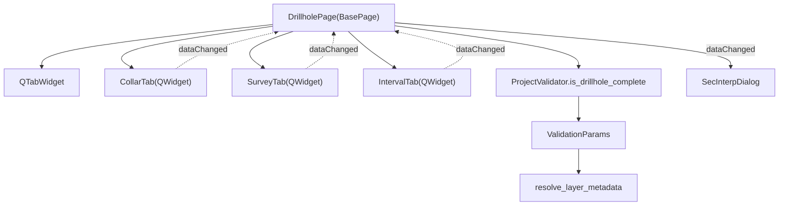

---
tags:
  - secinterp
  - code-walkthrough
  - gui
  - ui-pages
aliases:
  - drillhole_page.py
  - DrillholePage
cssclass: secinterp-note
---

# `gui/ui/pages/drillhole_page.py`

> [!abstract] One-line summary
> **Drillhole** configuration page (Collar / Survey / Interval) acting as a **coordinator**: it owns the `QTabWidget`, delegates each form to [[drillhole_tabs]], and validates with `ProjectValidator.is_drillhole_complete`.

> [!info] Refactor 2026-09-20
> This 451-line page was decomposed into tabs ([[drillhole_tabs]]); `DrillholePage` is now a **130-line coordinator** that does not know the field widgets of each tab.

**Path**: `gui/ui/pages/drillhole_page.py` (130 lines; formerly 451)
**Class**: `DrillholePage(BasePage)`
**Layer**: GUI · UI Pages
**Tags**: #secinterp #gui #ui-pages

---

## 🎯 Why does this file exist?

| Problem (before) | Solution (today) |
|------------------|------------------|
| 451 lines mixing 3 forms + validation + coordination | A `QTabWidget` + 3 tabs in `gui/ui/pages/drillhole/` |
| A change in Collar forced touching a giant module | Each tab is an isolated `QWidget` |
| Hard-to-trace signals | Each tab exposes its own `dataChanged`; the page re-emits it |
| Validation coupled to concrete widgets | `get_data()` → `ValidationParams` → `ProjectValidator` |
| Scattered persistence | `dump()/load()/reset()` protocol delegated to each tab |

> [!important] Coordinator, not a form
> `DrillholePage` only orchestrates: it aggregates `get_data`/`dump`/`load`/`reset` from the tabs and translates to core validation. It builds no `QgsFieldComboBox` or `QgsMapLayerComboBox`.

---

## 🧬 Relationship diagram



> [!tip] How to read
> Solid arrow = composition/import; dotted = signal re-emitted by the coordinator. Validation crosses into `core/validation`.

---

## 📦 Imports — architectural reading

```python
# drillhole_page.py
import contextlib
from typing import Any

from qgis.PyQt.QtCore import QCoreApplication, pyqtSignal
from qgis.PyQt.QtWidgets import QTabWidget, QVBoxLayout, QWidget

from sec_interp.core.validation.project_validator import (
    ProjectValidator, ValidationParams,
)
from sec_interp.gui.adapters.validation_extractor import resolve_layer_metadata
from sec_interp.logger_config import get_logger

from .base_page import BasePage
from .drillhole import CollarTab, IntervalTab, SurveyTab
```

| # | Observation |
|---|-------------|
| ① | The page imports `core.validation` (pure rules) and an Extract adapter — the correct pattern. |
| ② | `resolve_layer_metadata` converts QGIS layers into serializable metadata before validating. |
| ③ | Tabs are imported from the `drillhole` subpackage; the page never touches `qgis.gui`. |

---

## 🧱 Class and metadata

```python
class DrillholePage(BasePage):
    """Configuration page for Drillhole data (Collar, Survey, Intervals)."""

    dataChanged = pyqtSignal()
    layer_keys = frozenset({"dh_collar_layer", "dh_survey_layer", "dh_interval_layer"})

    def __init__(self, parent: QWidget | None = None) -> None:
        super().__init__(
            QCoreApplication.translate("DrillholePage", "Drillhole Data"), parent
        )
```

| Symbol | Role |
|--------|------|
| `dataChanged` | Signal re-emitted to the dialog when any tab changes. |
| `layer_keys` | Persistence keys representing layers (used by the dialog save logic). |
| `BasePage` | Provides `group_box`, `main_layout` and the `get_data/validate/...` protocol. |

---

## 🧱 `_setup_ui()` — mounting the tab container

```python
def _setup_ui(self) -> None:
    super()._setup_ui()

    layout = self.group_box.layout()
    if layout is None:
        layout = QVBoxLayout(self.group_box)
        self.group_box.setLayout(layout)

    self.tab_widget = QTabWidget()
    layout.addWidget(self.tab_widget)

    self.collar_tab = CollarTab()
    self.tab_widget.addTab(self.collar_tab, self.tr("Collars"))

    self.survey_tab = SurveyTab()
    self.tab_widget.addTab(self.survey_tab, self.tr("Survey"))

    self.interval_tab = IntervalTab()
    self.tab_widget.addTab(self.interval_tab, self.tr("Intervals"))

    layout.addStretch()
```

| Tab | Content (delegated) |
|-----|---------------------|
| `collar_tab` | Collar layer, ID, X/Y/Z, total depth, `use_geometry`. |
| `survey_tab` | Survey layer + ID/depth/azimuth/inclination. |
| `interval_tab` | Interval layer + ID/from/to/lithology. |

> [!note] No widgets of its own
> The page exposes no `self.c_id` or similar: backward-compatible aliases would read `self.collar_tab.c_id`. This keeps the decomposition clean.

---

## 🧱 Data protocol — `get_data` / `dump` / `load` / `reset`

```python
def get_data(self) -> dict[str, Any]:
    data: dict[str, Any] = {}
    data.update(self.collar_tab.get_data())
    data.update(self.survey_tab.get_data())
    data.update(self.interval_tab.get_data())
    return data

def dump(self) -> dict[str, Any]:
    data: dict[str, Any] = {}
    data.update(self.collar_tab.dump())
    data.update(self.survey_tab.dump())
    data.update(self.interval_tab.dump())
    return data

def load(self, data: dict[str, Any]) -> None:
    self.collar_tab.load(data)
    self.survey_tab.load(data)
    self.interval_tab.load(data)

def reset(self) -> None:
    self.collar_tab.reset()
    self.survey_tab.reset()
    self.interval_tab.reset()
```

| Method | Keys | Use |
|--------|------|-----|
| `get_data()` | `collar_*`, `survey_*`, `interval_*` | Validation and extraction toward core. |
| `dump()` | `dh_*` | Dialog state persistence. |
| `load(data)` | `dh_*` | Restore on open. |
| `reset()` | — | Default values. |

> [!tip] Merge via `update`
> Since each tab uses a distinct key space, `dict.update` composes the dictionary without collisions. It is the Composite pattern applied to forms.

---

## 🧱 `is_complete()` — validation against core

```python
def is_complete(self) -> bool:
    data = self.get_data()
    params = ValidationParams(
        collar_layer=resolve_layer_metadata(data["collar_layer"]),
        collar_id=data["collar_id"],
        collar_use_geom=data["use_geometry"],
        collar_x=data["collar_x"],
        collar_y=data["collar_y"],
        survey_layer=resolve_layer_metadata(data["survey_layer"]),
        survey_id=data["survey_id"],
        survey_depth=data["survey_depth"],
        survey_azim=data["survey_azim"],
        survey_incl=data["survey_incl"],
        interval_layer=resolve_layer_metadata(data["interval_layer"]),
        interval_id=data["interval_id"],
        interval_from=data["interval_from"],
        interval_to=data["interval_to"],
        interval_lith=data["interval_lith"],
    )
    return ProjectValidator.is_drillhole_complete(params)
```

| Step | Detail |
|------|--------|
| 1 | `get_data()` gathers the 3 tabs. |
| 2 | `resolve_layer_metadata()` extracts serializable metadata from each layer. |
| 3 | An immutable `ValidationParams` is built. |
| 4 | `ProjectValidator.is_drillhole_complete(params)` (core, no QGIS) decides. |

> [!important] Extract-then-Compute
> Validation does **not** happen in the GUI: it only extracts and delegates to `core/validation/project_validator.py`.

---

## 🧱 `connect_signals()` / `disconnect_signals()`

```python
def connect_signals(self) -> None:
    for tab in (self.collar_tab, self.survey_tab, self.interval_tab):
        tab.dataChanged.connect(self.dataChanged.emit)
        tab.connect_signals()

def disconnect_signals(self) -> None:
    for tab in (self.collar_tab, self.survey_tab, self.interval_tab):
        tab.disconnect_signals()
        with contextlib.suppress(TypeError, RuntimeError):
            tab.dataChanged.disconnect(self.dataChanged.emit)

    with contextlib.suppress(TypeError, RuntimeError):
        self.dataChanged.disconnect()
```

| Phase | Action |
|-------|--------|
| Connect | Re-emits each tab's `dataChanged` and connects the tab's internal widgets. |
| Disconnect | Disconnects the tabs, the re-emission and the page's own signal. |
| Tolerance | `contextlib.suppress` avoids errors if already disconnected. |

---

## 🏛️ Design patterns present

| Pattern | Where | Purpose |
|---------|-------|---------|
| **Composite / Coordinator** | `DrillholePage` | One page over 3 homogeneous tabs. |
| **Observer** | Re-emitted `dataChanged` | The dialog reacts to any change. |
| **Protocol (dump/load/reset/get_data)** | tabs + page | Uniform persistence. |
| **Adapter (Extract)** | `resolve_layer_metadata` | QGIS layer → metadata for core. |
| **Delegation** | `ProjectValidator` | Validation outside the GUI. |

---

## 🧾 API summary

| Symbol | Signature / Inherits | Typical use |
|--------|----------------------|-------------|
| `dataChanged` | `pyqtSignal()` | Change notification to the dialog. |
| `layer_keys` | `frozenset[str]` | Persistable layer keys. |
| `DrillholePage` | `BasePage` | Drillhole page. |
| `get_data()` | `() -> dict[str, Any]` | Data for validation/extraction. |
| `dump()` / `load(data)` | `dict[str, Any]` | Persistence (`dh_*`). |
| `reset()` | `() -> None` | Defaults. |
| `is_complete()` | `() -> bool` | Validation via `ProjectValidator`. |
| `connect_signals()` / `disconnect_signals()` | `() -> None` | Signal lifecycle. |

---

## 👀 Observations and notes

> [!success] Strengths
> - A 130-line coordinator: the decomposition left the page readable and focused.
> - Validation lives in core and receives a DTO (`ValidationParams`), not widgets.
> - Each tab can evolve without touching the others.

> [!warning] Points of attention
> - `is_complete()` accesses by direct key (`data["collar_layer"]`): if a tab changed its keys it would break silently.
> - The page exposes no widget aliases; code that used `page.c_id` must migrate to `page.collar_tab.c_id`.

> [!question] Open questions
> - Should `is_complete()` also return a per-tab error message to guide the user?
> - Should the `dump/load/reset` protocol move to a common tab interface?

---

## 🔗 Related notes

- [[Index]] — vault index
- [[drillhole_tabs]] — tabs package (`CollarTab`, `SurveyTab`, `IntervalTab`)
- [[drillhole_service]] — consumes the extracted data
- [[drillhole_extractor]] — Extract adapter
- [[ui_pages]] — page catalog
- [[layer_gui_ui_pages]] — GUI pages layer

---

*Note of the SecInterp Code Walkthrough vault — v3.8.0*
