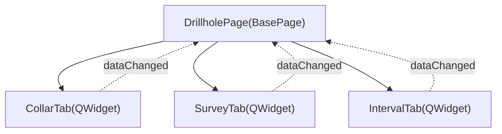

---
tags:
  - secinterp
  - code-walkthrough
  - gui
  - ui-pages
  - drillhole-tabs
aliases:
  - drillhole/
  - CollarTab
  - SurveyTab
  - IntervalTab
cssclass: secinterp-note
---

# `gui/ui/pages/drillhole/`

> [!abstract] One-line summary
> Tab package for the **drillhole** form: `CollarTab`, `SurveyTab` and `IntervalTab`, decomposed on **2026-09-20** from the former `drillhole_page.py` (451 lines).

**Path**: `gui/ui/pages/drillhole/` (collar_tab 180 · survey_tab 144 · interval_tab 144 · `__init__` 9 lines)
**Main class**: `CollarTab`, `SurveyTab`, `IntervalTab` (`QWidget`)
**Layer**: GUI · UI Pages
**Tags**: #secinterp #gui #ui-pages #drillhole-tabs

---

## 🎯 Why does this package exist?

| Problem | Solution |
|---------|----------|
| `drillhole_page.py` had 451 lines mixing 3 forms + coordination | Widget/Composite decomposition (2026-09-20) |
| A Collar change forced editing a giant module | Each tab is an isolated `QWidget` |
| Signals were hard to trace | Each tab exposes its own `dataChanged` |

> [!important] Coordinator, not form
> `DrillholePage` (130 lines) only owns the `QTabWidget` and delegates: it does not know the field widgets of each tab.

---

## 🧬 Relationship diagram



> [!tip] How to read
> Solid arrow = composition/imports; dotted = signal re-emitted by the coordinator.

---

## 🧱 Main section — `CollarTab`

```python
class CollarTab(QWidget):
    dataChanged = pyqtSignal()

    def _toggle_xy_fields(self, checked: bool) -> None:
        enabled = not checked
        self.lbl_x.setEnabled(enabled)
        self.c_x.setEnabled(enabled)
```

| Symbol | Role |
|--------|------|
| `chk_use_geom` | When checked, disables X/Y via `_toggle_xy_fields`. |
| `get_data()` | Returns `collar_layer/id/x/y/z/depth` + `use_geometry`. |
| `dump()/load()/reset()` | Persistence protocol with `dh_*` keys. |

---

## 🧱 `SurveyTab` and `IntervalTab`

- **`SurveyTab`**: layer + id/depth/azimuth/inclination; modern `setFilters` (`Qgis.LayerFilters`) with a legacy fallback (`QgsMapLayerProxyModel.Filter`).
- **`IntervalTab`**: layer + id/from/to/lithology; same filter fallback pattern.

> [!tip] QGIS compatibility
> The `try/except (AttributeError, TypeError)` keeps support across filter-API versions.

---

## 🏛️ Design patterns present

| Pattern | Where | Purpose |
|---------|-------|---------|
| **Widget decomposition / Composite** | `DrillholePage` | One coordinator + 3 tabs |
| **Observer** | `dataChanged` | Each tab re-emits changes to the page |
| **Protocol (dump/load/reset)** | tabs + page | Persistence via `dialog_settings_persistence` |

> [!warning] Point of attention
> `_toggle_xy_fields(True)` runs on connect; the initial state disables X/Y.

---

## 🔗 Related notes

- [[drillhole_page]] — `DrillholePage` coordinator
- [[drillhole_service]] — consumes the extracted data
- [[drillhole_extractor]] — Extract adapter
- [[ui_pages]] — page catalog
- [[Index]] — vault index

---

*Note of the SecInterp Code Walkthrough vault — v3.8.0*
