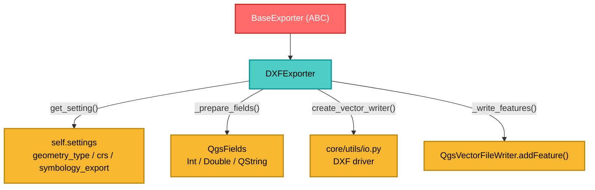

---
tags:
  - secinterp
  - code-walkthrough
  - exporters
  - dxf
  - vector
  - cad
aliases:
  - dxf_exporter.py
  - DXFExporter
cssclass: secinterp-note
---

# `exporters/dxf_exporter.py`

> [!abstract] One-line summary
> Exports **features to DXF** (CAD format) with `QgsVectorFileWriter`, inferring the field schema from the first feature and supporting symbology export.

**Path**: `exporters/dxf_exporter.py` (126 lines)
**Class**: `DXFExporter(BaseExporter)`
**Layer**: Exporters (QGIS · Vector)
**Tags**: #secinterp #exporters #dxf #vector #cad

---

## 🎯 Why does this file exist?

DXF is the format consumed by CAD software (AutoCAD, QCAD) to review geological sections. It has quirks a shapefile/GPKG does not have: CAD layers, exportable symbology and reserved field names.

| Problem | Solution |
|---------|----------|
| CAD does not understand arbitrary QGIS attributes | `_prepare_fields()` infers `Int`/`Double`/`QString` types |
| The user wants colors/symbology in CAD | `symbology_export` configurable in `create_vector_writer` |
| Missing CRS in the data | Default `EPSG:4326` via `get_setting("crs", ...)` |
| Writers left open, locking the file | `del writer` to force the close |

> [!important] Architectural note
> Although `DXFExporter` exists, the **factory** `get_exporter()` maps `.dxf` to `VectorExporter`. Both share almost identical code; `DXFExporter` remains a direct specialization (see "Points of attention").

---

## 🧬 Relationship diagram



---

## 📦 Imports — architectural reading

```python
from qgis.core import (
    QgsCoordinateReferenceSystem, QgsFeature, QgsField,
    QgsFields, QgsVectorFileWriter, QgsWkbTypes,
)
from qgis.PyQt.QtCore import QMetaType

from sec_interp.core.utils import io as scu_io
from sec_interp.logger_config import get_logger
from .base_exporter import BaseExporter
```

| # | Observation |
|---|-------------|
| ① | `QgsVectorFileWriter` is imported **only to check errors** (`WriterError.NoError`) |
| ② | `QMetaType` (Qt6) replaces `QVariant` for declaring field types |
| ③ | `scu_io.create_vector_writer` centralizes writer creation (driver `DXF`) |
| ④ | Unlike CSV/SVG, this module **does** depend on QGIS |

---

## 🧱 `export()` — writer creation and writing

```python
def export(self, output_path, features_data, layer_name=None) -> bool:
    if not features_data:
        return False
    try:
        geometry_type = self.get_setting("geometry_type", QgsWkbTypes.Type.LineString)
        crs = self.get_setting("crs", QgsCoordinateReferenceSystem("EPSG:4326"))
        symb_mode = self.get_setting(
            "symbology_export", QgsVectorFileWriter.SymbologyExport.NoSymbology)

        fields = self._prepare_fields(features_data)
        writer = scu_io.create_vector_writer(
            output_path, crs, fields, geometry_type,
            layer_name=layer_name, symbology_export=symb_mode)

        if writer.hasError() != QgsVectorFileWriter.WriterError.NoError:
            logger.error(f"Failed to create DXF writer: {writer.errorMessage()}")
            return False

        self._write_features(writer, features_data, fields)
        del writer  # writer is closed when object is deleted or goes out of scope
    except Exception:
        logger.exception(f"DXF export failed for {output_path}")
        return False
    else:
        return True
```

| Setting | Default | Role |
|---------|---------|------|
| `geometry_type` | `QgsWkbTypes.Type.LineString` | DXF geometry type |
| `crs` | `EPSG:4326` | Coordinate reference system |
| `symbology_export` | `NoSymbology` | Export symbology (colors) to CAD |

> [!warning] The writer is closed with `del writer`
> `QgsVectorFileWriter` has **no** useful explicit `close()`: it closes on destruction. `del writer` decrements the refcount and forces the close before returning `True`, preventing the file from staying locked.

---

## 🧱 `_write_features()` and `_prepare_fields()`

```python
def _write_features(self, writer, features_data, fields) -> None:
    for data in features_data:
        feature = QgsFeature(fields)
        if "geometry" in data:
            feature.setGeometry(data["geometry"])
        if "attributes" in data:
            attrs = data["attributes"]
            feature.setAttributes([attrs.get(f.name()) for f in fields])
        writer.addFeature(feature)

def _prepare_fields(self, features_data) -> QgsFields:
    fields = QgsFields()
    if not features_data or not isinstance(features_data, list):
        return fields
    first_item = features_data[0]
    if not isinstance(first_item, dict) or "attributes" not in first_item:
        return fields
    for key, value in first_item["attributes"].items():
        if isinstance(value, int):
            fields.append(QgsField(key, QMetaType.Type.Int))
        elif isinstance(value, float):
            fields.append(QgsField(key, QMetaType.Type.Double))
        else:
            fields.append(QgsField(key, QMetaType.Type.QString))
    return fields
```

| Detail | Behavior |
|--------|----------|
| `setAttributes([...])` | Maps by **field name**, in `fields` order; missing → `None` |
| `addFeature()` | Boolean return is **ignored** (a failed feature does not abort the rest) |
| Inferred types | `int`→`Int`, `float`→`Double`, otherwise→`QString` |
| Schema source | Only the **first** feature (assumes a homogeneous schema) |

> [!important] For DXF, `create_vector_writer` ignores these fields
> In `core/utils/io.py` (lines 76-82), for `.dxf` it sets `effective_fields = QgsFields()` to avoid conflicts with reserved CAD names. Attributes are **not** materialized in the DXF; geometry is.

---

## 🏛️ Design patterns present

| Pattern | Where | Purpose |
|---------|-------|---------|
| **Template Method** | `BaseExporter` | Common contract + `get_setting()` |
| **Strategy** | `DXFExporter` | CAD-specific vector strategy |
| **Factory Method** | `scu_io.create_vector_writer` | Picks the driver by extension |
| **Schema Inference** | `_prepare_fields` | Derives the schema from the first record |
| **Fail-safe** | `try/except` + `logger.exception` | Does not propagate write errors |

---

## 🧾 API summary

| Symbol | Signature / Inherits | Typical use |
|--------|----------------------|-------------|
| `DXFExporter` | `class DXFExporter(BaseExporter)` | CAD exporter |
| `get_supported_extensions()` | `-> [".dxf"]` | Extension validation |
| `export(output_path, features_data, layer_name=None)` | `-> bool` | Writes a list of features |
| `_write_features(writer, features_data, fields)` | private | Iterates and adds features |
| `_prepare_fields(features_data)` | private | Infers `QgsFields` |

---

## 👀 Observations and notes

> [!success] Strengths
> - **Automatic schema**: no need to declare fields by hand.
> - **Tolerant of features without geometry or attributes**.
> - **CAD symbology** optional and **explicit writer close**.

> [!warning] Points of attention
> - **Duplication with `VectorExporter`** (126 vs 122 lines, nearly identical).
> - The `get_exporter('.dxf')` factory returns `VectorExporter`, not `DXFExporter`; the latter is instantiated directly. Technical debt to consolidate.
> - The return of `writer.addFeature(feature)` is discarded: features can be lost silently.
> - It does not validate `output_path`; it relies on the orchestrator's `validate_export_path()`.
> - `except Exception` silences programming errors by returning `False`.

> [!question] Open questions
> - Should `DXFExporter` and `VectorExporter` be unified into one class with optional `symbology_export`?
> - Should it count written features and warn if `addFeature` fails?

---

## 🔗 Related notes

- [[Index]] — vault index
- [[base_exporter]] — abstract contract
- [[vector_exporter]] — nearly identical generic implementation
- [[layer_exporters]] — layer of specialized exporters
- [[export_package]] — orchestrator that routes `.dxf`
- [[controller]] — produces the geometries

---

*Note of the SecInterp Code Walkthrough vault — v3.8.0*
