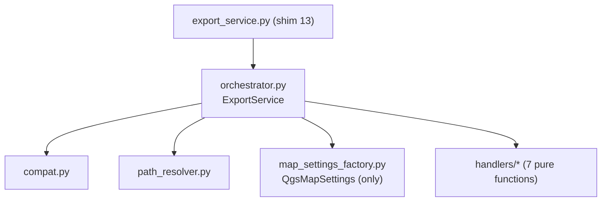

---
tags:
  - secinterp
  - code-walkthrough
  - core
  - export-package
  - orchestrator
aliases:
  - export/ package
  - ExportService
cssclass: secinterp-note
---

# `core/services/export/`

> [!abstract] One-line summary
> Package that **decomposes** the former monolithic export into an orchestrator + path resolver + handlers per data type, with `export_service.py` as a compatibility shim.

**Path**: `core/services/export/` (package, 11 modules · ~920 lines)
**Class**: `ExportService` (`orchestrator.py`, 207 lines)
**Layer**: Core · Services
**Tags**: #secinterp #core #export-package #orchestrator

---

## 🎯 Why does this file exist?

On 2026-09-20 the former 645-line `export_service.py` was split. Today `core/services/export_service.py` is a **13-line shim** that only re-exports `ExportService` so existing imports keep working.

| Problem (before) | Solution (`export/` package) |
|------------------|------------------------------|
| One file did orchestration + paths + QGIS + 12 exporters | One module per responsibility |
| Impossible to test without dragging everything | Pure handlers + isolated factory |
| Private API used by tests | `compat.py` with `_export_*` wrappers |

> [!important] Core boundary
> Handlers **do not import `qgis`**. The only module importing `QgsMapSettings` is `map_settings_factory.py`, isolating it from the rest.

---

## 🧬 Relationship diagram



---

## 🧱 `orchestrator.py` — the facade

`ExportService(ExportServiceCompatMixin)` validates options (`any()`), requires `profile_data` and `line_layer` (`_resolve_layers`), derives `.shp`/`.gpkg`/`.dxf` from `default_format` and routes through a **routing dict** keyed by `exp_*` option:

```python
handlers = {  # routing dict: exp_topo, exp_geol, exp_struct,
    "exp_topo": topo_handler,   #  exp_drill, exp_drill_3d, exp_interp
    "exp_geol": lambda: geo_h.export_geology(...),
}
for opt, handler in handlers.items():
    if options.get(opt, True):
        handler()
```

---

## 🧩 Modules and handlers

| Module | Lines | Responsibility |
|--------|:-----:|----------------|
| `path_resolver.py` | 60 | `get_profile_name()` sanitizes `/` and `\`; `resolve_export_path()` applies `naming_pattern` and chooses GPKG (`profile.gpkg`) vs container folder |
| `map_settings_factory.py` | 34 | Only import of `qgis.core.QgsMapSettings`; `create_map_settings()` |
| `compat.py` | 129 | Mixin with legacy `_export_*` wrappers and `_get_export_path` for tests |
| `handlers/topography.py` | 63 | `export_topography` → CSV `topo_profile` + `profile_line` vector |
| `handlers/geology.py` | 66 | `export_geology` → CSV + `GeologyVectorExporter` |
| `handlers/structures.py` | 77 | `export_structures` → CSV + `StructureVectorExporter` |
| `handlers/drillholes.py` | 70 | `export_drillholes` → 2D traces + intervals |
| `handlers/drillholes_3d.py` | 82 | `export_drillholes_3d` → declarative table of 4 tasks (real/projected) |
| `handlers/interpretations.py` | 93 | `export_interpretations` → 2D + 3D gated by `AccessControlService.can_export_3d()` |
| `handlers/axes.py` | 39 | `export_axes` → `AxesVectorExporter` |

---

## 🏛️ Design patterns present

| Pattern | Where | Purpose |
|---------|-------|---------|
| **Facade / Orchestrator** | `ExportService` | One API over 7 handlers |
| **Strategy per format** | `*.export(...)` | SHP/GPKG/DXF/CSV interchangeable |
| **Registry / routing dict** | `handlers` | Declarative dispatch per `exp_*` |
| **Backward-compat shim** | `export_service.py` + `compat.py` | Do not break imports or tests |

---

## 🔗 Related notes

- [[export_service]] — note on the former monolith (historical context)
- [[base_exporter]] / [[vector_exporter]] — contract and implementations
- [[access_control_service]] — 3D gate
- [[controller]] — data source and settings
- [[Index]] — vault index

---

*Note of the SecInterp Code Walkthrough vault — v3.8.0*
