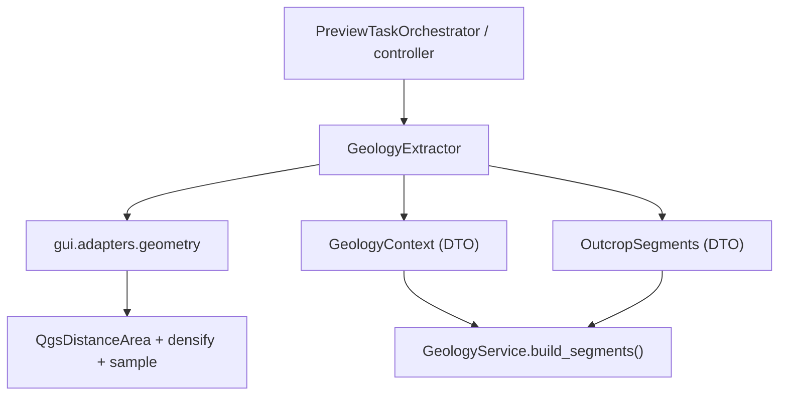

---
tags:
  - secinterp
  - code-walkthrough
  - gui
  - adapters
  - geology
aliases:
  - geology_extractor.py
  - GeologyExtractor
  - GeologyContext
cssclass: secinterp-note
---

# `gui/adapters/geology_extractor.py`

> [!abstract] One-line summary
> **Extract** adapter for geology: reads line + DEM + outcrops, densifies the master profile and intersects the outcrop polygons with the line → a fully detached `GeologyContext`.

**Path**: `gui/adapters/geology_extractor.py` (235 lines)
**Class**: `GeologyExtractor`
**Layer**: GUI · Adapters (Extract phase)
**Tags**: #secinterp #gui #adapters #geology

---

## 🎯 Why does this file exist?

| Problem | Solution |
|---------|----------|
| `GeologyService` (core) cannot touch `QgsGeometry` | The adapter produces WKT + tuples |
| Topography must be sampled at raster resolution | `_generate_master_profile` densifies by `rasterUnitsPerPixelX()` and samples with `dataProvider().sample()` |
| We must know which line stretches cross each unit | `line_geom.intersection(outcrop_geom)` → segments with distances |
| Errors must be clear before computing | `_validate_inputs` raises `DataMissingError` / `ValidationError` |

> [!important] Extract boundary
> The only geology module that imports `qgis.core`. The result, `GeologyContext`, contains only `(dist, elev)` tuples, `(x, y)` points and WKT.

---

## 🧬 Relationship diagram



> [!tip] How to read
> `GeologyExtractor` combines geometry (the `geometry` adapter) with the layers and returns two DTOs the pure service consumes.

---

## 📦 Imports — architectural reading

```python
from qgis.core import (QgsDistanceArea, QgsFeatureRequest, QgsGeometry,
                       QgsPointXY, QgsRasterLayer, QgsVectorLayer)
from qgis.PyQt.QtCore import QCoreApplication
from sec_interp.core import utils as scu
from sec_interp.core.domain import DomainGeometry
from sec_interp.core.domain.task_inputs import GeologyContext, OutcropSegments
from sec_interp.core.exceptions import DataMissingError, GeometryError, ValidationError
from sec_interp.gui.adapters import geometry
```

| # | Observation |
|---|-------------|
| ① | Imports the DTOs from `core.domain.task_inputs` rather than redefining them. |
| ② | Uses `gui.adapters.geometry` as a shared geometry toolbox. |
| ③ | `scu.extract_feature_attributes` sanitizes each outcrop's attributes. |
| ④ | `QCoreApplication` is used in `tr()` for i18n. |

---

## 🧱 `extract_context()` — extraction orchestration

```python
def extract_context(self, line_lyr, raster_lyr, outcrop_lyr,
                    outcrop_name_field, band_number=1) -> GeologyContext:
    self._validate_inputs(line_lyr, raster_lyr, outcrop_lyr, outcrop_name_field, band_number)
    line_geom, line_start = self._extract_line_info(line_lyr)
    crs = line_lyr.crs()
    da = geometry.create_distance_area(crs)
    master_profile_data, master_grid_dists_raw = self._generate_master_profile(...)
    master_grid_dists = [(d, (pt.x(), pt.y()), e) for d, pt, e in master_grid_dists_raw]
    outcrops = [OutcropSegments(unit_name=..., attributes=..., segments=...) ...]
    return GeologyContext(master_profile_data=..., master_grid_dists=..., outcrops=..., tolerance=0.001)
```

| Output | Content |
|--------|---------|
| `master_profile_data` | `[(distance, elevation)]` of the topographic profile |
| `master_grid_dists` | `[(distance, (x, y), elevation)]` for interpolation |
| `outcrops` | List of `OutcropSegments` with `(d0, d1, wkt)` stretches |
| `tolerance` | Fixed `0.001` for intersection sampling |

---

## 🧱 `_validate_inputs()` — fail-fast

| Check | Exception |
|-------|-----------|
| Line and raster are valid | `DataMissingError` |
| Outcrop (if present) is valid | `DataMissingError` |
| `band_number >= 1` | `ValidationError` |
| `band_number <= raster.bandCount()` | `ValidationError` |
| `outcrop_name_field` exists (`indexFromName != -1`) | `ValidationError` |

> [!tip] Early validation
> All input errors are caught **before** densifying or intersecting, avoiding expensive and useless work.

---

## 🧱 `_generate_master_profile()` — densify and sample

```python
interval = raster_lyr.rasterUnitsPerPixelX()
master_densified = geometry.densify_line_by_interval(line_geom, interval)
grid_points = geometry.get_line_vertices(master_densified)
...
for i, pt in enumerate(grid_points):
    if i > 0:
        current_dist += da.measureLine(grid_points[i - 1], pt)
    val, ok = raster_lyr.dataProvider().sample(pt, band_number)
    elev = val if ok else 0.0
```

| Detail | Value |
|--------|-------|
| Interval | Native raster resolution (`rasterUnitsPerPixelX`) |
| Fallback | If densifying fails (`AttributeError/ValueError/TypeError`) it uses the original vertices |
| Distance | Accumulated with `QgsDistanceArea.measureLine` (ellipsoidal) |
| Elevation | `sample()`; if it fails, `0.0` |

---

## 🧱 `_extract_outcrop_data()` + `_intersect_outcrop()`

```python
request = QgsFeatureRequest().setFilterRect(line_geom.boundingBox())
for feature in outcrop_lyr.getFeatures(request):
    attrs = scu.extract_feature_attributes(feature)
    unit_name = str(feature[outcrop_name_field])  # except KeyError -> "Unknown"
    outcrop_data.append({"wkt": feature.geometry().asWkt(), "attrs": attrs, "unit_name": unit_name})
```

```python
outcrop_geom = QgsGeometry.fromWkt(item["wkt"])
intersection = line_geom.intersection(outcrop_geom)
if intersection.isEmpty():
    return []
for seg_geom in geometry.extract_lines_from_geometry(intersection):
    dist_start, dist_end = geometry.calculate_segment_range(seg_geom, line_start, da)
    segments.append((dist_start, dist_end, seg_geom.asWkt()))
```

> [!note] WKT as the exchange currency
> The polygon is converted to WKT on extraction and back to `QgsGeometry` only to intersect; the result becomes WKT again. The core never sees QGIS geometry.

---

## 🏛️ Design patterns present

| Pattern | Where | Purpose |
|---------|-------|---------|
| **Adapter / Bridge** | `GeologyExtractor` | QGIS → DTOs |
| **Facade** | `extract_context` | A single entry point |
| **Fail-fast** | `_validate_inputs` | Errors before computing |
| **Graceful degradation** | densification fallback | Robust against odd rasters |
| **Template method** | `_generate_master_profile` | Fixed sampling steps |

---

## 🧾 API summary

| Symbol | Signature | Use |
|--------|-----------|-----|
| `extract_context` | `(line_lyr, raster_lyr, outcrop_lyr, outcrop_name_field, band_number=1) -> GeologyContext` | Entry point |
| `tr` | `(message) -> str` | i18n |
| `_validate_inputs` | `(...) -> None` | Fail-fast validation |
| `_extract_line_info` | `(line_lyr) -> (QgsGeometry, QgsPointXY)` | Line + start |
| `_generate_master_profile` | `(...) -> (profile, grid)` | Master profile |
| `_extract_outcrop_data` | `(line_geom, outcrop_lyr, field) -> list[dict]` | Outcrops in bbox |
| `_intersect_outcrop` | `(...) -> list[tuple[float, float, str]]` | Stretches per outcrop |

---

## 👀 Observations and notes

> [!success] Strengths
> - `GeologyContext` is fully serializable (tuples/WKT).
> - Early validation and translatable messages.
> - Fallback if densification fails.

> [!warning] Points of attention
> - `tolerance=0.001` is **hardcoded** in `extract_context`; it does not come from `params`.
> - The intersection uses real `QgsGeometry`; with huge polygons the cost can rise.
> - `unit_name` falls back to `"Unknown"` only on `KeyError`; null values become the text `"None"`.

> [!question] Open questions
> - Should `tolerance` be configurable from `PreviewParams`?
> - Should outcrops be filtered with an exact `intersects` in addition to the bbox?

---

## 🔗 Related notes

- [[geology_service]] — consumes `GeologyContext` and `OutcropSegments`
- [[adapters]] — overview of the Extract phase
- [[domain]] — definition of `GeologyContext` / `OutcropSegments`
- [[tasks]] — `GeologyGenerationTask` carries this context into the thread
- [[controller]] — orchestrates extraction + service
- [[Index]] — vault index

---

*Note of the SecInterp Code Walkthrough vault — v3.8.0*
