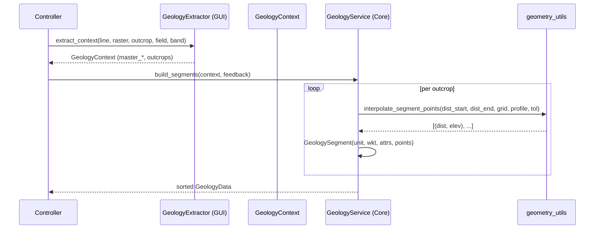

---
tags:
  - secinterp
  - code-walkthrough
  - core
  - geology
  - services
aliases:
  - geology_service.py
  - GeologyService
cssclass: secinterp-note
---

# 14 — `core/services/geology_service.py`

> [!abstract] One-line summary
> The **pure geology service** (Compute phase): from a detached `GeologyContext` it interpolates elevations and builds sorted `GeologySegment`s — **without touching QGIS**.

**Path**: `core/services/geology_service.py` (87 lines)
**Class**: `GeologyService(IGeologyService)`
**Interface**: `IGeologyService` → `build_segments(context, feedback=None) -> GeologyData`
**Layer**: Core · Services
**Tags**: #secinterp #core #geology #services

---

## 🎯 Why does this file exist?

Geology arrives as **QGIS polygons** intersecting the section line. The `GeologyExtractor` adapter already did the heavy work (densifying, intersecting, extracting attributes). This service only **interpolates** and **assembles** segments:

| Input (adapter) | Output (core) |
|------------------|---------------|
| `GeologyContext` with `master_profile_data`, `master_grid_dists`, `outcrops: list[OutcropSegments]` | `GeologyData = list[GeologySegment]` sorted by distance |

> [!important] Fully QGIS-agnostic
> It does not import `qgis.*`. It only uses `interpolate_segment_points` and `interpolate_elevation` (pure math) + `performance_monitor`.

---

## 🧬 Extract → Compute relationship



---

## 🧱 Interface — `IGeologyService`

```python
class IGeologyService(ABC):
    @abstractmethod
    def build_segments(self, context: GeologyContext, feedback: Any | None = None) -> Any:
        """Build geological segments from a detached context."""
```

| Parameter | Role |
|-----------|------|
| `context` | Output of `GeologyExtractor` (no QGIS) |
| `feedback` | Optional object with `isCanceled()` / `setProgress()` (QgsFeedback in production) |

> [!tip] Test abstraction
> You can mock `IGeologyService.build_segments` and the controller won't notice.

---

## 🧱 Service — `build_segments()`

```python
class GeologyService(IGeologyService):
    @performance_monitor
    def build_segments(self, context: GeologyContext, feedback: Any | None = None) -> GeologyData:
        segments: list[GeologySegment] = []
        total = len(context.outcrops)

        for i, outcrop in enumerate(context.outcrops):
            if feedback and feedback.isCanceled():
                return []

            for dist_start, dist_end, wkt in outcrop.segments:
                segment_points = interpolate_segment_points(
                    dist_start, dist_end,
                    context.master_grid_dists,
                    context.master_profile_data,
                    context.tolerance,
                )
                segments.append(
                    GeologySegment(
                        unit_name=outcrop.unit_name,
                        geometry_wkt=wkt,
                        attributes=outcrop.attributes,
                        points=[(float(d), float(e)) for d, e in segment_points],
                    )
                )

            if feedback:
                feedback.setProgress((i / total) * 100)

        segments.sort(key=lambda x: x.points[0][0] if x.points else 0)
        return segments
```

### Step by step

| # | What it does |
|---|--------------|
| 1 | Iterates `outcrops` from the context |
| 2 | Checks `feedback.isCanceled()` → aborts if the user cancelled |
| 3 | For each `(dist_start, dist_end, wkt)` interpolates points via `interpolate_segment_points` |
| 4 | Creates `GeologySegment` with the original WKT and `(dist, elev)` points |
| 5 | Reports progress `setProgress(i/total)` |
| 6 | Sorts by starting distance |

> [!note] `wkt` is preserved as-is
> The service **does not modify** the WKT geometry; it only adds `points` for rendering.

### Helper — `interpolate_segment_points()`

In `core/utils/geometry_utils/processing.py`:

```python
def interpolate_segment_points(
    dist_start, dist_end, master_grid_dists, master_profile_data, tolerance
) -> list[tuple[float, float]]:
    inner_points = [
        (d, e) for d, _, e in master_grid_dists
        if dist_start + tolerance < d < dist_end - tolerance
    ]
    elev_start = interpolate_elevation(master_profile_data, dist_start)
    elev_end   = interpolate_elevation(master_profile_data, dist_end)
    return [(dist_start, elev_start), *inner_points, (dist_end, elev_end)]
```

| Input | Derived from |
|-------|--------------|
| `master_profile_data` | `[(dist, elev)]` from the master profile |
| `master_grid_dists` | `[(dist, (x,y), elev)]` from the densified grid |
| `tolerance` | `0.001` from the context |

> [!tip] Idea
> Copies grid points that fall inside, and places interpolated start/end.
> This makes the segment **follow the topography** without recomputing it.

---

## 🏛️ Design patterns present

| Pattern | Where | Purpose |
|---------|-------|---------|
| **Pure Strategy (Compute)** | `build_segments` | Computation without QGIS |
| **Progress Template** | `feedback` | Cancellation and % |
| **Value Object** | `GeologyContext` / `OutcropSegments` | Immutable input data |
| **Decorator** | `@performance_monitor` | Traces without polluting logic |

---

## 🧾 API summary

| Symbol | Signature |
|--------|-----------|
| `IGeologyService.build_segments` | `(context: GeologyContext, feedback?) -> GeologyData` |
| `GeologyService.build_segments` | same, with interpolation and sort |
| `interpolate_segment_points` | `(dist_start, dist_end, grid, profile, tol) -> list[(dist,elev)]` |

---

## 👀 Observations and notes

> [!success] Strengths
> - **Minimal**, focused core (87 lines).
> - No QGIS → testable with a fabricated `GeologyContext`.
> - Respects cancellation feedback.

> [!warning] Points of attention
> - Does not validate `context` (assumes the extractor already did).
> - `feedback` is `Any` (coupled to the QGIS `QgsFeedback` interface).
> - Sorting only by `points[0][0]` could collide for segments with the same start distance.

> [!question] Open questions
> - Should `tolerance` be a configurable project parameter?
> - Should `GeologySegment` also carry `dist_start/dist_end` besides `points`?

---

## 🔗 Related notes

- [[Index]] — vault index
- [[controller]] — orchestrates `_process_geology` (cache + Extract/Compute)
- [[domain]] — `GeologyContext`, `GeologySegment`, `GeologyData`
- [[profile_service]] — extraction of the master profile (topography base)
- [[adapters]] — `GeologyExtractor` (context producer)
- `core/utils/geometry_utils/processing.py` — densification/interpolation

---

*Note 14 of the SecInterp Code Walkthrough vault — v3.8.0*
