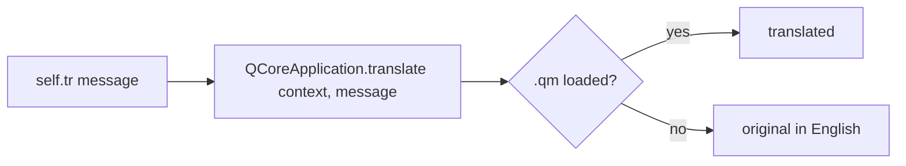

---
tags:
  - secinterp
  - code-walkthrough
  - core
  - utils
  - i18n
aliases:
  - i18n.py
  - TranslatableMixin
cssclass: secinterp-note
---

# `core/utils/i18n.py`

> [!abstract] One-line summary
> A **QGIS-agnostic i18n** helper: a `TranslatableMixin` that exposes `self.tr()` without inheriting from `QObject`.

**Path**: `core/utils/i18n.py` (30 lines)
**Class**: `TranslatableMixin`
**Layer**: Core · Utils
**Tags**: #secinterp #core #utils #i18n

---

## 🎯 Why does this file exist?

Translating in QGIS is done via `QCoreApplication.translate(context, message)`. But:

| Problem | `TranslatableMixin` solution |
|---------|------------------------------|
| Core classes **don't inherit** from `QObject` → no `self.tr()` | The mixin provides it |
| Repeated, error-prone context | Uses `self.__class__.__name__` as context automatically |
| Importing `QCoreApplication` everywhere | Centralized in one place |

> [!important] QGIS-agnostic (almost)
> It only imports `qgis.PyQt.QtCore.QCoreApplication` for `translate()`. It does not touch widgets or `Qgs*`.

---

## 🧱 The class — `TranslatableMixin`

```python
class TranslatableMixin:
    """Mixin to provide a standardized tr() method for translations."""

    def tr(self, message: str) -> str:
        return QCoreApplication.translate(self.__class__.__name__, message)
```

| Detail | Explanation |
|--------|-------------|
| **`self.__class__.__name__`** | Context = concrete class name (e.g. `"GeologyService"`, `"SecInterp"`) |
| **`QCoreApplication.translate`** | Qt's standard translation entry point |
| **`# type: ignore[no-any-return]`** | Silences mypy (Qt signature) |

> [!tip] Context per class
> Allows **class-specific** translations without collisions. The `.ts` file groups by that context.
> ```xml
> <context>
>     <name>GeologyService</name>
>     <message><source>No topographic profile data</source></message>
> </context>
> ```

### Typical usage

```python
from sec_interp.core.utils.i18n import TranslatableMixin

class ProfileController(TranslatableMixin):
    def _process_topography(self, params, ...):
        if not line_lyr:
            raise ProcessingError(self.tr("Required layers for topography are missing."))
```

```python
class DrillholeService(TranslatableMixin):
    except (ValueError, TypeError) as e:
        logger.exception(self.tr("Data error in hole {0}: {1}").format(hole_id, e))
```

### Alternative in GUI adapters

GUI adapters **do** inherit from `QObject` or touch `Qgs*`, so they can use `QCoreApplication.translate` directly:

```python
# gui/adapters/profile_extractor.py
def tr(self, message: str) -> str:
    return QCoreApplication.translate("ProfileExtractor", message)
```

> [!note] Same effect, different path
> Core classes use the mixin; GUI adapters use a local `tr()`. Both reach the same `translate`.

---

## 🔄 Translation cycle



> [!tip] Where `.qm` files are loaded
> See [[sec_interp_plugin]]: `QTranslator.load(SecInterp_<locale>.qm)` in `SecInterp.__init__`.

---

## 🏛️ Design patterns present

| Pattern | Where | Purpose |
|---------|-------|---------|
| **Mixin** | `TranslatableMixin` | Adds `tr()` without Qt multiple inheritance |
| **Template (context)** | `self.__class__.__name__` | Automatic context per subclass |

---

## 🧾 API summary

| Symbol | Signature | Use |
|--------|-----------|-----|
| `TranslatableMixin.tr(message: str)` | `-> str` | `self.tr("...")` in any core class |

---

## 👀 Observations and notes

> [!success] Strengths
> - Avoids duplicating `translate` in every core class.
> - Per-class context → clean `.ts`.

> [!warning] Points of attention
> - Renaming a class **orphans** its translations (new context).
> - Does not support pluralization or `QObject.tr()` with `QMetaObject` handling.

> [!question] Open questions
> - Should a `tr_plural(singular, plural, n)` helper be added?

---

## 🔗 Related notes

- [[Index]] — vault index
- [[sec_interp_plugin]] — `SecInterp(TranslatableMixin)` and `.qm` loading
- [[controller]] — `ProfileController(TranslatableMixin)` uses `self.tr()` in exceptions
- [[exceptions]] — translatable messages carried in exceptions

---

*Note of the SecInterp Code Walkthrough vault — v3.8.0*
