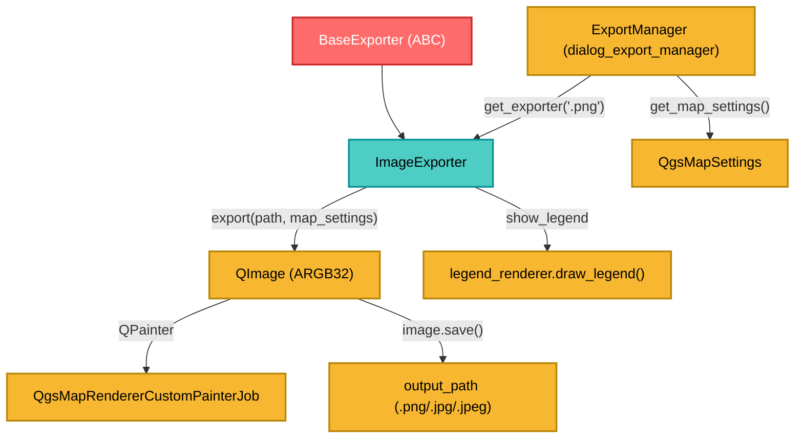

---
tags:
  - secinterp
  - code-walkthrough
  - exporters
  - image
  - png
  - raster
  - render
aliases:
  - image_exporter.py
  - ImageExporter
cssclass: secinterp-note
---

# `exporters/image_exporter.py`

> [!abstract] One-line summary
> Renders a `QgsMapSettings` to **PNG/JPG** using `QImage` + `QgsMapRendererCustomPainterJob`, with background color, antialiasing and optional legend.

**Path**: `exporters/image_exporter.py` (72 lines)
**Class**: `ImageExporter(BaseExporter)`
**Layer**: Exporters (QGIS · Raster/Render)
**Tags**: #secinterp #exporters #image #png #raster #render

---

## 🎯 Why does this file exist?

The preview window shows the interpreted section on a canvas. The user needs to **save it as an image** for reports. That flow does not export data: it exports **pixels**.

| Problem | Solution |
|---------|----------|
| Reproducing the canvas render outside the UI | `QgsMapRendererCustomPainterJob` onto a `QPainter` |
| Jagged edges / pixelated text | `RenderHint.Antialiasing` + `SmoothPixmapTransform` |
| Transparent/black image by default | `image.fill(background_color)` (white by default) |
| Missing layer legend | Optional `legend_renderer.draw_legend()` |
| Qt5/Qt6 enum incompatibility | `getattr(QImage, "Format", QImage).Format_ARGB32` |

> [!important] Layer boundary
> Unlike `CSVExporter`, this exporter **depends on QGIS** (render). It receives a `QgsMapSettings` already built by `ExportService.get_map_settings()`; it extracts no data and knows nothing about the geological model.

---

## 🧬 Relationship diagram



---

## 📦 Imports — architectural reading

```python
from qgis.core import QgsMapRendererCustomPainterJob, QgsMapSettings
from qgis.PyQt.QtCore import QRectF, QSize
from qgis.PyQt.QtGui import QColor, QImage, QPainter

from sec_interp.logger_config import get_logger
from .base_exporter import BaseExporter
```

| # | Observation |
|---|-------------|
| ① | `QgsMapSettings` is only a **type annotation**: the object is injected from the manager |
| ② | `QImage`, `QPainter`, `QColor`, `QSize`, `QRectF` → pure Qt rendering |
| ③ | `QgsMapRendererCustomPainterJob` is the QGIS bridge: it draws layers onto any `QPainter` |
| ④ | There is no `QgsProject`: the map is configured externally (no global state) |

---

## 🧱 `get_supported_extensions()` — raster formats

```python
def get_supported_extensions(self) -> list[str]:
    """Get supported image extensions."""
    return [".png", ".jpg", ".jpeg"]
```

`.png` for reports (lossless, supports transparency); `.jpg`/`.jpeg` for presentations (compressed, no alpha).

---

## 🧱 `export()` — render to image

```python
def export(self, output_path: Path, map_settings: QgsMapSettings) -> bool:
    try:
        width = self.get_setting("width", 800)
        height = self.get_setting("height", 600)
        background_color = self.get_setting("background_color", QColor(255, 255, 255))

        # Create image (Qt5/Qt6 compatibility for enum)
        img_format = getattr(QImage, "Format", QImage).Format_ARGB32
        image = QImage(QSize(width, height), img_format)
        image.fill(background_color)

        painter = QPainter(image)
        painter.setRenderHint(QPainter.RenderHint.Antialiasing)
        painter.setRenderHint(QPainter.RenderHint.SmoothPixmapTransform)

        job = QgsMapRendererCustomPainterJob(map_settings, painter)
        job.start()
        job.waitForFinished()

        show_legend = self.get_setting("show_legend", True)
        legend_renderer = self.get_setting("legend_renderer")
        if legend_renderer and show_legend:
            legend_renderer.draw_legend(painter, QRectF(0, 0, width, height))

        painter.end()
        return image.save(str(output_path))
    except Exception:
        logger.exception(f"Image export failed for {output_path}")
        return False
```

| Setting | Default | Role |
|---------|---------|------|
| `width` / `height` | `800` / `600` | Dimensions in pixels |
| `background_color` | `QColor(255, 255, 255)` | Initial fill |
| `show_legend` | `True` | Enable/disable the legend |
| `legend_renderer` | `None` | Object with `draw_legend(painter, rect)` |

> [!tip] Qt5/Qt6 compatibility
> `getattr(QImage, "Format", QImage).Format_ARGB32` avoids the scoped-enum warning in PyQt6: if `QImage.Format` exists, it uses it; otherwise it falls back to the classic `QImage`.

> [!warning] Signature incompatible with the base contract and no `finally`
> `export` defines **only two** parameters (no `layer_name`): it works through duck typing but breaks Liskov (a caller with `layer_name=` gets `TypeError`). Also, `painter.end()` is **not** in `finally`: if the job raises, the painter is not closed.

---

## 🏛️ Design patterns present

| Pattern | Where | Purpose |
|---------|-------|---------|
| **Template Method** | `BaseExporter` | Contract and settings |
| **Strategy** | `ImageExporter` | Concrete raster strategy |
| **Job / Command** | `QgsMapRendererCustomPainterJob` | Encapsulates the QGIS render |
| **Decorator (informal)** | `legend_renderer.draw_legend` | Overlays the legend after the render |
| **Fail-safe** | `try/except` + `logger.exception` | Returns `False` on failure |

---

## 🧾 API summary

| Symbol | Signature / Inherits | Typical use |
|--------|----------------------|-------------|
| `ImageExporter` | `class ImageExporter(BaseExporter)` | Image exporter |
| `get_supported_extensions()` | `-> [".png", ".jpg", ".jpeg"]` | Extension validation |
| `export(output_path, map_settings)` | `-> bool` | Renders and saves |
| `get_setting(key, default)` | inherited | Access to settings |

---

## 👀 Observations and notes

> [!success] Strengths
> - **Faithful render**: uses the same engine as QGIS.
> - **Quality**: antialiasing + pixmap smoothing.
> - **No global state** and **optional legend** decoupled via settings.

> [!warning] Points of attention
> - **Does not close the painter in `finally`** (unlike PDF/SVG).
> - Signature differs from the base contract (`layer_name` absent) → risk of `TypeError`.
> - `image.save()` infers the format from the extension; an unsupported extension returns `False` with no log.
> - `legend_renderer` couples the exporter to the GUI.
> - Render is **synchronous**: it blocks the calling thread.

> [!question] Open questions
> - Should `painter.end()` be moved into a `finally` block to guarantee cleanup?
> - Should the `export` signature be unified to respect the base contract?

---

## 🔗 Related notes

- [[Index]] — vault index
- [[base_exporter]] — abstract contract
- [[pdf_exporter]] / [[svg_exporter]] — same render job, different destination
- [[dialog_export_manager]] — builds `QgsMapSettings` and calls `export()`
- [[export_package]] — `ExportService.get_map_settings()`
- [[controller]] — preview data flow

---

*Note of the SecInterp Code Walkthrough vault — v3.8.0*
