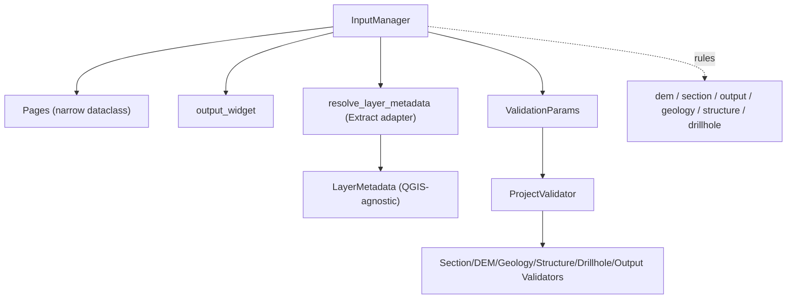

---
tags:
  - secinterp
  - code-walkthrough
  - gui
  - input-manager
aliases:
  - dialog_input_manager.py
  - InputManager
cssclass: secinterp-note
---

# `gui/dialog_input_manager.py`

> [!abstract] One-line summary
> Dialog **Extract adapter**: collects inputs from the pages, converts them into detached `LayerMetadata`, validates them with `ProjectValidator` (core), and decides `can_preview`/`can_export`.

**Path**: `gui/dialog_input_manager.py` (200 lines)
**Class**: `InputManager`
**Layer**: GUI · Managers (Adapter)
**Tags**: #secinterp #gui #input-manager

---

## 🎯 Why does this file exist?

The dialog needs two different things from the same source: a **flat dict** for the pipeline (`PreviewParams`) and a **detached `ValidationParams`** for the core validator.

| Problem | Solution |
|---------|----------|
| Each page exposes its values under its own names | `get_all_values()` flattens into a dict with stable keys |
| Core cannot receive QGIS objects | `resolve_layer_metadata()` → `LayerMetadata` (data only) |
| UI rules ("can I preview?") mixed with business validation | local `rules` + core `ProjectValidator` |
| The dialog must not know the validator pipeline | `validate_inputs()` returns `(bool, str)` |

> [!important] Extract-then-Compute
> This file is the **Extract** phase: it takes QGIS widgets and produces DTOs (`LayerMetadata`, `ValidationParams`). **Compute** happens in `core/validation/project_validator.py`, 100% QGIS-agnostic.

---

## 🧬 Relationship diagram



The `resolve_layer_metadata` adapter is the boundary toward core.

---

## 📦 Imports — architectural reading

```python
from __future__ import annotations
from collections.abc import Callable
from typing import Any
from sec_interp.core.exceptions import ValidationError
from sec_interp.core.validation.project_validator import ProjectValidator, ValidationParams
from sec_interp.gui.adapters.validation_extractor import resolve_layer_metadata
from .dialog_dependencies import Pages
```

It imports **core** and **one GUI adapter** (the only one touching QGIS). `Pages` is a `@dataclass` with 6 fields (narrow dependency); `Callable[[str], str]` types `tr` without coupling to Qt.

---

## 🧱 Code walkthrough — `InputManager`

### `__init__(pages, output_widget, translate)`

```python
def __init__(self, pages: Pages, output_widget: Any,
             translate: Callable[[str], str]) -> None:
    self.pages = pages
    self.output_widget = output_widget
    self.tr = translate
    self._setup_validation_rules()
```

### `_setup_validation_rules()` — local rules

```python
self.rules = {
    "dem": {"check": lambda p: bool(p.raster_layer),
            "message": self.tr("Raster DEM layer is required")},
    "section": {"check": lambda p: bool(p.line_layer),
                "message": self.tr("Cross-section line layer is required")},
    "output": {"check": lambda p: bool(p.output_path),
               "message": self.tr("Output directory path is required")},
    "geology": {"check": lambda p: (
        ProjectValidator.is_geology_complete(p) if p.outcrop_layer else True),
        "message": self.tr("Geology configuration is incomplete")},
    # structure and drillhole are analogous
}
```

| Rule | Checks | Semantics |
|------|--------|-----------|
| `dem` / `section` / `output` | `bool(...)` | Required |
| `geology` / `structure` / `drillhole` | `is_*_complete(p)` **if** a layer exists | Optional but complete if present |

Rules receive a `ValidationParams`, not widgets: the lambda works on DTOs.

### `get_all_values()` — flat dict for the pipeline

```python
dem = self.pages.dem.get_data();  sect = self.pages.section.get_data()
geol = self.pages.geology.get_data();  stru = self.pages.structure.get_data()
dh = self.pages.drillhole.get_data()

return {
    "raster_layer": dem["raster_layer"], "selected_band": dem["selected_band"],
    "crossline_layer": sect["crossline_layer"], "buffer_distance": sect["buffer_distance"],
    "outcrop_layer": geol["outcrop_layer"], "outcrop_name_field": geol["outcrop_name_field"],
    "structural_layer": stru["structural_layer"], "dip_field": stru["dip_field"],
    "collar_layer_obj": dh["collar_layer"], "collar_id_field": dh["collar_id"],
    # ... survey_*, interval_*
    "output_path": self.output_widget.filePath(),
    **(self.pages.settings.get_data() if self.pages.settings is not None else {}),
}
```

### `get_validation_params()` — build the core DTO

```python
return ValidationParams(
    raster_layer=resolve_layer_metadata(dem["raster_layer"]),
    band_number=dem["selected_band"],
    line_layer=resolve_layer_metadata(sect["crossline_layer"]),
    output_path=self.output_widget.filePath(),
    scale=dem["scale"], vert_exag=dem["vertexag"],
    buffer_dist=sect["buffer_distance"],
    outcrop_layer=resolve_layer_metadata(geol["outcrop_layer"]),
    struct_layer=resolve_layer_metadata(stru["structural_layer"]),
    # ... collar/survey/interval via resolve_layer_metadata
)
```

Every QGIS layer becomes `LayerMetadata` (name, validity, type, fields, CRS) before crossing into core.

### Validation and UI decisions

```python
def validate_inputs(self) -> tuple[bool, str]:
    try:
        ProjectValidator.validate_all(self.get_validation_params())
        return True, ""
    except ValidationError as e:
        return False, str(e)

def is_section_valid(self, section: str) -> bool:
    if section not in self.rules:
        return True
    return self.rules[section]["check"](self.get_validation_params())

def get_section_error(self, section: str) -> str:
    return "" if self.is_section_valid(section) else self.rules[section]["message"]

def can_preview(self) -> bool:
    return self.is_section_valid("dem") and self.is_section_valid("section")

def can_export(self) -> bool:
    return self.can_preview() and self.is_section_valid("output")
```

`validate_preview_requirements()` uses `ProjectValidator.validate_preview_requirements` (DEM + section only). `validate_all` runs the full pipeline (6 validators) and raises `ValidationError`; `is_section_valid`/`can_preview`/`can_export` are **cheap** queries that do not raise.

---

## 🏛️ Design patterns present

| Pattern | Where | Purpose |
|---------|-------|---------|
| **Adapter (Extract)** | `resolve_layer_metadata` | QGIS → `LayerMetadata` |
| **DTO** | `ValidationParams`, `LayerMetadata` | Pure data toward core |
| **Strategy/Registry** | `self.rules` (dict) | Declarative UI rules |
| **Facade** | `validate_inputs` | `(bool, str)` over the core pipeline |
| **Composition container** | `Pages` dataclass | Narrow dependency |

---

## 🧾 API summary

| Symbol | Signature | Typical use |
|--------|-----------|-------------|
| `InputManager(pages, output_widget, tr)` | `__init__` | Composition root |
| `get_all_values()` | `-> dict[str, Any]` | Feed `PreviewParams` |
| `get_validation_params()` | `-> ValidationParams` | DTO for core |
| `validate_inputs()` / `validate_preview_requirements()` | `-> tuple[bool, str]` | Full / minimal validation |
| `is_section_valid(section)` / `get_section_error(section)` | `-> bool` / `-> str` | Enable widgets / tooltip |
| `can_preview()` / `can_export()` | `-> bool` | Preview / export-save button |

---

## 👀 Observations and notes

> [!success] Strengths
> - Clean core boundary: **zero QGIS objects** cross into `ProjectValidator`.
> - Cheap queries separated from full validation.
> - Narrow `Pages`: it does not depend on the whole dialog.

> [!warning] Points of attention
> - `get_validation_params()` is rebuilt on **every** `is_section_valid`: `update_preview_checkbox_states` may invoke it 5+ times per refresh.
> - `get_all_values()` assumes each page has `get_data()` and that keys exist: a rename breaks silently.
> - `validate_inputs()` only catches `ValidationError`; other exceptions propagate to the UI.

> [!question] Open questions
> - Would a `ValidationParams` cache invalidated by `dataChanged` be worthwhile?

---

## 🔗 Related notes

- [[main_dialog]] — creates the manager and calls `validate_inputs()`
- [[validation]] — `ProjectValidator`/`LayerMetadata`/`ValidationParams`
- [[adapters]] — `resolve_layer_metadata` (Extract)
- [[ui_status_manager]] — consumes `is_section_valid`/`can_preview`/`can_export`
- [[state_manager]] — dialog state
- [[Index]] — vault index

---

*Note of the SecInterp Code Walkthrough vault — v3.8.0*
