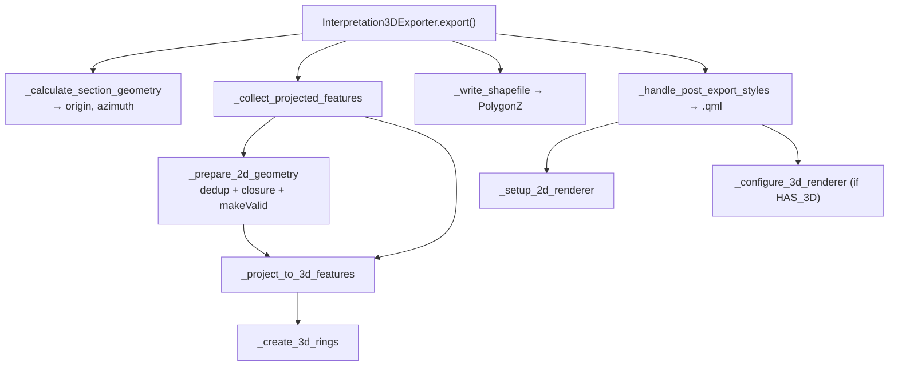

---
tags:
  - secinterp
  - code-walkthrough
  - exporters
aliases:
  - interpretation_3d_exporter.py
  - Interpretation3DExporter
cssclass: secinterp-note
---

# `exporters/interpretation_3d_exporter.py`

> [!abstract] One-line summary
> Projects the 2D `(distance, elevation)` interpretations into real space using the **origin and azimuth of the section plane**, writes a 2.5D `PolygonZ`, and generates a **QML** with categorized 2D symbology and a rule-based 3D renderer.

**Path**: `exporters/interpretation_3d_exporter.py` (465 lines)
**Class**: `Interpretation3DExporter(BaseExporter)`
**Layer**: Exporters (QGIS · format strategies)
**Tags**: #secinterp #exporters #3d

---

## 🎯 Why does this file exist?

This is the most complex exporter in the layer. It does not just write geometry: it rebuilds the 3D position of every vertex from the section line and leaves the style ready so the layer looks the same in 2D and 3D.

| Problem | Solution |
|---------|----------|
| A `(dist, elev)` vertex has no global X/Y | `_create_3d_rings` rotates `dist` by the azimuth from the origin |
| Polygons may be multipart or invalid | `_project_to_3d_features` + `makeValid()` |
| Duplicate vertices or open rings | `_get_unique_vertices` + `_ensure_closed_polygon` |
| The style must travel with the layer | `_generate_qml_style` saves a `.qml` |
| QGIS may lack the 3D module | `try: import qgis._3d` → `HAS_3D` flag |

> [!important] Conversion to real space
> `east = origin_x + dist·cos(az)`, `north = origin_y + dist·sin(az)`, `elev = elev / vert_exag`. Rotating by `azimuth` places the point on the section plane in the world; `dist` is the distance along the section and `elev` the elevation.

---

## 🧬 Relationship diagram



---

## 🧱 `export()` — pipeline orchestration

```python
if not self._validate_export_input(interpretations, section_line):
    return False
fields, sorted_keys = self._prepare_fields(interpretations)
try:
    origin_x, origin_y, azimuth = self._calculate_section_geometry(section_line)
except Exception as e:
    raise ExportError(f"Failed to calculate section geometry: {e}") from e

features = self._collect_projected_features(
    interpretations, fields, sorted_keys, origin_x, origin_y, azimuth
)
success = self._write_shapefile(
    output_path, features, fields,
    QgsWkbTypes.Type.PolygonZ, src_crs, layer_name=layer_name,
)
if success:
    self._handle_post_export_styles(output_path, interpretations, fields, src_crs)
return success
```

> [!warning] Fails loudly, not silently
> `_validate_export_input` **raises** `ExportError` when `section_line` is missing (projection is impossible without a plane). By contrast, failure to generate the QML is only logged as a `warning` and does not abort the export.

---

## 🧱 Section plane and 3D projection

`_calculate_section_geometry` takes `p1` and `p2` from the line (supports multipart) and returns `p1.x()`, `p1.y()` and `azimuth = atan2(dy, dx)` **in radians**. `_create_3d_rings` applies that rotation:

```python
def _create_3d_rings(self, poly_2d, origin_x, origin_y, azimuth, vert_exag):
    cos_a, sin_a = math.cos(azimuth), math.sin(azimuth)
    rings_3d = []
    for ring_2d in poly_2d:
        points_3d = [
            QgsPoint(origin_x + (p.x() * cos_a),
                     origin_y + (p.x() * sin_a),
                     p.y() / vert_exag)
            for p in ring_2d
        ]
        rings_3d.append(QgsLineString(points_3d))
    return rings_3d
```

`vert_exag` attenuates the Z; today `_collect_projected_features` always passes `vert_exag=1.0`, so elevation is preserved.

---

## 🧱 Validation and geometry cleanup

```python
def _prepare_2d_geometry(self, polygon):
    vertices = self._ensure_closed_polygon(
        self._get_unique_vertices(polygon.vertices_2d)
    )
    if not vertices or len(vertices) < MIN_VALID_POLYGON_VERTICES:
        logger.warning(f"Polygon {polygon.id} has insufficient unique vertices. Skipping.")
        return None
    polygon_2d = QgsPolygon()
    polygon_2d.setExteriorRing(QgsLineString([QgsPoint(x, y, 0.0) for x, y in vertices]))
    geom_2d = QgsGeometry(polygon_2d)
    return geom_2d if geom_2d.isGeosValid() else geom_2d.makeValid()
```

---

## 🧱 `_generate_qml_style()` — 2D + 3D style

```python
qml_path = Path(shp_path).with_suffix(".qml")
layer = QgsVectorLayer(f"Polygon?crs={crs.authid()}&z=yes", "temp_style", "memory")
layer.dataProvider().addAttributes(fields)
layer.updateFields()
self._setup_2d_renderer(layer, interpretations)
if HAS_3D:
    self._configure_3d_renderer(layer, interpretations)
msg, ok = layer.saveNamedStyle(str(qml_path))
```

| Renderer | Mechanism | Detail |
|----------|-----------|--------|
| 2D | `QgsCategorizedSymbolRenderer("name", categories)` | Color per unit, alpha 180, outline `darker(150)` |
| 3D | `QgsRuleBased3DRenderer` | Rule `"name" = '<unit>'` with Phong material (`setDiffuse` + `setAmbient`) |

The `.qml` is generated as a sibling file even when the target is `.shp`/`.gpkg`/`.dxf`.

---

## 🏛️ Design patterns present

| Pattern | Where | Purpose |
|---------|-------|---------|
| **Template Method** | `BaseExporter` | Shared contract and validation |
| **Pipeline / step methods** | `export()` | Validate → project → write → style |
| **DTO→feature Adapter** | `_project_to_3d_features` | `InterpretationPolygon` → 3D `QgsFeature` |
| **Graceful degradation** | `HAS_3D` | If `qgis._3d` is missing, still generates the 2D QML |

---

## 🧾 API summary

| Symbol | Signature / Inherits | Typical use |
|--------|----------------------|-------------|
| `Interpretation3DExporter` | `BaseExporter` | 2.5D 3D polygons + QML |
| `_calculate_section_geometry(line)` | `-> (x, y, azimuth)` | Plane origin and azimuth |
| `_create_3d_rings(poly_2d, ...)` | `-> list[QgsLineString]` | Profile → world rotation |
| `_prepare_2d_geometry(polygon)` | `-> QgsGeometry \| None` | Dedup, closure and `makeValid` |

---

## 👀 Observations and notes

> [!success] Strengths
> - Correct geometric projection, well isolated in `_create_3d_rings`.
> - Explicit handling of multipart, interior rings and invalid geometries.

> [!warning] Points of attention
> - `makeValid()` can alter the polygon topology without telling the user.

> [!question] Open questions
> - Should `vert_exag` be exposed as an export option instead of being fixed at `1.0`?

---

## 🔗 Related notes

- [[Index]] — vault index
- [[base_exporter]] — inherited contract
- [[interpretation_exporters]] — 2D variant
- [[interpretation_manager]] — DTO source
- [[access_control_service]] — `can_export_3d()` gate enabling this exporter

---

*Note of the SecInterp Code Walkthrough vault — v3.8.0*
