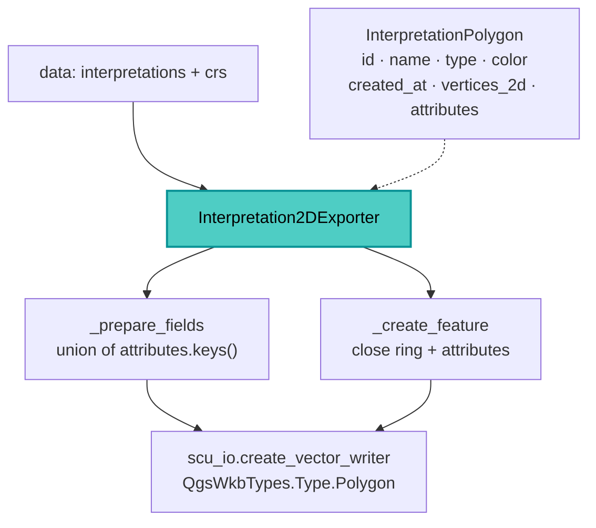

---
tags:
  - secinterp
  - code-walkthrough
  - exporters
aliases:
  - interpretation_exporters.py
  - Interpretation2DExporter
cssclass: secinterp-note
---

# `exporters/interpretation_exporters.py`

> [!abstract] One-line summary
> Exports **2D interpretations** (polygons in `distance/elevation` coordinates) to SHP/GPKG/DXF, with a fixed schema (`id`, `name`, `type`, `color`, `created_at`) plus whatever custom attributes appear in the DTOs.

**Path**: `exporters/interpretation_exporters.py` (146 lines)
**Class**: `Interpretation2DExporter(BaseExporter)`
**Layer**: Exporters (QGIS · format strategies)
**Tags**: #secinterp #exporters #interpretation

---

## 🎯 Why does this file exist?

Interpretations digitized on the profile (`InterpretationPolygon`) carry identity and metadata, not just geometry. This exporter materializes both the shape and that identity into the resulting layer.

| Problem | Solution |
|---------|----------|
| The polygon may not come closed | `_create_feature` appends the first point at the end if missing |
| Custom attributes vary between polygons | `_prepare_fields` collects the **union** of keys and sorts them |
| "No data" must be told apart from "write failure" | Explicit guard + `writer.hasError()` |
| The base schema must be stable | 5 fixed fields before the custom ones |

> [!important] `Polygon` geometry in profile coordinates
> The CRS passed to `create_vector_writer` is the project CRS, but the vertices are `(distance, elevation)`: the layer is a "section" layer, not a geographic one.

---

## 🧬 Relationship diagram



---

## 📦 Imports — architectural reading

It is the only one of the four using an **absolute import** `sec_interp.exporters.base_exporter` instead of a relative one. `QgsWkbTypes.Type.Polygon` fixes the geometry type and `QgsVectorFileWriter` is only used to compare `writer.hasError()` with `WriterError.NoError`. It defines an explicit `__init__(settings)` that just delegates to `super()`.

---

## 🧱 `export()` — full flow

```python
interpretations = data.get("interpretations", [])
if not interpretations:
    logger.warning("No interpretations to export.")
    return False

try:
    crs = data.get("crs")
    fields, sorted_keys = self._prepare_fields(interpretations)
    writer = scu_io.create_vector_writer(
        str(output_path), crs, fields,
        geometry_type=QgsWkbTypes.Type.Polygon, layer_name=layer_name,
    )
    if writer.hasError() != QgsVectorFileWriter.WriterError.NoError:
        logger.error(f"Failed to create writer for {output_path}: {writer.errorMessage()}")
        return False
    for interp in interpretations:
        feat = self._create_feature(interp, fields, sorted_keys)
        if feat:
            writer.addFeature(feat)
    del writer  # Flushes and closes the file
    logger.info(f"Successfully exported to {output_path}")
    return True
except Exception:
    logger.exception(f"Failed to export interpretations to {output_path}")
    return False
```

> [!note] Two failure paths
> "No data" returns `False` with a `warning` (not an error). A write failure goes through `hasError()` or the `except`, logged with `logger.error` / `logger.exception`.

---

## 🧱 `_prepare_fields()` — fixed schema + attribute union

```python
all_attr_keys = set()
for interp in interpretations:
    if interp.attributes:
        all_attr_keys.update(interp.attributes.keys())

sorted_keys = sorted(all_attr_keys)
fields = QgsFields()
fields.append(QgsField("id", QMetaType.Type.QString, len=50))
fields.append(QgsField("name", QMetaType.Type.QString, len=100))
fields.append(QgsField("type", QMetaType.Type.QString, len=50))
fields.append(QgsField("color", QMetaType.Type.QString, len=10))
fields.append(QgsField("created_at", QMetaType.Type.QString, len=30))

for key in sorted_keys:
    fields.append(QgsField(key, QMetaType.Type.QString, len=255))
return fields, sorted_keys
```

| Field | Type | Length |
|-------|------|:------:|
| `id` / `name` / `type` | `QString` | 50 / 100 / 50 |
| `color` / `created_at` | `QString` | 10 / 30 |
| custom | `QString` | 255 |

> [!tip] Union, not intersection
> Using `set.update`, a key present in any polygon enters the schema. Polygons lacking it receive `""` in `_create_feature`.

---

## 🧱 `_create_feature()` — close the ring and dump attributes

```python
points = [QgsPointXY(x, y) for x, y in interp.vertices_2d]
if points and points[0] != points[-1]:
    points.append(points[0])
geom = QgsGeometry.fromPolygonXY([points])

feature = QgsFeature(fields)
feature.setGeometry(geom)

attrs = [interp.id, interp.name, interp.type, interp.color, interp.created_at]
for key in sorted_keys:
    attrs.append(str(interp.attributes.get(key, "")))
feature.setAttributes(attrs)
return feature
```

> [!warning] Coupled attribute order
> `attrs` must follow exactly the order of `_prepare_fields`: the 5 fixed ones and then `sorted_keys`. Adding a fixed field without updating both breaks the correspondence.

---

## 🏛️ Design patterns present

| Pattern | Where | Purpose |
|---------|-------|---------|
| **Template Method** | `BaseExporter` | Contract and path validation |
| **Schema union** | `_prepare_fields` | Complete schema from scattered attributes |
| **Fail-safe** | `try/except` + `hasError()` | Never propagates I/O errors |
| **DTO → feature** | `_create_feature` | `InterpretationPolygon` → `QgsFeature` |

---

## 🧾 API summary

| Symbol | Signature / Inherits | Typical use |
|--------|----------------------|-------------|
| `Interpretation2DExporter` | `BaseExporter` | 2D polygons → `Polygon` layer |
| `_prepare_fields(interpretations)` | `-> (QgsFields, list[str])` | Schema + sorted keys |
| `_create_feature(interp, fields, keys)` | `-> QgsFeature` | One interpretation per feature |
| `get_supported_extensions()` | `-> list[str]` | `[".shp", ".gpkg", ".dxf"]` |

---

## 👀 Observations and notes

> [!success] Strengths
> - Deterministic schema: the 5 base fields are always present.
> - Automatically closes the polygon if the DTO does not bring it closed.
> - Tells "no data" (`warning`) apart from "write failure" (`error`).

> [!warning] Points of attention
> - Custom attributes are stored as `str`, even when numeric.
> - `_create_feature` never returns `None` even for a degenerate polygon.

> [!question] Open questions
> - Should a minimum of 3 unique vertices be validated before building the polygon?

---

## 🔗 Related notes

- [[Index]] — vault index
- [[base_exporter]] — inherited contract
- [[interpretation_3d_exporter]] — 3D variant with section plane
- [[interpretation_manager]] — DTO source
- [[export_package]] — orchestrator (`handlers/interpretations.py`)

---

*Note of the SecInterp Code Walkthrough vault — v3.8.0*
