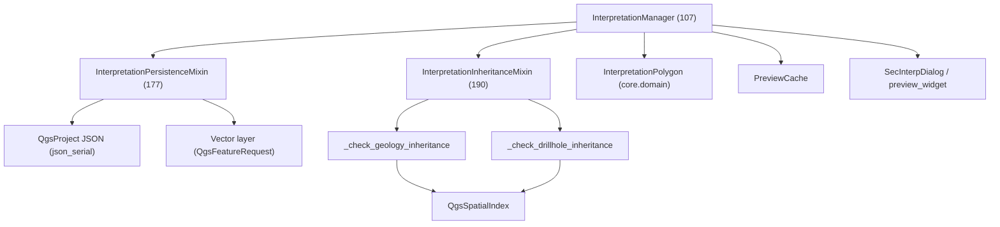

---
tags:
  - secinterp
  - code-walkthrough
  - gui
  - interpretation
aliases:
  - dialog_interpretation_manager.py
  - InterpretationManager
cssclass: secinterp-note
---

# `gui/dialog_interpretation_manager.py`

> [!abstract] One-line summary
> **Facade** that manages interpretation polygons: lifecycle and properties dialog in the base class, with dual persistence and attribute inheritance delegated to two mixins.

> [!info] Refactor 2026-09-20
> This 444-line manager was decomposed into mixins ([[interpretation_mixins]]); `InterpretationManager` is now a **107-line class** inheriting `InterpretationPersistenceMixin` + `InterpretationInheritanceMixin`.

**Path**: `gui/dialog_interpretation_manager.py` (107 lines; formerly 444)
**Class**: `InterpretationManager(InterpretationPersistenceMixin, InterpretationInheritanceMixin)`
**Layer**: GUI · Managers
**Tags**: #secinterp #gui #interpretation

---

## 🎯 Why does this file exist?

| Problem | Solution |
|---------|----------|
| `main_dialog` would accumulate drag, `QgsSpatialIndex`, JSON and `QgsProject` | A dedicated manager, separate from the dialog |
| Persistence and inheritance in a 444-line file | Two mixins, one per responsibility |
| Debt: manual `feat_id += 1` and unfiltered `getFeatures()` | Fixed on 2026-09-20 (qgis-analyzer: **0 issues**) |
| The UI had to re-render after adding a polygon | `_on_preview_update` callback |

> [!important] Shared cache
> Receives `PreviewCache` (injected by the dialog) to read `geol`/`drillhole` without recomputing.

---

## 🧬 Relationship diagram



> [!tip] How to read
> Solid arrow = imports/inherits; the facade composes the mixins and uses `self.dialog` + `self._preview_cache` as shared context.

---

## 📦 Imports — architectural reading

```python
# dialog_interpretation_manager.py
from collections.abc import Callable
from typing import TYPE_CHECKING

from sec_interp.core.domain import InterpretationPolygon
from sec_interp.gui.interpretation_inheritance_mixin import InterpretationInheritanceMixin
from sec_interp.gui.interpretation_persistence_mixin import InterpretationPersistenceMixin
from sec_interp.logger_config import get_logger, log_critical_operation

from .preview_state import PreviewCache

if TYPE_CHECKING:
    from .main_dialog import SecInterpDialog
```

| # | Observation |
|---|-------------|
| ① | `TYPE_CHECKING` avoids a runtime circular import with `main_dialog`. |
| ② | `InterpretationPropertiesDialog` is imported **inside** the method (deferred import). |
| ③ | The facade imports no `QgsProject`/`QgsSpatialIndex`: that lives in the mixins. |

---

## 🧱 `__init__` — shared context

```python
class InterpretationManager(InterpretationPersistenceMixin, InterpretationInheritanceMixin):
    """Manages interpretation polygons and their business logic."""

    def __init__(self, dialog: SecInterpDialog, cache: PreviewCache | None = None) -> None:
        self.dialog = dialog
        self.interpretations: list[InterpretationPolygon] = []
        self._preview_cache = cache if cache is not None else PreviewCache()
        self._on_preview_update: Callable[[], None] | None = None
```

| Member | Role |
|--------|------|
| `self.dialog` | Owning dialog (access to `page_interpretation`, `preview_widget`, `project`, `layer_factory`). |
| `self.interpretations` | List of live polygons. |
| `self._preview_cache` | Shared cache (or a fresh one if not injected). |
| `self._on_preview_update` | Optional re-render callback. |

> [!note] Mixins without `__init__`
> The mixins assume `self.dialog`, `self.interpretations` and `self._preview_cache` exist: the facade provides them. It is composition through an implicit contract.

---

## 🧱 Lifecycle — `set_preview_update_handler` and `clear_interpretations`

```python
def set_preview_update_handler(self, handler: Callable[[], None]) -> None:
    self._on_preview_update = handler

def clear_interpretations(self) -> None:
    self.interpretations = []
    self.save_interpretations()      # delegates to the persistence mixin
```

| Method | Detail |
|--------|--------|
| `set_preview_update_handler` | Dependency injection: the dialog registers `preview_manager.update_from_checkboxes`. |
| `clear_interpretations` | Empties the list and **persists** the emptiness immediately. |

> [!tip] Dependency inversion
> The manager does not know the preview manager: it receives a `Callable` and invokes it. This eases testing without a real UI.

---

## 🧱 `handle_interpretation_finished()` — the full flow

```python
def handle_interpretation_finished(self, interpretation: InterpretationPolygon) -> None:
    from .dialogs.interpretation_properties_dialog import (
        InterpretationPropertiesDialog,
    )

    log_critical_operation(
        logger, "handle_interpretation_finished",
        polygon_id=interpretation.id, vertices=len(interpretation.vertices_2d),
    )

    interp_config = self.dialog.page_interpretation.get_data()

    if interp_config.get("inherit_geology") or interp_config.get("inherit_drillholes"):
        self.apply_attribute_inheritance(interpretation, interp_config)   # mixin

    dlg = InterpretationPropertiesDialog(
        interpretation, interp_config.get("custom_fields"), self.dialog
    )

    if dlg.exec() != 1:
        self.dialog.preview_widget.btn_interpret.setChecked(False)
        return

    self.interpretations.append(interpretation)
    self.save_interpretations()      # mixin
    ...
    self.dialog.preview_widget.results_text.setHtml(msg)
    self.dialog.preview_widget.results_group.setCollapsed(False)
    self.dialog.preview_widget.btn_interpret.setChecked(False)

    if self._on_preview_update:
        self._on_preview_update()
```

| Step | Detail |
|------|--------|
| 1 | Deferred import of the properties dialog. |
| 2 | `log_critical_operation` with id and vertex count. |
| 3 | Optional inheritance via `apply_attribute_inheritance` (mixin). |
| 4 | Modal dialog; if canceled (`exec() != 1`) unchecks the button and exits. |
| 5 | Appends, persists, updates the results text and re-renders. |

> [!important] Real delegation
> The "brains" of persistence and inheritance are **not** here: the facade only orchestrates the call order to the mixins.

---

## 🧱 Persistence mixin — `InterpretationPersistenceMixin`

```python
def load_interpretations(self) -> None:
    interp_config = self.dialog.page_interpretation.get_data()
    if interp_config.get("source_type") == "layer":
        target_layer = QgsProject.instance().mapLayer(interp_config.get("target_layer_id"))
        if target_layer and target_layer.isValid():
            self.sync_from_layer(target_layer)
            return
    json_data, ok = self.dialog.project.readEntry("SecInterp", "interpretations", "[]")
    ...

def sync_from_layer(self, layer: Any) -> None:
    request = QgsFeatureRequest().setFilterRect(layer.extent())   # spatial index
    for feature in layer.getFeatures(request):
        ...
```

| Method | Role |
|--------|------|
| `load_interpretations` | Chosen source: layer (`source_type == "layer"`) or project JSON. |
| `save_interpretations` | `json.dumps` with `json_serial` for PyQGIS `QVariant`. |
| `sync_from_layer` | `QgsFeatureRequest().setFilterRect(...)` → uses the spatial index, not a full scan. |
| `save_to_layer` | `startEditing`/`deleteFeatures`/`addFeatures`/`commitChanges`. |

> [!note] Debt paid (2026-09-20)
> The unfiltered `getFeatures()` now uses a `QgsFeatureRequest` with `setFilterRect(layer.extent())`. See [[interpretation_mixins]].

---

## 🧱 Inheritance mixin — `InterpretationInheritanceMixin`

```python
def apply_attribute_inheritance(self, interpretation, config) -> None:
    ring = [QgsPointXY(x, y) for x, y in interpretation.vertices_2d]
    poly_geom = QgsGeometry.fromPolygonXY([ring])
    ref_point = poly_geom.centroid().asPoint()

    if config.get("inherit_geology"):
        best_match, min_dist = self._check_geology_inheritance(ref_point, min_dist, best_match)
    if config.get("inherit_drillholes"):
        best_match, min_dist = self._check_drillhole_inheritance(ref_point, min_dist, best_match)
    ...
```

| Method | Detail |
|--------|--------|
| `apply_attribute_inheritance` | Centroid → compares geology and/or drillholes, applies name/type/attrs/color. |
| `_check_geology_inheritance` | Indexes segments from `_preview_cache["geol"]` and queries `nearestNeighbor`. |
| `_check_drillhole_inheritance` | `enumerate(self._iter_drillhole_interval_geoms(dh_data))` + `QgsSpatialIndex`. |
| `_iter_drillhole_interval_geoms` | Generator `(interval, geom)` for every interval with points. |
| `_extract_intervals_from_dh_data` | Supports legacy format (tuple) and objects with `.intervals`. |

> [!note] Debt paid (2026-09-20)
> The manual `feat_id += 1` counter was replaced by `enumerate`. `qgis-analyzer` reports **0 issues**.

---

## 🏛️ Design patterns present

| Pattern | Where | Purpose |
|---------|-------|---------|
| **Facade** | `InterpretationManager` | Orchestrates without implementing persistence/inheritance. |
| **Mixin composition** | Two bases | Separate domains per responsibility. |
| **Strategy** | `_check_geology` vs `_check_drillhole` | Choose the nearest attribute source. |
| **Spatial Index** | `QgsSpatialIndex` | Efficient nearest neighbor. |
| **Dependency Injection** | `PreviewCache` + `_on_preview_update` | Testable and decoupled. |

---

## 🧾 API summary

| Symbol | Signature / Inherits | Typical use |
|--------|----------------------|-------------|
| `InterpretationManager` | `(PersistenceMixin, InheritanceMixin)` | Interpretation facade. |
| `__init__(dialog, cache=None)` | — | Creates list, cache and callback. |
| `set_preview_update_handler(handler)` | `Callable` | Register re-render. |
| `clear_interpretations()` | `() -> None` | Clear and persist. |
| `handle_interpretation_finished(polygon)` | `InterpretationPolygon` | Full add flow. |
| `load/save_interpretations()` | mixin | Dual persistence. |
| `sync_from_layer(layer)` / `save_to_layer(layer)` | mixin | External layer. |
| `apply_attribute_inheritance(...)` | mixin | Proximity inheritance. |

---

## 👀 Observations and notes

> [!success] Strengths
> - A 107-line facade: it orchestrates, it does not accumulate logic.
> - Cohesive, testable mixins; qgis-analyzer debt paid (0 issues).
> - Idiomatic `QgsSpatialIndex` and `enumerate` in inheritance.

> [!warning] Points of attention
> - `sync_from_layer` does not populate `attributes` (stays `{}`); it only syncs geometry and base fields.
> - `save_to_layer` deletes and rewrites **all** features in the layer.
> - The mixins depend on facade attributes (`dialog`, `_preview_cache`): an implicit contract.

> [!question] Open questions
> - Should `save_to_layer` use incremental transactional editing instead of delete+add?
> - Should inheritance move to `core/` receiving geometries as WKT?

---

## 🔗 Related notes

- [[Index]] — vault index
- [[interpretation_mixins]] — the two mixins of this facade
- [[interpretation_tool]] — produces polygons via `polygonFinished`
- [[main_dialog]] — creates and wires the manager
- [[domain]] — `InterpretationPolygon`
- [[ui_pages]] — `InterpretationPage` (configuration form)

---

*Note of the SecInterp Code Walkthrough vault — v3.8.0*
