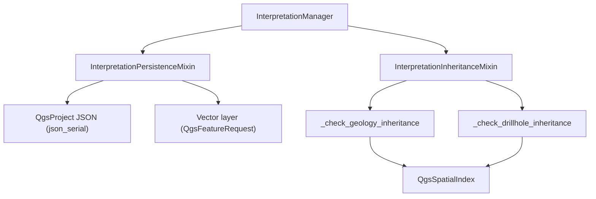

---
tags:
  - secinterp
  - code-walkthrough
  - gui
  - interpretation
  - mixins
aliases:
  - interpretation_persistence_mixin.py
  - interpretation_inheritance_mixin.py
  - InterpretationManager
cssclass: secinterp-note
---

# `gui/dialog_interpretation_manager.py` — mixins

> [!abstract] One-line summary
> The former 445-line `dialog_interpretation_manager.py` was decomposed (2026-09-20); `InterpretationManager` is now a 107-line class keeping `__init__`, `set_preview_update_handler`, `clear_interpretations`, and `handle_interpretation_finished`.

**Path**: `gui/dialog_interpretation_manager.py` (107 lines) + `gui/interpretation_persistence_mixin.py` (177), `gui/interpretation_inheritance_mixin.py` (190)
**Class**: `InterpretationManager(InterpretationPersistenceMixin, InterpretationInheritanceMixin)`
**Layer**: GUI · Managers
**Tags**: #secinterp #gui #interpretation #mixins

---

## 🎯 Why does this file exist?

| Problem | Solution |
|---------|----------|
| Persistence, inheritance, and lifecycle in a 445-line file | Two mixins, one responsibility each |
| `QgsSpatialIndex` and JSON mixed with the UI | Each mixin groups its own domain |
| Debt: manual `feat_id += 1` and unfiltered `getFeatures()` | Fixed on 2026-09-20 (qgis-analyzer: 0 issues) |

---

## 🧬 Relationship diagram

---

## 🧱 `InterpretationPersistenceMixin` — dual persistence

| Method | Role |
|--------|------|
| `load_interpretations` | Reads from a layer (`source_type == "layer"`) or the `QgsProject` JSON |
| `save_interpretations` | Writes JSON with `json_serial` for `QVariant` values |
| `sync_from_layer` | `layer.getFeatures(QgsFeatureRequest().setFilterRect(layer.extent()))` → uses the spatial index |
| `save_to_layer` | `QgsFeature`s + `startEditing`/`deleteFeatures`/`addFeatures`/`commitChanges` |

---

## 🧱 `InterpretationInheritanceMixin` — nearest-match inheritance

| Method | Detail |
|--------|--------|
| `apply_attribute_inheritance` | Polygon centroid → delegates to `_check_geology` and/or `_check_drillhole` per `config` |
| `_check_geology_inheritance` | Indexes the `_preview_cache["geol"]` segments and queries `nearestNeighbor` |
| `_check_drillhole_inheritance` | `enumerate(self._iter_drillhole_interval_geoms(dh_data))` + `QgsSpatialIndex` |
| `_iter_drillhole_interval_geoms` | Generator of `(interval, geom)` for every interval with points |
| `_extract_intervals_from_dh_data` | Supports the legacy format (tuple) and objects with `.intervals` |

> [!note] Debt paid (2026-09-20)
> The manual `feat_id += 1` counter was replaced by `enumerate`, and `getFeatures()` now uses a configured `QgsFeatureRequest`. `qgis-analyzer` reports **0 issues**.

---

## 🏛️ Design patterns present

| Pattern | Where | Purpose |
|---------|-------|---------|
| **Mixin composition** | Two bases | Separate persistence from inheritance |
| **Strategy** | `_check_geology` vs `_check_drillhole` | Pick the nearest attribute source |
| **Spatial index** | `QgsSpatialIndex` | Efficient nearest neighbor |

---

## 👀 Observations and notes

> [!success] Strengths
> - Manager drops from 445 to 107 lines; cohesive mixins.
> - Uses the spatial index and idiomatic `enumerate`.

> [!warning] Points of attention
> - `sync_from_layer` does not sync `attributes` (stays `{}`).
> - `save_to_layer` deletes and rewrites every feature.

---

## 🔗 Related notes

- [[Index]] — vault index
- [[interpretation_manager]] — the class that composes these mixins
- [[main_dialog]] — creates and wires the manager
- [[domain]] — `InterpretationPolygon`
- [[ui_pages]] — `InterpretationPage`

---

*Note of the SecInterp Code Walkthrough vault — v3.8.0*
