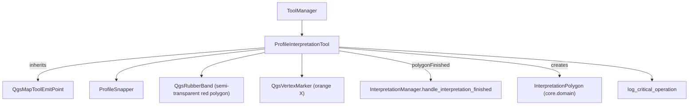

---
tags:
  - secinterp
  - code-walkthrough
  - gui
  - tools
aliases:
  - interpretation_tool.py
  - ProfileInterpretationTool
cssclass: secinterp-note
---

# `gui/tools/interpretation_tool.py`

> [!abstract] One-line summary
> `QgsMapTool` for **digitizing interpretation polygons** on the preview: it adds/removes snapped vertices, previews the polygon, and emits a complete `InterpretationPolygon` (uuid, random color, timestamp).

**Path**: `gui/tools/interpretation_tool.py` (269 lines)
**Class**: `ProfileInterpretationTool(QgsMapToolEmitPoint)`
**Layer**: GUI · Tools
**Tags**: #secinterp #gui #tools

---

## 🎯 Why does this file exist?

| Problem | Solution |
|---------|----------|
| The user needs to outline lithologies/units on the profile | Vertex-by-vertex polygon digitizing tool |
| Slow clicks duplicated vertices | `compare(point, 1e-6)` guard in `_add_point` |
| The UI must not build the domain DTO | `finalize_polygon()` creates the `InterpretationPolygon` |
| Removing a misplaced vertex must be immediate | Right click → `_remove_last_point()` |
| Canvas crashes when activating/resetting tools | `log_critical_operation` on every sensitive operation |

> [!important] Core boundary
> The tool imports `InterpretationPolygon` from `core.domain` and produces the DTO; persistence and inheritance live in [[interpretation_manager]]. There is no business logic here.

---

## 🧬 Relationship diagram



> [!tip] How to read
> Solid arrow = imports/composes; `polygonFinished` crosses from the tool to the manager and from there to the properties dialog.

---

## 📦 Imports — architectural reading

```python
# interpretation_tool.py
import contextlib, datetime, random, uuid
from typing import Any

from qgis.core import QgsPointXY, QgsWkbTypes
from qgis.gui import (
    QgsMapCanvas, QgsMapToolEmitPoint, QgsRubberBand, QgsVertexMarker,
)
from qgis.PyQt.QtCore import QCoreApplication, Qt, pyqtSignal
from qgis.PyQt.QtGui import QColor

from sec_interp.core.domain import InterpretationPolygon
from sec_interp.gui.tools.snapper import ProfileSnapper
from sec_interp.logger_config import get_logger, log_critical_operation
```

| # | Observation |
|---|-------------|
| ① | `uuid`, `datetime` and `random` build the DTO's identity and aesthetics at the GUI edge. |
| ② | `log_critical_operation` wraps the operations that touch the canvas (segfault risk). |
| ③ | `InterpretationPolygon` is the only `core` import — the tool does not compute, it only materializes. |

---

## 🧱 State, signal and lifecycle

```python
class ProfileInterpretationTool(QgsMapToolEmitPoint):
    polygonFinished = pyqtSignal(InterpretationPolygon)

    def __init__(self, canvas: QgsMapCanvas) -> None:
        super().__init__(canvas)
        self.canvas = canvas
        self.points: list[QgsPointXY] = []
        self.rubber_band: QgsRubberBand | None = None
        self.vertex_markers: list[QgsVertexMarker] = []
        self.snapper = ProfileSnapper(canvas)
        self.cursor = Qt.CursorShape.CrossCursor

    def activate(self) -> None:
        log_critical_operation(logger, "activate_interpretation_tool")
        super().activate()
        self.canvas.setCursor(self.cursor)

    def deactivate(self) -> None:
        log_critical_operation(logger, "deactivate_interpretation_tool")
        self.reset()                     # unlike measure_tool
        super().deactivate()
```

| Member | Role |
|--------|------|
| `polygonFinished` | Emits the finished `InterpretationPolygon`. |
| `points` | Vertices under construction. |
| `rubber_band` / `vertex_markers` | Provisional polygon and vertex marks. |
| `is_drawing` | State flag used by `reset()`. |

> [!note] `deactivate` clears
> Here `reset()` is called on deactivate (the opposite of [[measure_tool]]): the in-progress polygon is discarded and the canvas refreshed.

---

## 🧱 `reset()` — safe canvas cleanup

```python
def reset(self) -> None:
    log_critical_operation(logger, "reset_interpretation_tool",
                           points=len(self.points) if self.points else 0)
    self.points = []

    if self.rubber_band:
        with contextlib.suppress(Exception):
            self.rubber_band.reset(QgsWkbTypes.GeometryType.PolygonGeometry)
            self.canvas.scene().removeItem(self.rubber_band)
        self.rubber_band = None

    for marker in self.vertex_markers:
        with contextlib.suppress(Exception):
            self.canvas.scene().removeItem(marker)
    self.vertex_markers = []

    self.is_drawing = False
    if self.canvas:
        self.canvas.refresh()
```

| Detail | Value |
|--------|-------|
| Critical log | Includes `points=<n>` for correlation in the log. |
| Rubber band | Reset to `PolygonGeometry` before removal. |
| Refresh | `self.canvas.refresh()` after cleanup. |

---

## 🧱 Mouse and keyboard events

```python
def canvasReleaseEvent(self, event: Any) -> None:
    if event.button() == Qt.MouseButton.RightButton:
        if self.points:
            self._remove_last_point()
        return
    snapped_point = self.snapper.snap(event.pos())
    self._add_point(snapped_point)

def canvasMoveEvent(self, event: Any) -> None:
    if not self.points:
        return
    current_point = self.snapper.snap(event.pos())
    self._update_rubber_band(current_point)

def canvasDoubleClickEvent(self, event: Any) -> None:
    MIN_POLYGON_POINTS = 3
    if len(self.points) >= MIN_POLYGON_POINTS:
        self.finalize_polygon()

def keyPressEvent(self, event: Any) -> None:
    if event.key() in (Qt.Key.Key_Return, Qt.Key.Key_Enter):
        MIN_POLYGON_POINTS = 3
        if len(self.points) >= MIN_POLYGON_POINTS:
            self.finalize_polygon()
            event.accept()
        return
    if event.key() == Qt.Key.Key_Escape:
        self.reset()
        event.accept()
        return
    super().keyPressEvent(event)
```

| Input | Action |
|-------|--------|
| Left click | Adds a snapped vertex. |
| Right click | Removes the last vertex (`_remove_last_point`). |
| Double click | Finalizes if there are ≥ 3 points. |
| Enter / Return | Finalizes if there are ≥ 3 points. |
| Escape | `reset()`. |

> [!important] Double click + Enter
> Two finalization paths coexist: `canvasDoubleClickEvent` and `keyPressEvent`. Both require `MIN_POLYGON_POINTS = 3`.

---

## 🧱 `_add_point` / `_remove_last_point`

```python
def _add_point(self, point: QgsPointXY) -> None:
    # Prevents the same point twice in a row (slow click)
    if self.points and self.points[-1].compare(point, 1e-6):
        return
    self.points.append(point)
    self._ensure_rubber_band()
    self.rubber_band.addPoint(point, True)
    self._add_vertex_marker(point)

def _remove_last_point(self) -> None:
    if not self.points:
        return
    self.points.pop()
    if self.vertex_markers:
        marker = self.vertex_markers.pop()
        self.canvas.scene().removeItem(marker)

    if not self.points:
        if self.rubber_band:
            self.canvas.scene().removeItem(self.rubber_band)
            self.rubber_band = None
    else:
        self.rubber_band.reset(QgsWkbTypes.GeometryType.PolygonGeometry)
        for p in self.points:
            self.rubber_band.addPoint(p, False)
```

> [!tip] 1e-6 tolerance
> `QgsPointXY.compare(point, 1e-6)` discards consecutive duplicates. Without this guard, a slow double click would insert two nearly identical vertices.

---

## 🧱 `finalize_polygon()` — building the DTO

```python
def finalize_polygon(self) -> None:
    log_critical_operation(logger, "finalize_polygon", points=len(self.points))
    MIN_POLYGON_POINTS = 3
    if len(self.points) < MIN_POLYGON_POINTS:
        return

    vertices_2d = [(p.x(), p.y()) for p in self.points]

    hue = random.randint(0, 359)          # nosec B311
    sat = random.randint(200, 255)        # nosec B311
    val = random.randint(150, 255)        # nosec B311
    color_hex = QColor.fromHsv(hue, sat, val).name()

    interp = InterpretationPolygon(
        id=str(uuid.uuid4()),
        name=QCoreApplication.translate("ProfileInterpretationTool", "New Interpretation"),
        type="lithology",
        vertices_2d=vertices_2d,
        attributes={},
        color=color_hex,
        created_at=datetime.datetime.now().isoformat(),
    )
    self.polygonFinished.emit(interp)
    # reset() is NOT called here: the dialog deactivates the tool and that resets cleanly.
```

| DTO field | Origin |
|-----------|--------|
| `id` | `uuid.uuid4()` |
| `name` | "New Interpretation" translation |
| `type` | `"lithology"` (editable later in the properties dialog) |
| `vertices_2d` | `(x, y)` = `(distance, elevation)` in profile units |
| `color` | Random HSV (hue 0-359, sat 200-255, val 150-255) |
| `created_at` | `datetime.now().isoformat()` |

> [!warning] Do not reset after emitting
> `finalize_polygon()` does **not** clean the tool: the dialog handler will deactivate it, and `deactivate()` calls `reset()`. Doing it here would break the flow.

---

## 🧱 Visual helpers

```python
def _add_vertex_marker(self, point: QgsPointXY) -> None:
    marker = QgsVertexMarker(self.canvas)
    marker.setCenter(point)
    marker.setColor(QColor(255, 165, 0))          # orange
    marker.setIconSize(10)
    marker.setIconType(QgsVertexMarker.IconType.ICON_X)
    marker.setPenWidth(2)
    self.vertex_markers.append(marker)

def _ensure_rubber_band(self) -> None:
    if self.rubber_band:
        return
    self.rubber_band = QgsRubberBand(self.canvas, QgsWkbTypes.GeometryType.PolygonGeometry)
    color = QColor(255, 0, 0, 100)                # semi-transparent red
    self.rubber_band.setColor(color)
    self.rubber_band.setFillColor(color)
    self.rubber_band.setWidth(2)
```

> [!tip] Distinctive aesthetics
> Vertices are orange `ICON_X` (10 px) and the polygon is a filled translucent red — different from the red/green of [[measure_tool]], so the user can tell each mode apart.

---

## 🏛️ Design patterns present

| Pattern | Where | Purpose |
|---------|-------|---------|
| **Builder** | `_add_point` → `finalize_polygon` | Build an `InterpretationPolygon` step by step. |
| **Delegation** | `ProfileSnapper` | Isolate snapping. |
| **Command / Observer** | `polygonFinished` | Deliver the DTO to the manager. |
| **Fail-safe** | `contextlib.suppress` + `log_critical_operation` | Survive canvas operations. |
| **Guard Clause** | `compare(..., 1e-6)` | Avoid duplicate vertices. |

---

## 🧾 API summary

| Symbol | Signature / Inherits | Typical use |
|--------|----------------------|-------------|
| `polygonFinished` | `pyqtSignal(InterpretationPolygon)` | Consumed by the manager. |
| `ProfileInterpretationTool` | `QgsMapToolEmitPoint` | Digitizing tool. |
| `activate()` / `deactivate()` | `() -> None` | Lifecycle; `deactivate` resets. |
| `reset()` | `() -> None` | Clear the in-progress polygon. |
| `_remove_last_point()` | `() -> None` | Right click. |
| `finalize_polygon()` | `() -> None` | Creates and emits the DTO. |
| `disconnect_signals()` | `() -> None` | Prevent leaks. |

---

## 👀 Observations and notes

> [!success] Strengths
> - `finalize_polygon` encapsulates identity, color and timestamp: a DTO ready to persist.
> - Duplicate guard with tolerance avoids degenerate vertices.
> - `log_critical_operation` covers activate/deactivate/reset/finalize (canvas operations).

> [!warning] Points of attention
> - `deactivate()` resets; if the drawing were meant to persist it would need changing (today it is lost).
> - `type="lithology"` and `attributes={}` are defaults; real inheritance happens in [[interpretation_manager]].
> - Random colors use `random` (flagged `nosec B311`): not cryptography, just aesthetics.

> [!question] Open questions
> - Should the tool allow moving/editing already placed vertices before finalizing?
> - Should there be a vertex limit for very complex interpretations?

---

## 🔗 Related notes

- [[Index]] — vault index
- [[tool_manager]] — activates/deactivates it
- [[measure_tool]] — sibling measurement tool
- [[interpretation_manager]] — consumes `polygonFinished` and persists
- [[interpretation_mixins]] — interpretation inheritance and persistence
- [[domain]] — `InterpretationPolygon`

---

*Note of the SecInterp Code Walkthrough vault — v3.8.0*
