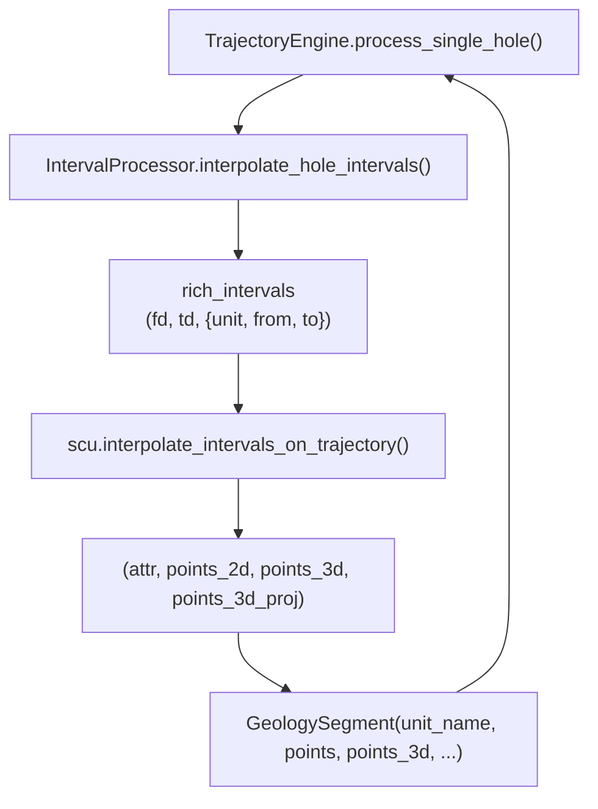

---
tags:
  - secinterp
  - code-walkthrough
  - core
  - drillhole
aliases:
  - interval_processor.py
  - IntervalProcessor
cssclass: secinterp-note
---

# `core/services/drillhole/interval_processor.py`

> [!abstract] One-line summary
> Interpolates **lithological intervals** along the projected trajectory and wraps them in `GeologySegment`s ready for render/export.

**Path**: `core/services/drillhole/interval_processor.py` (50 lines)
**Class**: `IntervalProcessor`
**Layer**: Core · Drillhole (QGIS-agnostic)
**Tags**: #secinterp #core #drillhole

---

## 🎯 Why does this file exist?

`TrajectoryEngine` already holds the projected trajectory `(depth, x, y, z, dist_along, offset, nx, ny)` and the raw intervals `(from, to, lith)`. What is missing is **sampling the geology along the trace** and converting it into the DTO consumed by renderers and exporters.

| Problem | Solution |
|---------|----------|
| Intervals arrive as raw tuples | They are enriched into dicts `{unit, from, to}` |
| The interpolation math is complex | Delegated to `scu.interpolate_intervals_on_trajectory` |
| Render/export expect a common DTO | Packaged into `GeologySegment` |
| A hole with no intervals | Early return `[]` |

> [!important] Core boundary
> It only uses `core.utils` (pure math) and `core.domain` (DTO). No QGIS, no Qt, no layer access.

---

## 🧬 Relationship diagram



> [!tip] How to read
> `IP` is a **shape adapter**: it converts the `scu` contract into the `GeologySegment` contract.

---

## 📦 Imports — architectural reading

```python
from sec_interp.core import utils as scu
from sec_interp.core.domain import GeologySegment
```

| # | Observation |
|---|-------------|
| ① | `scu` is the *namespace* of pure utilities from `core/utils` (`__init__.py` re-exports the API). |
| ② | `GeologySegment` is the output DTO; the processor does **not** build WKT or QGIS geometries. |
| ③ | `from __future__ import annotations` present → mandatory `core/` convention. |

---

## 🧱 `interpolate_hole_intervals()` — the only method

```python
def interpolate_hole_intervals(
    self,
    traj: list[tuple[float, float, float, float, float, float, float, float]],
    intervals: list[tuple[float, float, str]],
    buffer_width: float,
) -> list[GeologySegment]:
    """Interpolate intervals along a trajectory and return GeologySegments."""
    if not intervals:
        return []

    rich_intervals = [
        (fd, td, {"unit": lith, "from": fd, "to": td}) for fd, td, lith in intervals
    ]
    # Scu returns (attr, points_2d, points_3d, points_3d_proj)
    tuples = scu.interpolate_intervals_on_trajectory(traj, rich_intervals, buffer_width)

    segments = []
    for attr, points_2d, points_3d, points_3d_proj in tuples:
        segments.append(
            GeologySegment(
                unit_name=str(attr.get("unit", "Unknown")),
                geometry_wkt=None,
                attributes=attr,
                points=points_2d,
                points_3d=points_3d,
                points_3d_projected=points_3d_proj,
            )
        )
    return segments
```

| Parameter | Role |
|-----------|------|
| `traj` | Projected trajectory: `(depth, x, y, z, dist_along, offset, nx, ny)` per vertex |
| `intervals` | Raw intervals `(from, to, lith)` |
| `buffer_width` | Section band width (used by `scu` to clip) |
| **Returns** | `list[GeologySegment]` — one segment per interpolated interval |

### Two-phase flow

| Phase | What happens |
|-------|--------------|
| 1. Enrich | `rich_intervals` turns `(from, to, lith)` into `(from, to, {unit, from, to})` |
| 2. Delegate | `scu.interpolate_intervals_on_trajectory(...)` returns 4-tuples `(attr, p2d, p3d, p3d_proj)` |
| 3. Wrap | Each 4-tuple becomes a `GeologySegment` |

> [!note] `geometry_wkt=None`
> The segment carries no WKT: its geometry lives in `points` (2D profile) and `points_3d` (real space). WKT is materialized later, in the export/render layer.

---

## 🏛️ Design patterns present

| Pattern | Where | Purpose |
|---------|-------|---------|
| **Adapter / Mapper** | `interpolate_hole_intervals` | `scu` contract → `GeologySegment` contract |
| **Delegation** | `scu.interpolate_intervals_on_trajectory` | Keep the math out of the processor |
| **Guard Clause** | `if not intervals: return []` | Avoid work and errors on empty holes |
| **DTO Wrapping** | `GeologySegment(...)` | Unify output with surface geology |

---

## 🧾 API summary

| Symbol | Signature / Inherits | Typical use |
|--------|----------------------|-------------|
| `IntervalProcessor` | `class` (no inheritance) | Injected into `TrajectoryEngine` |
| `interpolate_hole_intervals` | `(traj: list[tuple], intervals: list[tuple[float, float, str]], buffer_width: float) -> list[GeologySegment]` | Step 3 of `process_single_hole` |

---

## 👀 Observations and notes

> [!success] Strengths
> - **High cohesion**: it only adapts data; all math lives in `core/utils`.
> - **Homogeneous output**: drillhole intervals and surface geology share a DTO.
> - **No QGIS**: testable with lists of tuples.

> [!warning] Points of attention
> - `unit_name` falls back to `"Unknown"` if the `unit` attribute is missing; the case is not logged.
> - The 8-component format of `traj` is an **implicit positional contract** shared with `scu`.
> - `geometry_wkt=None` forces consumers to handle WKT-less segments.

> [!question] Open questions
> - Should the length of `traj` tuples be validated before delegating?
> - Should a `TypedDict`/`NamedTuple` replace the positional tuples for `traj`?

---

## 🔗 Related notes

- [[Index]] — vault index
- [[trajectory_engine]] — invokes it in `process_single_hole`
- [[survey_processor]] — shares the interval/survey lists
- [[drillhole_service]] — top-level orchestrator
- [[domain]] — defines `GeologySegment`
- [[layer_core_utils_geometry_utils]] — pure geometry utilities
- [[layer_core_services_drillhole]] — pipeline sub-layer

---

*Note of the SecInterp Code Walkthrough vault — v3.8.0*
