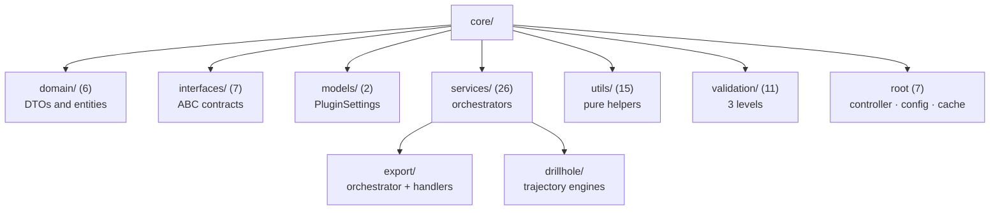

---
tags:
  - secinterp
  - code-walkthrough
  - layer
  - core
aliases:
  - core/
  - Core layer
cssclass: secinterp-layer
---

# `core/` — Core

> [!abstract] One-line summary
> **100% QGIS-agnostic and thread-safe** business-logic layer that turns primitives and WKT into domain DTOs, with no Qt signals or QGIS objects.

**Path**: `core/` (74 modules, ~7,163 lines)
**Layer**: Core (QGIS-agnostic)
**Tags**: #secinterp #layer #core

---

## 🎯 Layer role

| Problem | Solution |
|---------|----------|
| Geological logic was coupled to QGIS and could not be tested without installing it | Pure services that receive WKT/dicts and return DTOs |
| Extraction, computation, and presentation were mixed, preventing isolated testing | **Extract-then-Compute**: the GUI extracts, core computes |
| Heavy operations blocked the UI | Thread-safe core: no `QObject`, no mutable shared state |
| Silent, hard-to-trace errors | Custom `SecInterpError` hierarchy, logging before re-raising |

> [!important] Layer rules
> - ❌ `from qgis.core` / `from qgis.gui` → **FORBIDDEN**
> - ❌ `QgsProject.instance()` / `iface.mapCanvas()` → **FORBIDDEN**
> - ❌ `import PyQt5` / `PyQt6` → **FORBIDDEN** (stdlib only)
> - ✅ **Thread-safe**: no Qt signals or widgets
> - ✅ **Type annotations mandatory** (`from __future__ import annotations`)
> - ✅ WKT/dicts in, DTOs out

> [!warning] Known pragmatic exceptions
> `config.py` imports `QgsSettings`/`QCoreApplication` and `data_cache.py` imports `QCoreApplication` for `tr()`. These are isolated boundary leaks that the rest of `core/` does not replicate.

---

## 🧬 Layer / sublayer map

---

## 🧱 Module inventory

| Module | Role |
|--------|------|
| `controller.py` | `ProfileController`: orchestrates topo, geology, structures, and drillholes with granular caching |
| `config.py` | `ConfigService`: loads/persists settings into `PluginSettings` |
| `data_cache.py` | `DataCache`: in-memory cache by bucket (`topo`/`geol`/`struct`/`drill`) with TTL |
| `exceptions.py` | `SecInterpError` base → `ValidationError`, `ProcessingError`, `ExportError` |
| `performance_metrics.py` | `MetricsCollector`, `PerformanceTimer`, and the `@performance_monitor` decorator |
| `algorithms.py` | Reserved for pure algorithms (the plugin lives in `sec_interp_plugin.py`) |
| `__init__.py` | Core package docstring |
| `domain/` (6) | `[[layer_core_domain]]`: DTOs, entities, enums, and contexts |
| `interfaces/` (7) | `[[layer_core_interfaces]]`: ABC contracts |
| `models/` (2) | `[[layer_core_models]]`: settings model |
| `services/` (26) | `[[layer_core_services]]`: geology, structure, drillholes, preview, export |
| `utils/` (15) | `[[layer_core_utils]]`: geometry, sampling, IO, and parsing |
| `validation/` (11) | `[[layer_core_validation]]`: field, layer, path, and project validation |

---

## 🏛️ Design patterns present

| Pattern | Where | Purpose |
|---------|-------|---------|
| **Extract-then-Compute** | `controller.py` | Separate QGIS extraction from pure computation |
| **Facade / Orchestrator** | `ProfileController` | One API over several services |
| **Strategy** | `services/`, `validation/` | Swap algorithms without touching the caller |
| **Dependency Injection** | `ProfileController.__init__` | Inject GUI adapters from the composition root |
| **Lazy Loading + Safe fallback** | `[[safe_loader]]` | Degrade without breaking the plugin |
| **Custom Exception Hierarchy** | `[[exceptions]]` | Typed, localizable errors |

---

## 🔗 Related notes

- [[Index]] — vault index
- [[layer_core_domain]] · [[layer_core_interfaces]] · [[layer_core_models]] · [[layer_core_services]] · [[layer_core_utils]] · [[layer_core_validation]]
- [[controller]] · [[domain]] · [[exceptions]] · [[config]] · [[data_cache]] · [[performance_metrics]] · [[safe_loader]]
- [[layer_gui]] — layer that extracts and presents
- [[layer_exporters]] — consumers of the DTOs

---

*Note of the SecInterp Code Walkthrough vault — v3.8.0*
