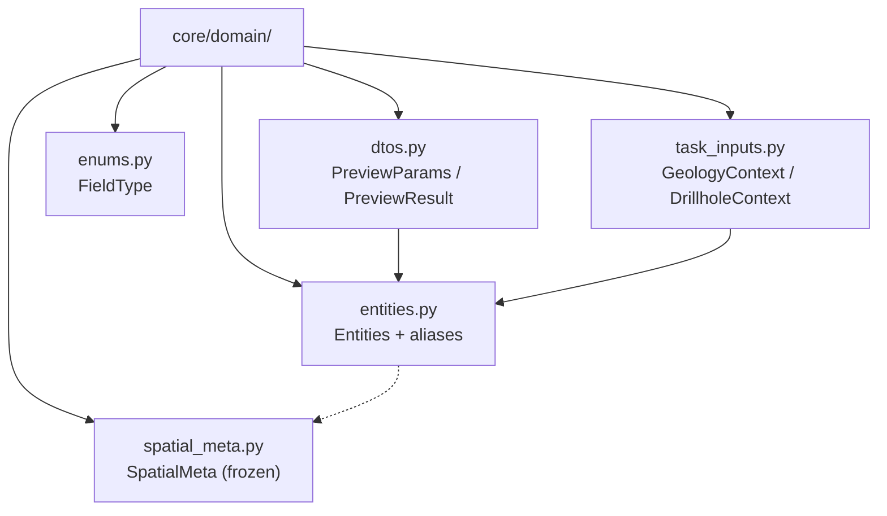

# `core/domain/` — Domain Layer

> [!abstract] One-line summary
> Layer defining the DTOs, entities, enums, and contexts that act as the QGIS-agnostic **data contract** between GUI, core, and exporters.

**Path**: `core/domain/` (6 modules, ~577 lines)
**Layer**: Core (QGIS-agnostic)
**Tags**: #secinterp #layer #core

---

## 🎯 Layer role

| Aspect | Detail |
|--------|--------|
| **What** | Pure domain model: entities, aliases, and DTOs |
| **Input** | Primitives and WKT coming from the GUI adapters |
| **Output** | `PreviewParams`, `PreviewResult`, `GeologyContext`, `DrillholeContext` |
| **Depends on** | Stdlib only (`dataclasses`, `enum`, `typing`) |
| **Consumed by** | `core/services/`, `exporters/`, renderers |

> [!important] Layer rules
> Core = QGIS-agnostic, thread-safe, `from __future__ import annotations`, strict typing, no `qgis.core/gui/PyQt`.

---

## 🧬 Layer / sublayer map

---

## 🧱 Module inventory

| Module | Role |
|--------|------|
| `__init__.py` | Import facade; re-exports everything via `__all__` |
| `entities.py` | Entities (`GeologySegment`, `DrillholeProjection`…) and aliases (`DomainGeometry = str`) |
| `dtos.py` | `PreviewParams` (input + `validate()`) and `PreviewResult` (output + ranges) |
| `enums.py` | `FieldType(IntEnum)`: a mirror of `QVariant.Type` without PyQt |
| `spatial_meta.py` | `SpatialMeta(frozen)`: immutable 2D/3D bridge |
| `task_inputs.py` | `OutcropSegments`, `GeologyContext`, `DrillholeContext` |

---

## 🏛️ Design patterns present

| Pattern | Where | Purpose |
|---------|-------|---------|
| **DTO** | `dtos.py`, `task_inputs.py` | Transport data between layers |
| **Entity** | `entities.py` | Model geological concepts |
| **Value Object** | `SpatialMeta` | Immutability and thread-safety |
| **Enum Bridge** | `FieldType` | Validate types without PyQt |
| **Type Alias** | `DomainGeometry`, `Point2D` | Decouple QGIS (WKT) |
| **Import Facade** | `__init__.py` | Stable import surface |

---

## 🔗 Related notes

- [[Index]] — vault index
- [[layer_core]] — parent layer
- [[domain]] — file note of the package
- [[layer_core_interfaces]] — contracts consuming these types
- [[layer_core_services]] — services processing these DTOs
- [[controller]] — builds the contexts from the GUI

---

*Note of the SecInterp Code Walkthrough vault — v3.8.0*
