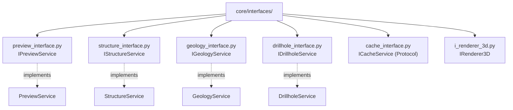

# `core/interfaces/` — Contracts and Ports

> [!abstract] One-line summary
> Layer of **contracts** (ABCs and one `Protocol`) defining the ports implemented by core services and consumed by the GUI adapters.

**Path**: `core/interfaces/` (7 modules, ~210 lines)
**Layer**: Core (QGIS-agnostic)
**Tags**: #secinterp #layer #core

---

## 🎯 Layer role

| Aspect | Detail |
|--------|--------|
| **What** | Abstract ports (interfaces) for services and renderers |
| **Input** | `@abstractmethod` definitions without implementation |
| **Output** | Contracts `IPreviewService`, `IStructureService`, `IGeologyService`… |
| **Depends on** | `abc`, `typing`, and DTOs from `core/domain/` |
| **Consumed by** | `core/services/` (implements), GUI and renderers (use) |

> [!important] Layer rules
> Core = QGIS-agnostic, thread-safe, `from __future__ import annotations`, strict typing, no `qgis.core/gui/PyQt`.

---

## 🧬 Layer / sublayer map

---

## 🧱 Module inventory

| Module | Role |
|--------|------|
| `__init__.py` | Package marker (docstring + `from __future__` only) |
| `preview_interface.py` | `IPreviewService.generate_all()` — preview orchestration |
| `structure_interface.py` | `IStructureService.project_structures()` — structural projection |
| `geology_interface.py` | `IGeologyService.build_segments()` — geological segments |
| `drillhole_interface.py` | `IDrillholeService.process_context()` — drillhole processing |
| `cache_interface.py` | `ICacheService` (`Protocol` + `@runtime_checkable`) |
| `i_renderer_3d.py` | `IRenderer3D.render_3d()` / `clear()` — 3D engines |

---

## 🏛️ Design patterns present

| Pattern | Where | Purpose |
|---------|-------|---------|
| **Port / Adapter** | All interfaces | Invert dependencies toward abstractions |
| **Abstract Base Class** | `IPreviewService`, `IGeologyService`… | Enforce contract implementation |
| **Protocol (structural)** | `ICacheService` | Structural typing without inheritance |
| **Dependency Inversion** | Consumed by services | Core depends on interfaces, not details |

---

## 🔗 Related notes

- [[Index]] — vault index
- [[layer_core]] — parent layer
- [[layer_core_services]] — implementations of these ports
- [[domain]] — DTOs used in the signatures
- [[preview_service]] / [[geology_service]] / [[structure_service]] / [[drillhole_service]]
- [[adapters]] — adapters consuming the contracts

---

*Note of the SecInterp Code Walkthrough vault — v3.8.0*
