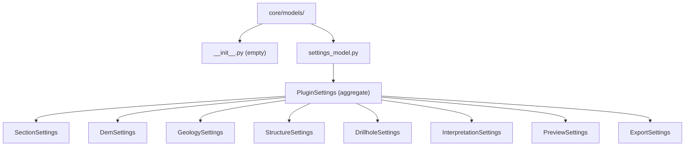

# `core/models/` — Settings Model

> [!abstract] One-line summary
> Layer modeling the plugin configuration as **validated dataclasses** grouped into a `PluginSettings` serializable to/from a dictionary.

**Path**: `core/models/` (2 modules, ~178 lines)
**Layer**: Core (QGIS-agnostic)
**Tags**: #secinterp #layer #core

---

## 🎯 Layer role

| Aspect | Detail |
|--------|--------|
| **What** | Typed settings model per GUI page |
| **Input** | Flat dicts loaded by `ConfigService` from `QgsSettings` |
| **Output** | `PluginSettings` (aggregate) and its per-domain sub-models |
| **Depends on** | `dataclasses` and `core/validation/validators` |
| **Consumed by** | `core/config.py`, GUI (`StateManager`, pages) |

> [!important] Layer rules
> Core = QGIS-agnostic, thread-safe, `from __future__ import annotations`, strict typing, no `qgis.core/gui/PyQt`.

---

## 🧬 Layer / sublayer map

---

## 🧱 Module inventory

| Module | Role |
|--------|------|
| `__init__.py` | Empty marker; the package is imported by full path |
| `settings_model.py` | Defines `PluginSettings` and 8 sub-models with `__post_init__` validation |

---

## 🏛️ Design patterns present

| Pattern | Where | Purpose |
|---------|-------|---------|
| **Settings Object** | Each sub-dataclass | Group options per page |
| **Aggregate / Composition** | `PluginSettings` | Compose all groups with `default_factory` |
| **Validating Constructor** | `__post_init__` + `validate_and_clamp` | Avoid out-of-range values |
| **Serialization** | `from_dict()` / `to_dict()` | Persistence and restoration |

---

## 🔗 Related notes

- [[Index]] — vault index
- [[layer_core]] — parent layer
- [[config]] — `ConfigService` loads and persists this model
- [[settings_page]] — page editing the settings
- [[state_manager]] — keeps the UI state

---

*Note of the SecInterp Code Walkthrough vault — v3.8.0*
