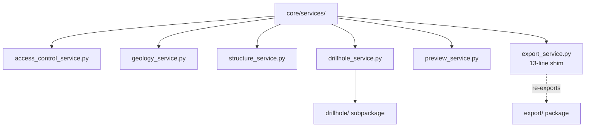

# `core/services/` — Business Services

> [!abstract] One-line summary
> Layer of **business orchestrators** that process already-extracted data (WKT, dicts, primitives) and return domain DTOs, without touching QGIS.

**Path**: `core/services/` (7 modules, ~630 lines)
**Layer**: Core (QGIS-agnostic)
**Tags**: #secinterp #layer #core

---

## 🎯 Layer role

| Aspect | Detail |
|--------|--------|
| **What** | One service per domain: geology, structure, drillholes, preview, export |
| **Input** | Decoupled contexts/`PreviewParams` produced by the GUI adapters |
| **Output** | `GeologyData`, `StructureData`, `DrillholeProjection`, `PreviewResult` |
| **Depends on** | `core/domain/`, `core/interfaces/`, `core/utils/` |
| **Consumed by** | `controller`, GUI tasks, and exporters |

> [!important] Layer rules
> Core = QGIS-agnostic, thread-safe, `from __future__ import annotations`, strict typing, no `qgis.core/gui/PyQt`.

---

## 🧬 Layer / sublayer map

---

## 🧱 Module inventory

| Module | Role |
|--------|------|
| `__init__.py` | Re-exports `DrillholeService`, `GeologyService`, `StructureService` |
| `access_control_service.py` → [[access_control_service]] | Gate for restricted features via `QgsSettings` (`can_export_3d`) |
| `geology_service.py` → [[geology_service]] | `build_segments()`: interpolates and sorts geological segments |
| `structure_service.py` → [[structure_service]] | `project_structures()`: projects and computes apparent dip |
| `drillhole_service.py` → [[drillhole_service]] | `process_context()`: orchestrates the drillhole pipeline |
| `preview_service.py` → [[preview_service]] | `generate_all()`: orchestrates preview topography and structures |
| `export_service.py` | **13-line shim** re-exporting `ExportService` from [[layer_core_services_export]] |

---

## 🏛️ Design patterns present

| Pattern | Where | Purpose |
|---------|-------|---------|
| **Service Layer** | All `*Service` | Encapsulate business rules |
| **Orchestrator** | `PreviewService`, `DrillholeService` | Compose sub-steps into a flow |
| **Facade** | `ExportService` (shim) | Stable API over the `export/` package |
| **Dependency Injection** | Service constructors | Inject processors/extractors |
| **Backward-compat Shim** | `export_service.py` | Do not break existing imports |
| **Port / Adapter** | Implement `core/interfaces/` | Depend on contracts |

---

## 🔗 Related notes

- [[Index]] — vault index
- [[layer_core]] — parent layer
- [[layer_core_services_drillhole]] — drillhole pipeline sublayer
- [[layer_core_services_export]] — export sublayer
- [[controller]] — calls and exposes these services
- [[geology_service]] / [[drillhole_service]] / [[structure_service]] / [[preview_service]] / [[access_control_service]]

---

*Note of the SecInterp Code Walkthrough vault — v3.8.0*
