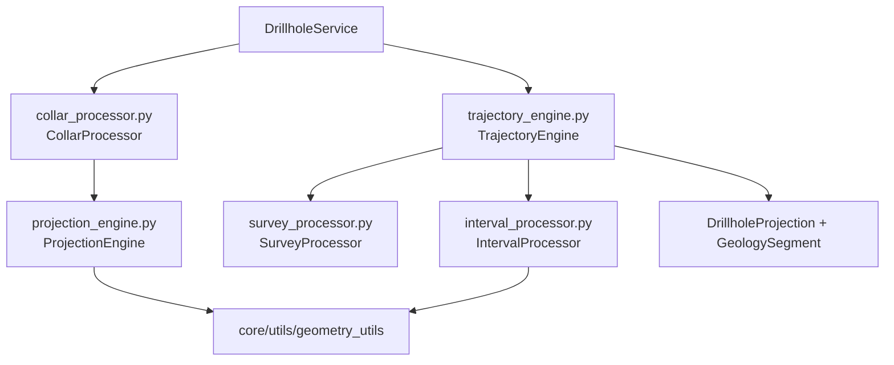

# `core/services/drillhole/` — Drillhole Pipeline

> [!abstract] One-line summary
> Sublayer of **pure processors** decomposing the drillhole pipeline into collar, survey, trajectory, intervals, and geometric projection.

**Path**: `core/services/drillhole/` (6 modules, ~309 lines)
**Layer**: Core (QGIS-agnostic)
**Tags**: #secinterp #layer #core

---

## 🎯 Layer role

| Aspect | Detail |
|--------|--------|
| **What** | Specialized processors for the drillhole domain |
| **Input** | Collar, surveys, and intervals already decoupled (`DrillholeContext`) |
| **Output** | `DrillholeProjection` + `GeologySegment` per interval |
| **Depends on** | `core/domain/`, `core/utils/` (geometry) |
| **Consumed by** | `drillhole_service.DrillholeService` |

> [!important] Layer rules
> Core = QGIS-agnostic, thread-safe, `from __future__ import annotations`, strict typing, no `qgis.core/gui/PyQt`.

---

## 🧬 Layer / sublayer map

---

## 🧱 Module inventory

| Module | Role |
|--------|------|
| `__init__.py` | Package marker (docstring + `from __future__`) |
| `collar_processor.py` | Projects the collar onto the profile and filters by `buffer_width` |
| `survey_processor.py` | `determine_final_depth()`: max survey/interval depth |
| `interval_processor.py` | Interpolates intervals along the trajectory → `GeologySegment` |
| `trajectory_engine.py` | Orchestrates trajectory, projection, and intervals per hole |
| `projection_engine.py` | `project_point_to_line()`: pure geometric projection |

---

## 🏛️ Design patterns present

| Pattern | Where | Purpose |
|---------|-------|---------|
| **Pipeline / Chain** | `process_single_hole` | Chain steps per drillhole |
| **Facade** | `TrajectoryEngine` | Hide the sequence of sub-steps |
| **Strategy / DI** | Injected processors | Swap implementations |
| **Static Utility** | `ProjectionEngine` | Stateless geometric computation |
| **Decomposition** | 6 modules | One responsibility per file |

---

## 🔗 Related notes

- [[Index]] — vault index
- [[layer_core_services]] — parent layer
- [[drillhole_service]] — orchestrating service of this sublayer
- [[collar_processor]] / [[survey_processor]] / [[interval_processor]]
- [[trajectory_engine]] / [[projection_engine]]
- [[layer_core_domain]] — `DrillholeProjection`, `GeologySegment`, `SpatialMeta`

---

*Note of the SecInterp Code Walkthrough vault — v3.8.0*
