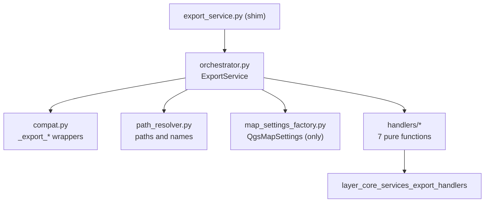

# `core/services/export/` — Export Orchestration

> [!abstract] One-line summary
> Package that decomposes the monolithic export into an orchestrator, a path resolver, a `QgsMapSettings` factory and a compatibility mixin.

**Path**: `core/services/export/` (5 modules, ~439 lines)
**Layer**: Core (QGIS-agnostic)
**Tags**: #secinterp #layer #core

---

## 🎯 Role of the layer

Coordinates the export of all profile data. `ExportService` validates options, resolves layers and routes to the handlers per data type, without writing files itself.

| Aspect | Detail |
|--------|--------|
| Input | `output_folder`, `PreviewParams` and profile/geology/structures/drillholes/interpretations data |
| Output | List of messages with the written paths |
| Hard dependency | `qgis.core.QgsMapSettings` **only** in `map_settings_factory.py` |
| State | Stateless except for injected `controller` and `AccessControlService` |

> [!important] Layer rules
> Core = QGIS-agnostic, thread-safe, `from __future__ import annotations`, strict typing.

## 🧬 Layer / sub-layer map

## 🧱 Module inventory

| Module | Role |
|--------|------|
| `__init__.py` | Re-exports `ExportService`, `create_map_settings`, `get_profile_name`, `resolve_export_path` |
| `orchestrator.py` → [[export_package]] | `ExportService`: validates options, derives format and dispatches via the `exp_*` routing dict |
| `path_resolver.py` → [[export_package]] | `get_profile_name()` sanitizes `/` and `\`; `resolve_export_path()` applies `naming_pattern` and chooses GPKG vs folder |
| `map_settings_factory.py` → [[export_package]] | Only import of `QgsMapSettings`; `create_map_settings()` |
| `compat.py` → [[export_package]] | Mixin with legacy `_export_*` and `_get_export_path` wrappers for tests |

## 🏛️ Design patterns present

| Pattern | Where | Purpose |
|---------|-------|---------|
| **Facade / Orchestrator** | `ExportService` | One API over 7 handlers |
| **Factory** | `create_map_settings` | Isolates the QGIS import in a single module |
| **Registry / routing dict** | `_orchestrate_exports` | Declarative dispatch per `exp_*` option |
| **Backward-compat shim** | `compat.py` + `export_service.py` | Do not break existing imports or tests |

## 🔗 Related notes

- [[Index]]
- [[layer_core_services]] — parent layer
- [[layer_core_services_export_handlers]] — handlers per data type
- [[export_package]] — full package view
- [[export_service]] — compatibility shim for the monolith

---

*Note of the SecInterp Code Walkthrough vault — v3.8.0*
