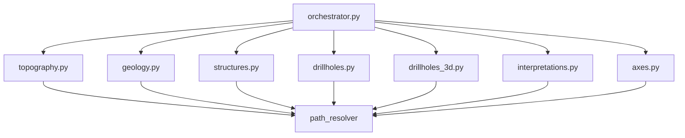

# `core/services/export/handlers/` — Export Handlers

> [!abstract] One-line summary
> Seven pure functions, one per data type, that write CSV/vector using the exporters and **without importing `qgis`**.

**Path**: `core/services/export/handlers/` (8 modules, ~490 lines)
**Layer**: Core (QGIS-agnostic)
**Tags**: #secinterp #layer #core

---

## 🎯 Role of the layer

Each handler receives already-extracted data, resolves its path with `path_resolver` and invokes the matching exporter. This is where the orchestrator delegates and where the "which files does each data type produce" logic lives.

| Handler | Output |
|---------|--------|
| `topography` | CSV `topo_profile` + `profile_line` vector |
| `geology` | CSV `geol_profile` + polygons |
| `structures` | CSV `structural_profile` + measurements |
| `drillholes` | 2D traces + intervals |
| `drillholes_3d` | 4 real/projected tasks |
| `interpretations` | 2D always, 3D gated |
| `axes` | `profile_axes` |

> [!important] Layer rules
> Core = QGIS-agnostic, thread-safe, `from __future__ import annotations`, strict typing.

## 🧬 Layer / sub-layer map

## 🧱 Module inventory

| Module | Role |
|--------|------|
| `__init__.py` | Empty: namespace package without re-exports |
| `topography.py` → [[export_package]] | `export_topography` → CSV + `ProfileLineVectorExporter` |
| `geology.py` → [[export_package]] | `export_geology` → CSV + `GeologyVectorExporter` |
| `structures.py` → [[export_package]] | `export_structures` → CSV + `StructureVectorExporter` (uses `rasterUnitsPerPixelX`) |
| `drillholes.py` → [[export_package]] | `export_drillholes` → 2D traces and intervals |
| `drillholes_3d.py` → [[export_package]] | `export_drillholes_3d` → declarative table of 4 tasks |
| `interpretations.py` → [[export_package]] | `export_interpretations` → 2D + 3D gated by `AccessControlService` |
| `axes.py` → [[export_package]] | `export_axes` → `AxesVectorExporter` |

## 🏛️ Design patterns present

| Pattern | Where | Purpose |
|---------|-------|---------|
| **Strategy per data type** | each `export_*` | A uniform signature per domain |
| **Lazy import** | `sec_interp.exporters` imports inside each function | Avoids loading exporters when importing the package |
| **Pure functions** | all modules | Stateless, testable without QGIS |

## 🔗 Related notes

- [[Index]]
- [[layer_core_services_export]] — parent layer
- [[export_package]] — full package view
- [[base_exporter]] — contract implemented by the invoked exporters

---

*Note of the SecInterp Code Walkthrough vault — v3.8.0*
