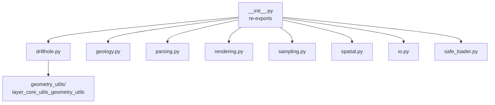

# `core/utils/` — Core Utilities

> [!abstract] One-line summary
> Toolbox of pure helpers (geological computation, parsing, sampling, I/O and safe loading) that supports the core services.

**Path**: `core/utils/` (11 modules, ~1183 lines)
**Layer**: Core (QGIS-agnostic)
**Tags**: #secinterp #layer #core

---

## 🎯 Role of the layer

Gathers stateless cross-cutting utilities that the services reuse. Most are pure math; two modules (`i18n.py`, `io.py`) touch QGIS/Qt APIs in a deliberate gray area.

| Group | Modules |
|-------|---------|
| Geological computation | `geology.py`, `drillhole.py` |
| Geometry / sampling | `spatial.py`, `sampling.py` |
| Parsing | `parsing.py` |
| Render / bounds | `rendering.py` |
| I/O and metadata | `io.py`, `metadata_reader.py` |
| Infrastructure | `safe_loader.py`, `i18n.py`, `__init__.py` |

> [!important] Layer rules
> Core = QGIS-agnostic, thread-safe, `from __future__ import annotations`, strict typing.

> [!note] Gray area
> `i18n.py` imports `QCoreApplication` and `io.py` imports `qgis.core` (`QgsVectorFileWriter`). These are bounded integrations that do not contaminate the rest of the pure helpers.

## 🧬 Layer / sub-layer map

## 🧱 Module inventory

| Module | Role |
|--------|------|
| `__init__.py` | Re-exports the public utils API |
| `metadata_reader.py` | `read_plugin_metadata()` from `metadata.txt` with caching |
| `rendering.py` | `calculate_bounds`, `create_coordinate_transform`, `calculate_interval` |
| `parsing.py` | `parse_strike`, `parse_dip`, `cardinal_to_azimuth`, `extract_feature_attributes` |
| `safe_loader.py` | `SafeLoader`: lazy, fault-tolerant import |
| `i18n.py` | `TranslatableMixin`: `tr()` without inheriting from `QObject` |
| `io.py` | `create_vector_writer` for SHP/GPKG/DXF |
| `spatial.py` | `calculate_line_azimuth` (pure math) |
| `drillhole.py` | Trajectories, section projection and interval interpolation |
| `geology.py` | `calculate_apparent_dip` |
| `sampling.py` | `interpolate_elevation` |

## 🏛️ Design patterns present

| Pattern | Where | Purpose |
|---------|-------|---------|
| **Package facade** | `__init__.py` | Flat API over thematic modules |
| **Static Service** | `SafeLoader` | Stateless helper |
| **Mixin** | `TranslatableMixin` | Reusable `tr()` |
| **Pure functions** | `spatial`, `sampling`, `geology` | Math testable without QGIS |
| **Cache / data singleton** | `_metadata_cache` | Avoids re-reading `metadata.txt` |

## 🔗 Related notes

- [[Index]]
- [[layer_core]] — parent layer
- [[layer_core_utils_geometry_utils]] — geometry sub-layer
- [[safe_loader]] — fault-tolerant loading
- [[i18n]] — translation mixin

---

*Note of the SecInterp Code Walkthrough vault — v3.8.0*
