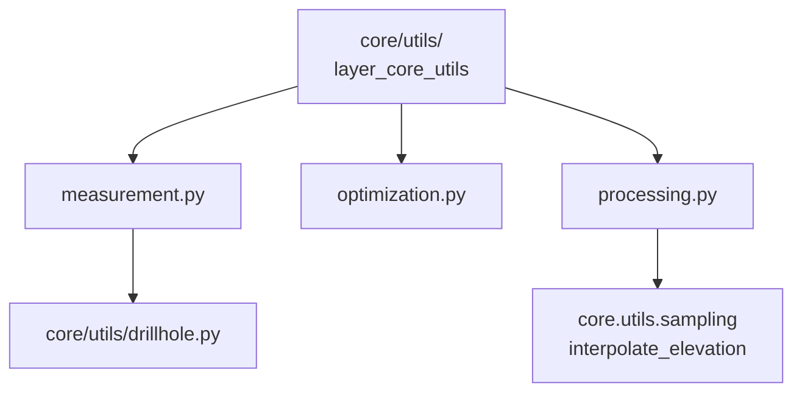

# `core/utils/geometry_utils/` — Geometry Utilities

> [!abstract] One-line summary
> Sub-layer of pure geometric math: measurement, polyline simplification and densification/interpolation.

**Path**: `core/utils/geometry_utils/` (4 modules, ~416 lines)
**Layer**: Core (QGIS-agnostic)
**Tags**: #secinterp #layer #core

---

## 🎯 Role of the layer

Provides 2D geometric primitives with no QGIS dependency, consumed by the core (`drillhole.py`, services) and by preview optimization.

| Module | Provides |
|--------|----------|
| `measurement.py` | Point-to-polyline projection and profile metrics |
| `optimization.py` | Douglas-Peucker, curvature and adaptive sampling |
| `processing.py` | Segment densification and interpolation |

> [!important] Layer rules
> Core = QGIS-agnostic, thread-safe, `from __future__ import annotations`, strict typing.

## 🧬 Layer / sub-layer map

## 🧱 Module inventory

| Module | Role |
|--------|------|
| `__init__.py` | Package docstring, no re-exports |
| `measurement.py` | `project_point_onto_polyline`, `calculate_polyline_metrics` |
| `optimization.py` | `PreviewOptimizer` (decimate, calculate_curvature, adaptive_sample) + `_douglas_peucker` |
| `processing.py` | `densify_line_points`, `interpolate_segment_points` |

## 🏛️ Design patterns present

| Pattern | Where | Purpose |
|---------|-------|---------|
| **Static utility class** | `PreviewOptimizer` | Groups stateless LOD optimization |
| **Recursive divide & conquer** | `_douglas_peucker` | Polyline simplification |
| **Pure functions** | `measurement`, `processing` | Math testable and thread-safe |
| **Tolerance strategy** | `decimate` / `adaptive_sample` | Fixed vs. curvature-based simplification |

## 🔗 Related notes

- [[Index]]
- [[layer_core_utils]] — parent layer
- [[projection_engine]] — consumes point-to-polyline projection
- [[preview_renderer]] — uses the LOD optimization

---

*Note of the SecInterp Code Walkthrough vault — v3.8.0*
