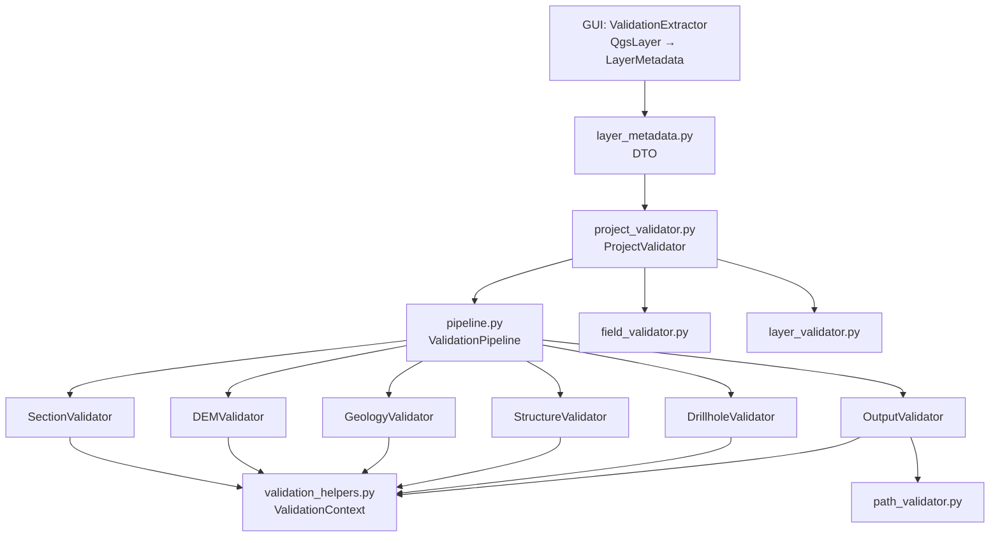

# `core/validation/` — Validation Framework

> [!abstract] One-line summary
> QGIS-agnostic 3-level validation framework (Type, Schema, Business) that accumulates errors and works over the `LayerMetadata` DTO.

**Path**: `core/validation/` (11 modules, ~1481 lines)
**Layer**: Core (QGIS-agnostic)
**Tags**: #secinterp #layer #core

---

## 🎯 Role of the layer

Centralizes validation that would otherwise live scattered across the dialog. The GUI extracts `LayerMetadata` (via `ValidationExtractor`) and this package validates without touching QGIS objects.

| Level | Focus | Modules |
|-------|-------|---------|
| **1 · Type** | Input types and ranges | `field_validator.py`, `validators.py` |
| **2 · Schema** | Consistency between fields/layers | `layer_validator.py`, `validation_helpers.py` |
| **3 · Business** | External project consistency | `project_validator.py`, `project_validators.py` |

> [!important] Layer rules
> Core = QGIS-agnostic, thread-safe, `from __future__ import annotations`, strict typing.

> [!note] Accumulation, not fail-fast
> `ValidationContext` collects all errors and warnings; `raise_if_errors()` raises a single `ValidationError` at the end of the pipeline.

## 🧬 Layer / sub-layer map

## 🧱 Module inventory

| Module | Role |
|--------|------|
| `__init__.py` | Re-exports field, layer, path validators and `ProjectValidator` |
| `base_validator.py` | `IValidator` (ABC) with `validate(params, context)` |
| `pipeline.py` | `ValidationPipeline`: runs validators in sequence |
| `layer_metadata.py` | `LayerMetadata` DTO and geometry/kind constants |
| `field_validator.py` | Field, numeric/integer input and angle validation |
| `layer_validator.py` | Features, geometry, bands, requirements and CRS |
| `path_validator.py` | `validate_safe_output_path` with traversal protection |
| `project_validator.py` | `ProjectValidator` and `ValidationParams` |
| `project_validators.py` | `Section/DEM/Geology/Structure/Drillhole/OutputValidator` |
| `validation_helpers.py` | `ValidationContext`, `RichValidationError`, `DependencyRule` |
| `validators.py` | Composable dataclass validators (`FieldValidator`) |

## 🏛️ Design patterns present

| Pattern | Where | Purpose |
|---------|-------|---------|
| **Pipeline / Chain** | `ValidationPipeline` | Orchestrates validators in sequence |
| **Strategy** | `IValidator` | One rule per domain |
| **Context Object** | `ValidationContext` | Accumulates errors without failing fast |
| **DTO / Bridge** | `LayerMetadata` | Decouples QGIS from the core |
| **Composite** | `FieldValidator` | Chains composable validators |

## 🔗 Related notes

- [[Index]]
- [[layer_core]] — parent layer
- [[validation]] — detailed pipeline note
- [[validation_extractor]] — GUI adapter producing `LayerMetadata`

---

*Note of the SecInterp Code Walkthrough vault — v3.8.0*
