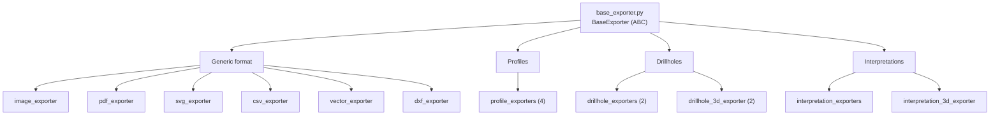

---
tags:
  - secinterp
  - code-walkthrough
  - layer
  - exporters
aliases:
  - exporters/
  - Exporters layer
cssclass: secinterp-layer
---

# `exporters/` — Exporters

> [!abstract] One-line summary
> **Format-strategy layer**: each exporter implements `BaseExporter` and writes one data type to SHP/GPKG/DXF/CSV/PNG/PDF/SVG.

**Path**: `exporters/` (13 modules, ~2,215 lines)
**Layer**: Exporters
**Tags**: #secinterp #layer #exporters

---

## 🎯 Layer role

| Problem | Solution |
|---------|----------|
| Every format duplicated path validation and writing | `BaseExporter` centralizes validation and the contract |
| Adding a format forced changes to orchestration | `get_exporter(ext)` selects the strategy |
| Geology, 2D, and 3D require different geometries and fields | Domain-specific exporters |
| Risk of path traversal in output paths | `validate_export_path()` on the base class |

> [!important] Layer rules
> - ✅ Every exporter inherits from `[[base_exporter]]` and implements `export()` and `get_supported_extensions()`
> - ✅ Output is `pathlib.Path`; never bare strings
> - ✅ Return `bool` (success/failure) and log the exception instead of propagating it
> - ✅ Consumed by `core/services/export/` and by the `get_exporter()` factory
> - ⚠️ `exporters/` does use QGIS (`QgsVectorFileWriter`, `QgsMapSettings`); it is not pure core

---

## 🧬 Layer / sublayer map

---

## 🧱 Module inventory

| Module | Role |
|--------|------|
| `base_exporter.py` → [[base_exporter]] | ABC with `export()`, `validate_export_path()`, and `validate_path()` |
| `vector_exporter.py` → [[vector_exporter]] | Generic SHP/GPKG/DXF from `features_data` |
| `csv_exporter.py` → [[csv_exporter]] | `headers`/`rows` tables to CSV |
| `dxf_exporter.py` → [[dxf_exporter]] | Dedicated DXF writing |
| `image_exporter.py` → [[image_exporter]] | Render to PNG/JPG via `QgsMapRendererCustomPainterJob` |
| `pdf_exporter.py` → [[pdf_exporter]] | Render to PDF via `QPdfWriter` |
| `svg_exporter.py` → [[svg_exporter]] | Render to SVG via `QSvgGenerator` |
| `profile_exporters.py` → [[profile_exporters]] | `ProfileLine`, `Geology`, `Structure`, and `Axes` (4 classes) |
| `drillhole_exporters.py` → [[drillhole_exporters]] | 2D drillhole traces and intervals |
| `drillhole_3d_exporter.py` → [[drillhole_3d_exporter]] | 3D traces and intervals (`LineStringZ`) |
| `interpretation_exporters.py` → [[interpretation_exporters]] | 2D interpretation polygons |
| `interpretation_3d_exporter.py` → [[interpretation_3d_exporter]] | 3D polygons (`PolygonZ`) + QML style |
| `__init__.py` | Facade and `get_exporter(extension, settings)` factory |

---

## 🏛️ Design patterns present

| Pattern | Where | Purpose |
|---------|-------|---------|
| **Strategy** | Each `*Exporter` | Swap format without changing the caller |
| **Template Method** | `BaseExporter` | Shared validation + abstract `export()` |
| **Factory** | `get_exporter()` | Resolve the strategy by extension |
| **Facade** | `__init__.py` | Stable import surface |
| **Specialization** | `profile_exporters`, `*_3d_exporter` | Per-domain geometries and fields |

---

## 🔗 Related notes

- [[Index]] — vault index
- [[base_exporter]] · [[vector_exporter]] · [[csv_exporter]] · [[dxf_exporter]]
- [[image_exporter]] · [[pdf_exporter]] · [[svg_exporter]]
- [[profile_exporters]] · [[drillhole_exporters]] · [[drillhole_3d_exporter]]
- [[interpretation_exporters]] · [[interpretation_3d_exporter]]
- [[export_package]] — core orchestrator that consumes them
- [[layer_core]] — input DTOs

---

*Note of the SecInterp Code Walkthrough vault — v3.8.0*
