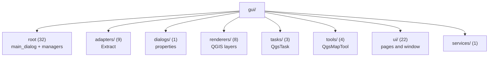

---
tags:
  - secinterp
  - code-walkthrough
  - layer
  - gui
aliases:
  - gui/
  - GUI layer
cssclass: secinterp-layer
---

# `gui/` — GUI

> [!abstract] One-line summary
> Layer that interacts with QGIS only to **extract** data into DTOs and **present** results; all business computation lives in `core/`.

**Path**: `gui/` (80 modules, ~10,410 lines)
**Layer**: GUI
**Tags**: #secinterp #layer #gui

---

## 🎯 Layer role

| Problem | Solution |
|---------|----------|
| Monolithic dialogs mixed UI, business logic, and persistence | **Manager Pattern**: one manager per responsibility |
| Tests impossible without QGIS | The GUI only extracts/presents; core is testable |
| UI frozen during heavy operations | `QgsTask` for operations > 100 ms with serialized data |
| Duplicate signals and memory leaks | Idempotent `SignalManager` connect/disconnect |

> [!important] Layer rules
> - ❌ Business logic in GUI classes
> - ❌ Direct file I/O in GUI classes
> - ❌ Passing live QGIS objects (`QgsVectorLayer`, `QgsFeature`) into a `QgsTask`
> - ✅ `QgsTask` for operations > 100 ms (extract to WKT/dict first)
> - ✅ `iface.messageBar()` **only** inside `gui/`
> - ✅ Only **Extract** and **Present** phases; **Compute** delegates to core

> [!info] 2026-09-20 refactor — mixin decomposition
> On **2026-09-20** the monoliths (`main_dialog`, `dialog_preview_manager`, `interpretation_manager`) were split into specialized mixins and managers to satisfy the *Module Size Gate* (< 300 lines).

---

## 🧬 Layer / sublayer map

---

## 🧱 Module inventory

| Module | Role |
|--------|------|
| `main_dialog.py` → [[main_dialog]] | `SecInterpDialog`: composes managers, mixins, and the window |
| `dialog_*_manager.py` | `PreviewManager`, `ExportManager`, `InputManager`, `InterpretationManager`, `SignalManager`, `StateManager`, `ToolManager` |
| `dialog_*_mixin.py` | Dialog lifecycle, messages, and facade |
| `preview_*.py` | Rendering, state, hashing, task orchestration, and legend |
| `interpretation_*_mixin.py` | Persistence (project/layer) and attribute inheritance |
| `layer_notification_manager.py` → [[layer_notification_manager]] | Invalidates the core cache when layers change |
| `ui_status_manager.py` → [[ui_status_manager]] | Indicators and button enablement |
| `adapters/` (9) | `[[layer_gui_adapters]]`: extraction from QGIS into DTOs |
| `dialogs/` (1) | `[[layer_gui_dialogs]]`: interpretation properties dialog |
| `renderers/` (8) | `[[layer_gui_renderers]]`: domain-specific rendering |
| `tasks/` (3) | `[[layer_gui_tasks]]`: background `QgsTask` |
| `tools/` (4) | `[[layer_gui_tools]]`: map tools |
| `ui/` (22) | `[[layer_gui_ui]]`: pages and main window |
| `services/` (1) | GUI services facade |

---

## 🏛️ Design patterns present

| Pattern | Where | Purpose |
|---------|-------|---------|
| **Manager** | `dialog_*_manager.py` | Delegate dialog responsibilities |
| **Mixin / Composition** | `dialog_*_mixin.py`, `preview_*` | Reuse behavior without deep inheritance |
| **Adapter (Extract)** | `gui/adapters/` | Convert QGIS → DTO/WKT |
| **Observer** | `SignalManager` | Wire widgets to managers |
| **Callback injection** | `PreviewManager` / `InterpretationManager` | Decouple managers from each other |
| **Task Orchestration** | `PreviewTaskOrchestrator` | `QgsTask` + progress callbacks |

---

## 🔗 Related notes

- [[Index]] — vault index
- [[layer_gui_adapters]] · [[layer_gui_dialogs]] · [[layer_gui_renderers]] · [[layer_gui_tasks]] · [[layer_gui_tools]] · [[layer_gui_ui]]
- [[main_dialog]] · [[dialog_mixins]] · [[dialog_preview_manager]] · [[preview_mixins]]
- [[interpretation_manager]] · [[interpretation_mixins]] · [[signal_manager]] · [[state_manager]]
- [[input_manager]] · [[tool_manager]] · [[layer_notification_manager]] · [[preview_renderer]] · [[preview_state]] · [[ui_pages]]
- [[layer_core]] — business logic this layer invokes

---

*Note of the SecInterp Code Walkthrough vault — v3.8.0*
