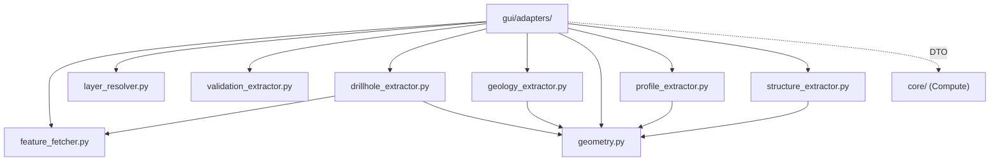

# `gui/adapters/` — GUI Adapters (Extract)

> [!abstract] One-line summary
> They convert live QGIS objects (layers, features, rasters) into DTOs and QGIS-agnostic primitives: the **Extract** phase of the Extract-then-Compute pattern.

**Path**: `gui/adapters/` (9 modules, ~1522 lines)
**Layer**: GUI
**Tags**: #secinterp #layer #gui

---

## 🎯 Role of the layer

| Responsibility | Detail |
|----------------|--------|
| Resolve layers | ID/name/object → `QgsMapLayer` with cache |
| Read features | `QgsFeatureRequest`, bbox/expression filters, destination CRS |
| Transform | Buffers, densification, vertices, raster sampling |
| Detach | Package everything into DTOs (`*Context`, `ProfileData`, `LayerMetadata`) |

> [!important] Layer rules
> GUI = Extract/Present only; no business logic; `QgsTask` for >100ms; never pass live QGIS objects to threads.

## 🧬 Layer / sublayer map

## 🧱 Module inventory

| Module | Role |
|--------|------|
| `__init__.py` | Documents the Extract-phase contract |
| `feature_fetcher.py` | `DataFetcher`: bulk survey/interval read in one pass |
| `layer_resolver.py` | `LayerResolver`: resolves and caches layers; `resolve_layer` wrapper |
| `validation_extractor.py` | Detached `LayerMetadata` and `build_validation_params` |
| `drillhole_extractor.py` | `DrillholeExtractor` → `DrillholeContext` |
| `geology_extractor.py` | `GeologyExtractor` → `GeologyContext` |
| `geometry.py` | QGIS geometry and raster-sampling helpers |
| `profile_extractor.py` | `ProfileExtractor` → topographic `ProfileData` |
| `structure_extractor.py` | `StructureExtractor` → `SectionContext` |

## 🏛️ Design patterns present

| Pattern | Where | Purpose |
|---------|-------|---------|
| **Adapter** | Whole layer | Translate QGIS → pure domain |
| **DTO / Detached context** | `*Context`, `ProfileData`, `LayerMetadata` | Thread-safe serializable data |
| **Facade** | `DrillholeExtractor.extract_context` | One call over many steps |
| **Cache (class-level)** | `LayerResolver._cache` | Avoid repeated `project.mapLayer()` |
| **Request factory** | `_prepare_feature_request` | Centralized bbox + destination CRS |

## 🔗 Related notes

- [[Index]] — vault index
- [[layer_gui]] — parent layer
- [[adapters]] — package/architecture note
- [[drillhole_extractor]] — drillhole extraction
- [[geology_extractor]] — geology extraction
- [[structure_extractor]] — structure extraction
- [[validation_extractor]] — validation metadata

---

*Note of the SecInterp Code Walkthrough vault — v3.8.0*
