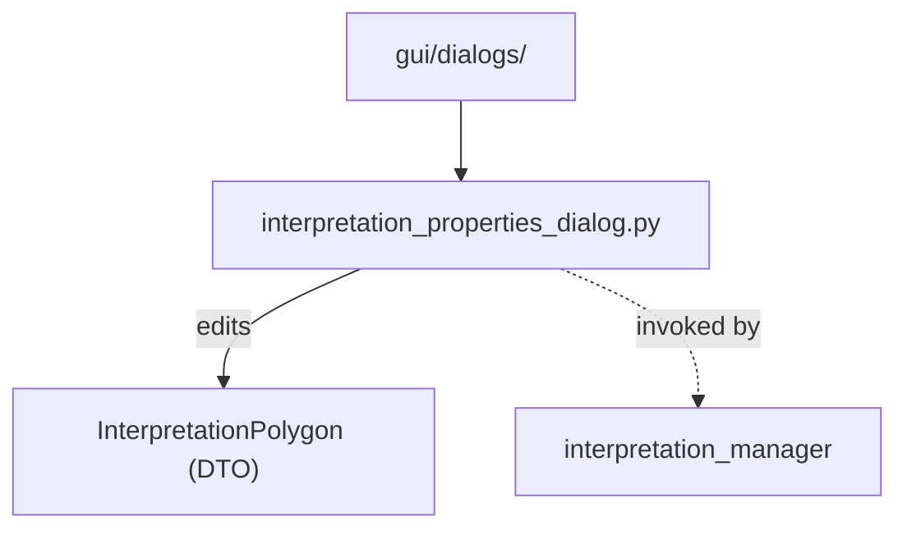

# `gui/dialogs/` — GUI Dialogs

> [!abstract] One-line summary
> Modal dialog sublayer; today it holds the property editor for a geological interpretation.

**Path**: `gui/dialogs/` (1 module, ~149 lines)
**Layer**: GUI
**Tags**: #secinterp #layer #gui

---

## 🎯 Role of the layer

| Responsibility | Detail |
|----------------|--------|
| Capture input | Name, type, color and custom attributes |
| Light validation | UI fields only; logic lives in core |
| Mutate the DTO | Writes onto `InterpretationPolygon` in `accept()` |
| Lifecycle | `disconnect_signals()` on close to avoid leaks |

> [!important] Layer rules
> GUI = Extract/Present only; no business logic; `QgsTask` for >100ms; never pass live QGIS objects to threads.

## 🧬 Layer / sublayer map

## 🧱 Module inventory

| Module | Role |
|--------|------|
| `interpretation_properties_dialog.py` | `InterpretationPropertiesDialog`: edit name, type, color and custom fields |

## 🏛️ Design patterns present

| Pattern | Where | Purpose |
|---------|-------|---------|
| **Dialog / Form** | `_setup_ui` | `QFormLayout` form + OK/Cancel buttons |
| **Observer (Qt signals)** | `button_box` | Dialog `accept`/`reject` |
| **Explicit teardown** | `disconnect_signals` | Avoid memory leaks on close |
| **Color picker** | `_pick_color` | `QColorDialog` over the interpretation color |

## 🧾 API summary

| Symbol | Signature / Inherits | Typical use |
|--------|----------------------|-------------|
| `InterpretationPropertiesDialog` | `QDialog` | Modal property editor |
| `_setup_ui()` | private | Builds the `QFormLayout` and buttons |
| `_pick_color()` | private | Opens `QColorDialog` and refreshes the preview |
| `accept()` | override | Flushes widgets into the DTO and closes |
| `disconnect_signals()` | public | Disconnects signals before closing |

## 🔗 Related notes

- [[Index]] — vault index
- [[layer_gui]] — parent layer
- [[interpretation_manager]] — opens and consumes the dialog

---

*Note of the SecInterp Code Walkthrough vault — v3.8.0*
